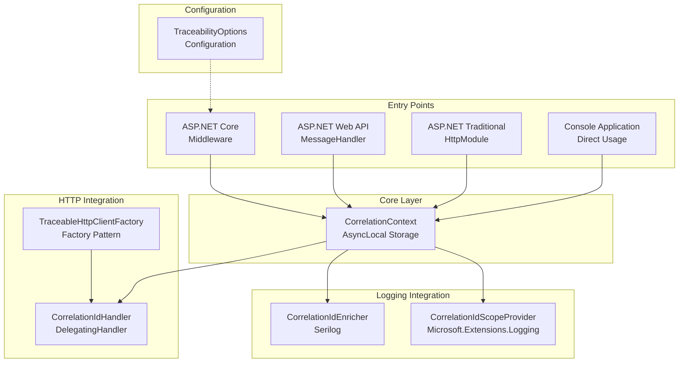
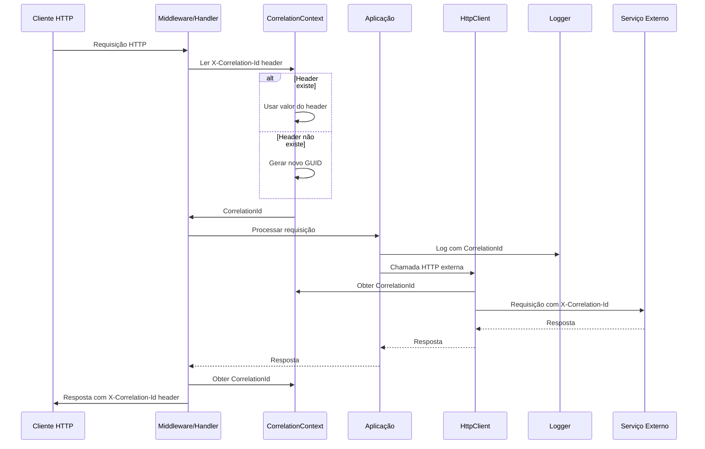
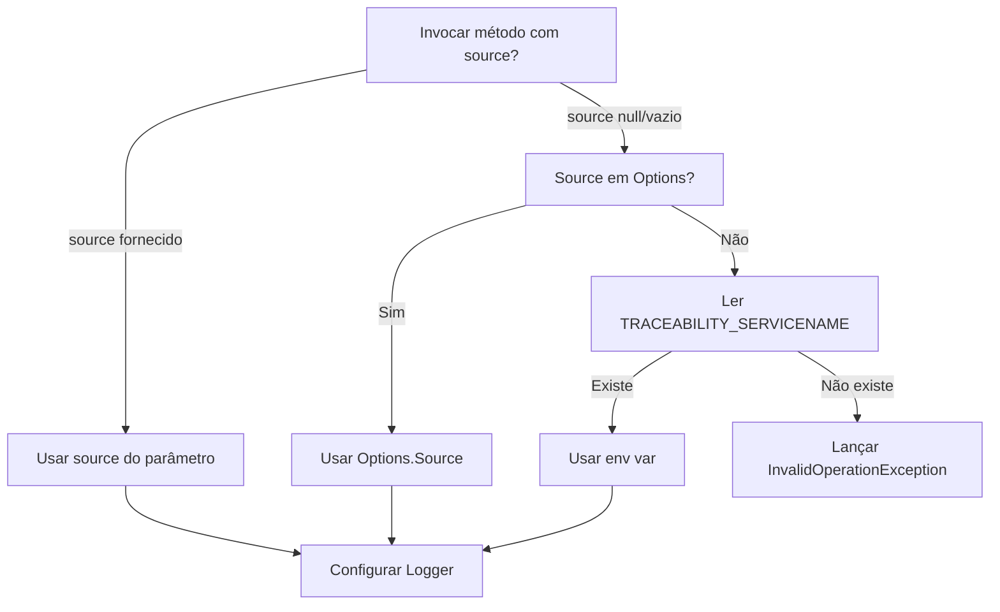
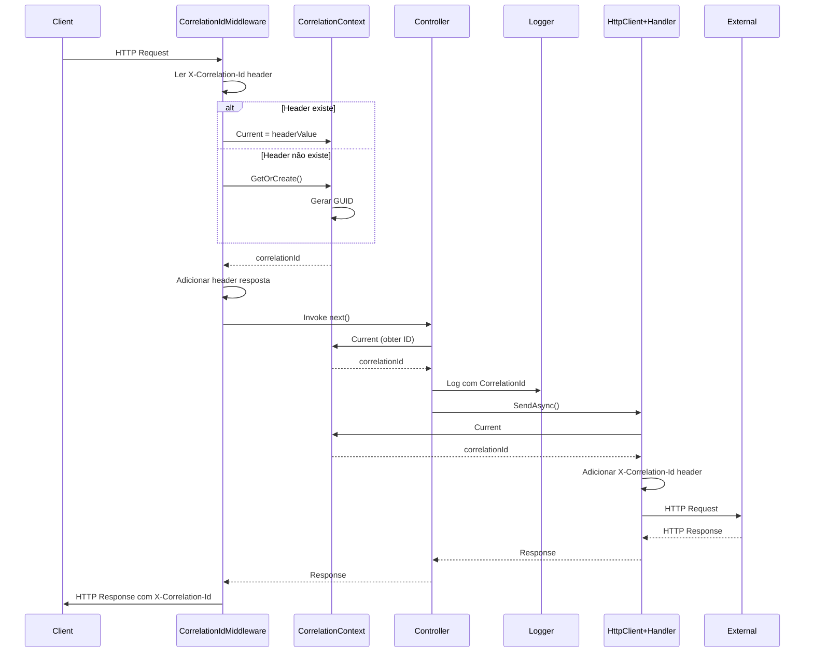
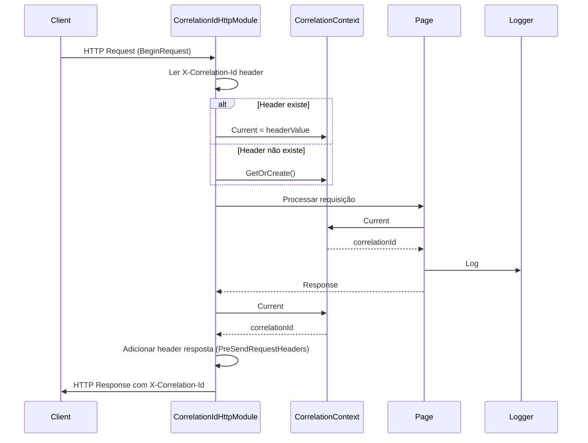
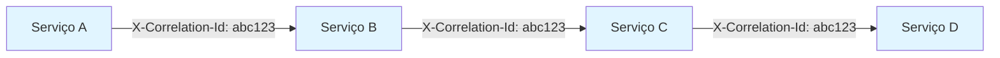
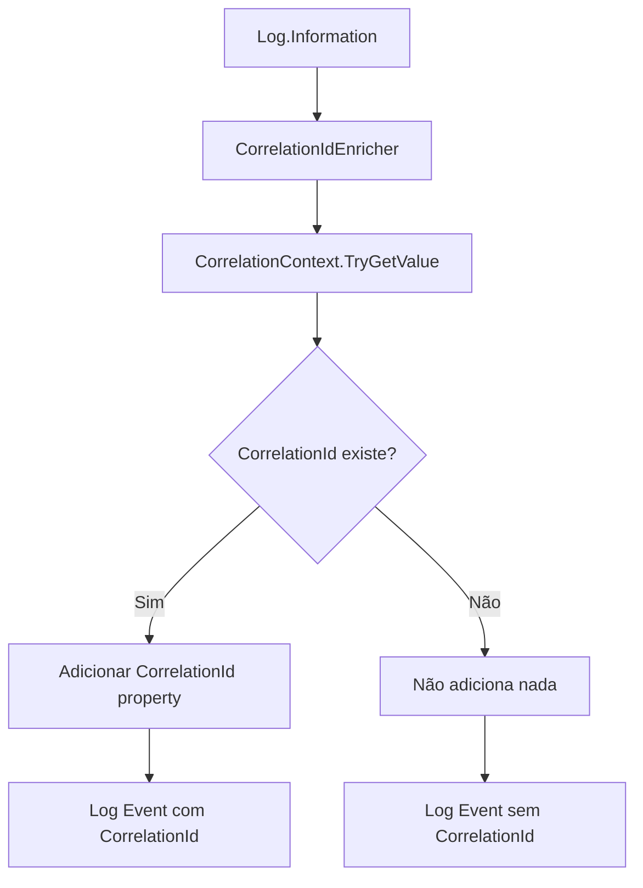
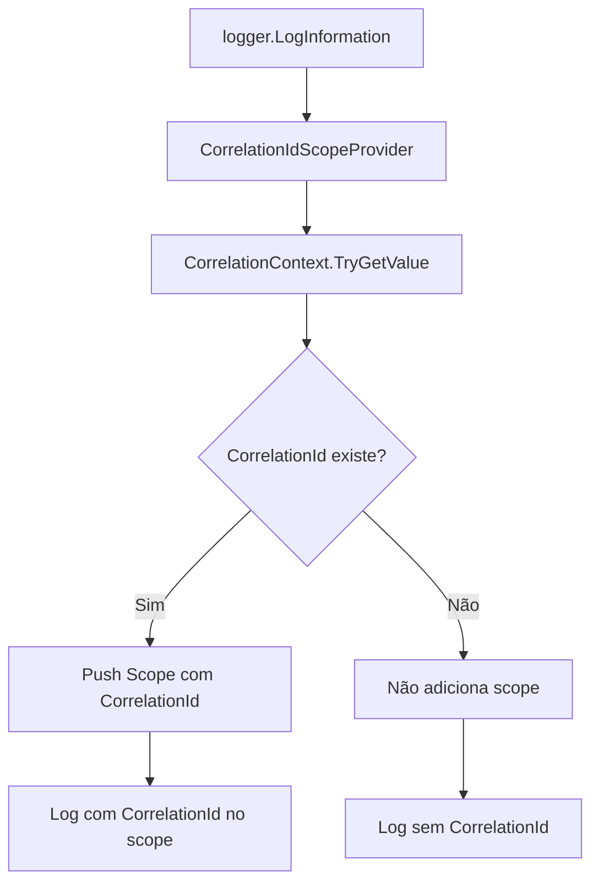

# Traceability - Arquitetura e Guia para LLMs

## METADATA E CONTEXTO INICIAL

### Informações do Projeto
- **Nome**: Traceability
- **Versão**: 1.0.0
- **Tipo**: Pacote NuGet
- **Licença**: MIT
- **Autor**: WhiteBeard IT

### Frameworks Suportados
- **.NET 8.0**: Suporte completo para ASP.NET Core
- **.NET Framework 4.8**: Suporte para ASP.NET Web API e ASP.NET Tradicional

### Dependências Principais

#### .NET 8.0
- `Microsoft.AspNetCore.Http.Abstractions` (2.2.0)
- `Microsoft.Extensions.Http` (8.0.0)
- `Microsoft.Extensions.Logging.Abstractions` (8.0.0)
- `Polly` (8.3.1)

#### .NET Framework 4.8
- `Polly` (7.2.3)
- `Microsoft.AspNet.WebApi.Client` (5.2.9)
- `Microsoft.Extensions.Logging.Abstractions` (2.1.1)
- `Microsoft.Extensions.DependencyInjection.Abstractions` (2.1.1)

#### Comum
- `Serilog` (3.1.1) - PrivateAssets: all

### Estrutura de Namespaces
```
Traceability
├── Traceability                          # Core: CorrelationContext
├── Traceability.Configuration            # Opções de configuração
├── Traceability.Extensions               # Extensões para DI e middleware
├── Traceability.HttpClient               # Integração com HttpClient
├── Traceability.Logging                  # Integrações de logging
├── Traceability.Middleware               # Middleware e handlers HTTP
└── Traceability.WebApi                   # Handlers específicos Web API
```

## ARQUITETURA DE ALTO NÍVEL

### Diagrama de Componentes



### Fluxo de Dados Principal



## COMPONENTES CORE - DETALHAMENTO TÉCNICO

### 1. CorrelationContext

**Localização**: `src/Traceability/CorrelationContext.cs`

**Responsabilidade**: Gerenciar o correlation-id no contexto assíncrono da thread atual usando `AsyncLocal<string>`.

**API Pública**:
```csharp
public static class CorrelationContext
{
    // Propriedades
    public static string Current { get; set; }
    public static bool HasValue { get; }
    
    // Métodos
    public static bool TryGetValue(out string? value);
    public static string GetOrCreate();
    public static void Clear();
}
```

**Dependências**: Nenhuma (classe estática pura)

**Comportamento**:
- Usa `AsyncLocal<string>` para isolamento entre contextos assíncronos
- Gera GUID formatado sem hífens (32 caracteres) quando necessário
- Thread-safe e async-safe
- Isolamento automático entre diferentes contextos assíncronos

**Exemplo de Uso**:
```csharp
// Obter ou criar correlation-id
var correlationId = CorrelationContext.Current;

// Verificar se existe
if (CorrelationContext.HasValue)
{
    var id = CorrelationContext.Current;
}

// Tentar obter sem criar (recomendado para evitar criação indesejada)
if (CorrelationContext.TryGetValue(out var correlationId))
{
    // Usar correlationId
}

// Limpar contexto
CorrelationContext.Clear();
```

**Decisões de Design**:
- `AsyncLocal` ao invés de `ThreadLocal` para suportar async/await corretamente
- GUID sem hífens para compatibilidade e legibilidade em logs
- Propriedade `Current` cria automaticamente se não existir (lazy initialization)

### 2. CorrelationIdMiddleware (ASP.NET Core)

**Localização**: `src/Traceability/Middleware/CorrelationIdMiddleware.cs`

**Condição de Compilação**: `#if NET8_0`

**Responsabilidade**: Middleware para ASP.NET Core que gerencia correlation-id automaticamente em requisições HTTP.

**API Pública**:
```csharp
public class CorrelationIdMiddleware
{
    public CorrelationIdMiddleware(RequestDelegate next, IOptions<TraceabilityOptions>? options = null);
    public Task InvokeAsync(HttpContext context);
}
```

**Dependências**:
- `Microsoft.AspNetCore.Http`
- `Traceability.CorrelationContext`

**Comportamento**:
1. Lê header `X-Correlation-Id` da requisição
2. Se existir, usa o valor e armazena em `CorrelationContext`
3. Se não existir, gera novo via `CorrelationContext.GetOrCreate()`
4. Adiciona correlation-id no header da resposta

**Header Padrão**: `X-Correlation-Id`

**Exemplo de Uso**:
```csharp
// Program.cs
app.UseCorrelationId();
```

### 3. CorrelationIdMessageHandler (ASP.NET Web API)

**Localização**: `src/Traceability/WebApi/CorrelationIdMessageHandler.cs`

**Condição de Compilação**: `#if NET48`

**Responsabilidade**: MessageHandler para ASP.NET Web API que gerencia correlation-id.

**API Pública**:
```csharp
public class CorrelationIdMessageHandler : DelegatingHandler
{
    public static void Configure(TraceabilityOptions options);
    protected override Task<HttpResponseMessage> SendAsync(
        HttpRequestMessage request,
        CancellationToken cancellationToken);
}
```

**Dependências**:
- `System.Net.Http`
- `System.Web.Http`
- `Traceability.CorrelationContext`
- `Traceability.Configuration`

**Comportamento**: Similar ao Middleware, mas adaptado para o pipeline do Web API. Como .NET Framework não tem DI nativo, usa configuração estática via `Configure()`.

**Exemplo de Uso**:
```csharp
// Global.asax.cs - Configurar opções (opcional)
CorrelationIdMessageHandler.Configure(new TraceabilityOptions
{
    HeaderName = "X-Correlation-Id",
    ValidateCorrelationIdFormat = true
});

GlobalConfiguration.Configure(config =>
{
    config.MessageHandlers.Add(new CorrelationIdMessageHandler());
});
```

### 4. CorrelationIdHttpModule (ASP.NET Tradicional)

**Localização**: `src/Traceability/Middleware/CorrelationIdHttpModule.cs`

**Condição de Compilação**: `#if NET48`

**Responsabilidade**: HttpModule para ASP.NET tradicional que gerencia correlation-id.

**API Pública**:
```csharp
public class CorrelationIdHttpModule : IHttpModule
{
    public static void Configure(TraceabilityOptions options);
    public void Init(HttpApplication context);
    public void Dispose();
}
```

**Dependências**:
- `System.Web`
- `Traceability.CorrelationContext`
- `Traceability.Configuration`

**Comportamento**: Intercepta eventos `BeginRequest` e `PreSendRequestHeaders` do pipeline do IIS. Como .NET Framework não tem DI nativo, usa configuração estática via `Configure()`.

**Exemplo de Uso**:
```csharp
// Global.asax.cs - Configurar opções (opcional, antes do módulo ser usado)
CorrelationIdHttpModule.Configure(new TraceabilityOptions
{
    HeaderName = "X-Correlation-Id",
    ValidateCorrelationIdFormat = true
});
```

```xml
<!-- web.config -->
<system.webServer>
  <modules>
    <add name="CorrelationIdHttpModule" 
         type="Traceability.Middleware.CorrelationIdHttpModule, Traceability" />
  </modules>
</system.webServer>
```

### 5. CorrelationIdHandler (HttpClient)

**Localização**: `src/Traceability/HttpClient/CorrelationIdHandler.cs`

**Responsabilidade**: DelegatingHandler que adiciona automaticamente correlation-id nos headers das requisições HTTP.

**API Pública**:
```csharp
public class CorrelationIdHandler : DelegatingHandler
{
    // .NET 8.0 apenas
    public CorrelationIdHandler(IOptions<TraceabilityOptions>? options = null);
    
    protected override Task<HttpResponseMessage> SendAsync(
        HttpRequestMessage request,
        CancellationToken cancellationToken);
    
    // .NET 8.0 apenas
    protected override HttpResponseMessage Send(
        HttpRequestMessage request,
        CancellationToken cancellationToken);
}
```

**Dependências**:
- `System.Net.Http`
- `Traceability.CorrelationContext`
- `.NET 8`: `Microsoft.Extensions.Options`, `Traceability.Configuration`

**Comportamento**:
- Usa `CorrelationContext.TryGetValue()` para obter correlation-id sem criar um novo se não existir
- Remove header existente (se houver)
- Adiciona `X-Correlation-Id` ao header da requisição apenas se correlation-id existir no contexto

**Exemplo de Uso**:
```csharp
// Com IHttpClientFactory
services.AddHttpClient("MyClient")
    .AddHttpMessageHandler<CorrelationIdHandler>();

// Ou diretamente
var handler = new CorrelationIdHandler();
var client = new HttpClient(handler);
```

### 6. TraceableHttpClientFactory

**Localização**: `src/Traceability/HttpClient/TraceableHttpClientFactory.cs`

**Responsabilidade**: Factory para criar HttpClient configurado com correlation-id usando IHttpClientFactory. Previne socket exhaustion ao reutilizar conexões HTTP.

**API Pública**:
```csharp
public class TraceableHttpClientFactory
{
    // ✅ RECOMENDADO - Previne socket exhaustion (.NET 8)
    public static HttpClient CreateFromFactory(
        IHttpClientFactory factory,
        string? clientName = null,
        string? baseAddress = null);
}

// Método de extensão para IServiceCollection (.NET 8)
public static IHttpClientBuilder AddTraceableHttpClient(
    this IServiceCollection services,
    string clientName,
    Action<HttpClient>? configureClient = null);
```

**Dependências**:
- `Traceability.HttpClient.CorrelationIdHandler`
- `.NET 8`: `Microsoft.Extensions.Http`, `Microsoft.Extensions.DependencyInjection`

**Comportamento**:
- Usa `IHttpClientFactory` que gerencia pool de conexões HTTP
- Reutiliza sockets, prevenindo socket exhaustion
- Suporta políticas Polly via `.AddPolicyHandler()` do IHttpClientBuilder

**Exemplo de Uso**:
```csharp
// ✅ RECOMENDADO - Previne socket exhaustion
// Program.cs
builder.Services.AddTraceableHttpClient("ExternalApi", client =>
{
    client.BaseAddress = new Uri("https://api.example.com/");
    client.Timeout = TimeSpan.FromSeconds(30);
})
.AddPolicyHandler(retryPolicy); // Com Polly

// No serviço ou controller
var client = _httpClientFactory.CreateClient("ExternalApi");
```

### 7. CorrelationIdEnricher (Serilog)

**Localização**: `src/Traceability/Logging/CorrelationIdEnricher.cs`

**Responsabilidade**: Enricher do Serilog que adiciona correlation-id aos logs.

**API Pública**:
```csharp
public class CorrelationIdEnricher : ILogEventEnricher
{
    public void Enrich(LogEvent logEvent, ILogEventPropertyFactory propertyFactory);
}
```

**Dependências**:
- `Serilog`
- `Traceability.CorrelationContext`

**Comportamento**:
- Adiciona propriedade `CorrelationId` a todos os eventos de log se existir no contexto
- Usa `CorrelationContext.TryGetValue()` para evitar criar correlation-id indesejadamente
- Se não houver correlation-id no contexto, não adiciona nada ao log (não cria um novo)

**Exemplo de Uso**:
```csharp
Log.Logger = new LoggerConfiguration()
    .Enrich.With<CorrelationIdEnricher>()
    .WriteTo.Console(
        outputTemplate: "[{Timestamp:HH:mm:ss} {Level:u3}] {CorrelationId} {Message:lj}")
    .CreateLogger();
```

### 8. CorrelationIdScopeProvider (Microsoft.Extensions.Logging)

**Localização**: `src/Traceability/Logging/CorrelationIdScopeProvider.cs`

**Responsabilidade**: Provider de scope para Microsoft.Extensions.Logging que adiciona correlation-id.

**API Pública**:
```csharp
public class CorrelationIdScopeProvider : IExternalScopeProvider
{
    public CorrelationIdScopeProvider(IExternalScopeProvider? innerProvider = null);
    public void ForEachScope<TState>(Action<object?, TState> callback, TState state);
    public IDisposable Push(object? state);
}
```

**Dependências**:
- `Microsoft.Extensions.Logging`
- `Traceability.CorrelationContext`

**Comportamento**:
- Adiciona `CorrelationId` ao scope de logging se existir no contexto
- Usa `CorrelationContext.TryGetValue()` para evitar criar correlation-id indesejadamente
- Se não houver correlation-id no contexto, não adiciona ao scope (não cria um novo)
- Suporta provider interno para encadeamento

**Exemplo de Uso**:
```csharp
// RECOMENDADO (.NET 8): AddTraceability decora o IExternalScopeProvider do logging
// para incluir CorrelationId nos scopes.
builder.Services.AddTraceability("UserService");
builder.Logging.AddConsole(options => options.IncludeScopes = true);
```

### 9. SourceEnricher (Serilog)

**Localização**: `src/Traceability/Logging/SourceEnricher.cs`

**Responsabilidade**: Enricher do Serilog que adiciona o campo `Source` aos logs. O campo `Source` identifica a origem/serviço que está gerando os logs, essencial para unificar logs em ambientes distribuídos.

**API Pública**:
```csharp
public class SourceEnricher : ILogEventEnricher
{
    public SourceEnricher(string source);
    public void Enrich(LogEvent logEvent, ILogEventPropertyFactory propertyFactory);
}
```

**Dependências**:
- `Serilog`
- Nenhuma dependência de `CorrelationContext` (Source sempre é adicionado)

**Comportamento**:
- Sempre adiciona propriedade `Source` a todos os eventos de log
- Usa cache para reduzir alocações (similar ao `CorrelationIdEnricher`)
- Source é obrigatório no construtor (não pode ser null ou vazio)

**Exemplo de Uso**:
```csharp
Log.Logger = new LoggerConfiguration()
    .WithTraceability("UserService")
    .WriteTo.Console(
        outputTemplate: "[{Timestamp:HH:mm:ss} {Level:u3}] {Source} {CorrelationId} {Message:lj}")
    .CreateLogger();
```

**Nota**: O campo `Source` sempre será adicionado aos logs, independentemente da presença de correlation-id.

### 10. SourceScopeProvider (Microsoft.Extensions.Logging)

**Localização**: `src/Traceability/Logging/SourceScopeProvider.cs`

**Responsabilidade**: Provider de scope para Microsoft.Extensions.Logging que adiciona o campo `Source`. O campo `Source` identifica a origem/serviço que está gerando os logs.

**API Pública**:
```csharp
public class SourceScopeProvider : IExternalScopeProvider
{
    public SourceScopeProvider(string source, IExternalScopeProvider? innerProvider = null);
    public void ForEachScope<TState>(Action<object?, TState> callback, TState state);
    public IDisposable Push(object? state);
}
```

**Dependências**:
- `Microsoft.Extensions.Logging`
- Nenhuma dependência de `CorrelationContext` (Source sempre é adicionado)

**Comportamento**:
- Sempre adiciona `Source` ao scope de logging
- Suporta provider interno para encadeamento (decorator pattern)
- Source é obrigatório no construtor (não pode ser null ou vazio)

**Exemplo de Uso**:
```csharp
// RECOMENDADO (.NET 8): Source + CorrelationId via AddTraceability
builder.Services.AddTraceability("UserService");
builder.Logging.AddConsole(options => options.IncludeScopes = true);
```

**Nota**: O campo `Source` sempre será adicionado ao scope, independentemente da presença de correlation-id.

### 11. DataEnricher (Serilog)

**Localização**: `src/Traceability/Logging/DataEnricher.cs`

**Responsabilidade**: Enricher do Serilog que detecta objetos complexos nas propriedades do log e os serializa em um campo `data`. Identifica objetos não primitivos e os agrupa em um único campo `data` no JSON de saída.

**API Pública**:
```csharp
public class DataEnricher : ILogEventEnricher
{
    public void Enrich(LogEvent logEvent, ILogEventPropertyFactory propertyFactory);
}
```

**Dependências**:
- `Serilog`
- Nenhuma dependência de `CorrelationContext`

**Comportamento**:
- Analisa todas as propriedades do LogEvent
- Identifica objetos complexos (StructureValue, DictionaryValue, SequenceValue)
- Ignora propriedades primitivas (strings, números, DateTime, etc.)
- Ignora propriedades conhecidas (Source, CorrelationId, Message, etc.)
- Serializa objetos complexos em um campo `data`
- Se múltiplos objetos, combina em um único objeto `data`

**Exemplo de Uso**:
```csharp
Log.Logger = new LoggerConfiguration()
    .Enrich.With<DataEnricher>()
    .WriteTo.Console(new JsonFormatter())
    .CreateLogger();

var user = new { UserId = 123, UserName = "john.doe" };
Log.Information("Processando requisição {@User}", user);
// Output: JSON com campo "data" contendo o objeto serializado
```

**Nota**: O `DataEnricher` é adicionado automaticamente quando você usa `WithTraceabilityJson()` com `LogIncludeData = true`.

### 12. JsonFormatter (Serilog)

**Localização**: `src/Traceability/Logging/JsonFormatter.cs`

**Responsabilidade**: Formatter JSON customizado para Serilog que formata logs em JSON estruturado. Suporta configuração via TraceabilityOptions para incluir/excluir campos específicos.

**API Pública**:
```csharp
public class JsonFormatter : ITextFormatter
{
    public JsonFormatter(TraceabilityOptions? options = null, bool indent = false);
    public void Format(LogEvent logEvent, TextWriter output);
}
```

**Dependências**:
- `Serilog`
- `Traceability.Configuration`

**Comportamento**:
- Formata logs em JSON estruturado
- Respeita as opções de `TraceabilityOptions` para incluir/excluir campos
- Suporta JSON compacto ou indentado
- Inclui automaticamente: Timestamp, Level, Source, CorrelationId, Message, Data, Exception (conforme configuração)

**Exemplo de Uso**:
```csharp
var options = new TraceabilityOptions
{
    Source = "UserService",
    LogIncludeData = true,
    LogIncludeTimestamp = true
};

Log.Logger = new LoggerConfiguration()
    .WithTraceabilityJson(options)
    .WriteTo.Console(new JsonFormatter(options, indent: true))
    .CreateLogger();
```

**Output Esperado (JSON Indentado)**:
```json
{
  "Timestamp": "2024-01-15T14:23:45.123Z",
  "Level": "Information",
  "Source": "UserService",
  "CorrelationId": "a1b2c3d4e5f6789012345678901234ab",
  "Message": "Processando requisição",
  "Data": {
    "UserId": 123,
    "UserName": "john.doe"
  }
}
```

### 13. TraceabilityOptions

**Localização**: `src/Traceability/Configuration/TraceabilityOptions.cs`

**Responsabilidade**: Opções de configuração para o pacote.

**API Pública**:
```csharp
public enum LogOutputFormat
{
    JsonCompact,
    JsonIndented,
    Text
}

public class TraceabilityOptions
{
    public string HeaderName { get; set; } = "X-Correlation-Id";
    public bool AlwaysGenerateNew { get; set; } = false;
    public bool ValidateCorrelationIdFormat { get; set; } = false;
    public string? Source { get; set; }
    public LogOutputFormat LogOutputFormat { get; set; } = LogOutputFormat.JsonCompact;
    public bool LogIncludeTimestamp { get; set; } = true;
    public bool LogIncludeLevel { get; set; } = true;
    public bool LogIncludeSource { get; set; } = true;
    public bool LogIncludeCorrelationId { get; set; } = true;
    public bool LogIncludeMessage { get; set; } = true;
    public bool LogIncludeData { get; set; } = true;
    public bool LogIncludeException { get; set; } = true;
}
```

**Propriedades**:
- `HeaderName`: Nome do header HTTP para correlation-id (padrão: "X-Correlation-Id")
- `AlwaysGenerateNew`: Se true, gera um novo correlation-id mesmo se já existir um no contexto (padrão: false)
- `ValidateCorrelationIdFormat`: Se true, valida o formato do correlation-id recebido no header (padrão: false)
- `Source`: Nome da origem/serviço que está gerando os logs (opcional, mas recomendado para unificar logs distribuídos)
- `LogOutputFormat`: Formato de saída para logs (padrão: JsonCompact)
- `LogIncludeTimestamp`: Se deve incluir timestamp nos logs (padrão: true)
- `LogIncludeLevel`: Se deve incluir level nos logs (padrão: true)
- `LogIncludeSource`: Se deve incluir Source nos logs (padrão: true)
- `LogIncludeCorrelationId`: Se deve incluir CorrelationId nos logs (padrão: true)
- `LogIncludeMessage`: Se deve incluir Message nos logs (padrão: true)
- `LogIncludeData`: Se deve incluir campo Data para objetos serializados nos logs (padrão: true)
- `LogIncludeException`: Se deve incluir Exception nos logs (padrão: true)

### 14. Variáveis de Ambiente e Prioridade de Configuração

**Localização**: Implementado em `src/Traceability/Extensions/LoggerConfigurationExtensions.cs` e `src/Traceability/Extensions/ServiceCollectionExtensions.cs`

**Responsabilidade**: Suportar variáveis de ambiente para reduzir verbosidade na configuração e garantir uniformização de logs em todas as aplicações e serviços.

**Variáveis de Ambiente Suportadas**:

1. **`TRACEABILITY_SERVICENAME`**: Define o nome do serviço/origem que está gerando os logs. Este valor será adicionado ao campo `Source` em todos os logs.

2. **`LOG_LEVEL`**: Define o nível mínimo de log (Verbose, Debug, Information, Warning, Error, Fatal).

**Fluxo de Decisão para Source (ServiceName)**:



**Prioridade de Configuração**:

1. **Source (ServiceName)**:
   - Prioridade 1: Parâmetro `source` fornecido explicitamente (prioridade máxima)
   - Prioridade 2: `TraceabilityOptions.Source` definido nas opções
   - Prioridade 3: Variável de ambiente `TRACEABILITY_SERVICENAME`
   - Se nenhum estiver disponível, uma exceção `InvalidOperationException` será lançada para forçar o padrão único

2. **LogLevel**:
   - Prioridade 1: Variável de ambiente `LOG_LEVEL` (prioridade máxima)
   - Prioridade 2: `TraceabilityOptions.MinimumLogLevel` definido nas opções
   - Prioridade 3: Information (padrão)

3. **Output Format**: Sempre JSON (JsonCompact ou JsonIndented, nunca Text)

**Output JSON Obrigatório**:

Todos os logs gerados pelo Traceability são sempre em formato JSON para garantir uniformização entre diferentes aplicações e serviços, independente do framework (.NET 8 ou .NET Framework 4.8). O formato JSON padrão inclui:
- `Timestamp`: Data e hora do log
- `Level`: Nível do log (Information, Warning, Error, etc.)
- `Source`: Nome do serviço (obtido de `TRACEABILITY_SERVICENAME` ou parâmetro)
- `CorrelationId`: ID de correlação (quando disponível)
- `Message`: Mensagem do log
- `Data`: Objetos serializados (quando presente)
- `Exception`: Informações de exceção (quando presente)

**Exemplo de Uso**:

```csharp
// Com variável de ambiente TRACEABILITY_SERVICENAME="UserService" definida
Log.Logger = new LoggerConfiguration()
    .WithTraceability() // source opcional - lê de TRACEABILITY_SERVICENAME
    .WriteTo.Console(new JsonFormatter())
    .CreateLogger();

// Com parâmetro explícito (sobrescreve env var)
Log.Logger = new LoggerConfiguration()
    .WithTraceability("CustomService") // parâmetro tem prioridade
    .WriteTo.Console(new JsonFormatter())
    .CreateLogger();

// Com AddTraceability
builder.Services.AddTraceability(); // source opcional - lê de TRACEABILITY_SERVICENAME
// ou
builder.Services.AddTraceability("CustomService"); // sobrescreve env var
```

**Racional**:

- **Reduzir Verbosidade**: Permite configurar ServiceName e LogLevel via variáveis de ambiente, reduzindo a necessidade de código repetitivo
- **Forçar Padrão Único**: Se Source não estiver disponível (nem parâmetro, nem options, nem env var), uma exceção é lançada para garantir que todos os serviços sigam o mesmo padrão
- **Uniformização de Logs**: Output sempre em JSON garante que todos os logs de diferentes aplicações e serviços tenham o mesmo formato, facilitando análise e correlação

### 10. Extensions

#### ServiceCollectionExtensions

**Localização**: `src/Traceability/Extensions/ServiceCollectionExtensions.cs`

**Condição de Compilação**: `#if NET8_0`

**Métodos**:
```csharp
// Sobrecarga 1: Configuração via Action (Source pode vir de options ou env var)
public static IServiceCollection AddTraceability(
    this IServiceCollection services,
    Action<TraceabilityOptions>? configureOptions = null);

// Sobrecarga 2: Configuração com Source direto (opcional - pode vir de env var)
public static IServiceCollection AddTraceability(
    this IServiceCollection services,
    string? source = null,
    Action<TraceabilityOptions>? configureOptions = null);

public static IServiceCollection AddTraceabilityLogging(
    this IServiceCollection services,
    string? source = null,
    Action<TraceabilityOptions>? configureOptions = null);
```

**Comportamento**:
- `AddTraceability()` e `AddTraceabilityLogging()` agora aceitam `source` como opcional
- Se `source` não for fornecido, será lido de `TraceabilityOptions.Source` ou variável de ambiente `TRACEABILITY_SERVICENAME`
- Se nenhum source estiver disponível, uma exceção `InvalidOperationException` será lançada
- Prioridade: Parâmetro > Options.Source > Env Var > Erro

public static IServiceCollection AddTraceableHttpClient<TClient>(
    this IServiceCollection services,
    string? baseAddress = null)
    where TClient : class, ITraceableHttpClient;

public static IHttpClientBuilder AddTraceableHttpClient(
    this IServiceCollection services,
    string clientName,
    Action<HttpClient>? configureClient = null);
```

#### ApplicationBuilderExtensions

**Localização**: `src/Traceability/Extensions/ApplicationBuilderExtensions.cs`

**Condição de Compilação**: `#if NET8_0`

**Métodos**:
```csharp
public static IApplicationBuilder UseCorrelationId(this IApplicationBuilder app);
```

#### HttpClientExtensions

**Localização**: `src/Traceability/Extensions/HttpClientExtensions.cs`

**Métodos**:
```csharp
public static HttpClient AddCorrelationIdHeader(
    this HttpClient client,
    HttpRequestMessage request);
```

#### LoggerConfigurationExtensions

**Localização**: `src/Traceability/Extensions/LoggerConfigurationExtensions.cs`

**Responsabilidade**: Extensões para LoggerConfiguration do Serilog que facilitam a configuração de traceability.

**Métodos**:
```csharp
// Método original - adiciona Source e CorrelationId (source opcional)
public static LoggerConfiguration WithTraceability(
    this LoggerConfiguration config,
    string? source = null);

// Novo método - adiciona Source, CorrelationId e DataEnricher para template JSON (source opcional)
public static LoggerConfiguration WithTraceabilityJson(
    this LoggerConfiguration config,
    string? source = null,
    Action<TraceabilityOptions>? configureOptions = null);

// Sobrecarga com TraceabilityOptions
public static LoggerConfiguration WithTraceabilityJson(
    this LoggerConfiguration config,
    TraceabilityOptions options);
```

**Comportamento**:
- `WithTraceability()`: Adiciona automaticamente `SourceEnricher` e `CorrelationIdEnricher` ao Serilog
- `WithTraceabilityJson()`: Adiciona `SourceEnricher`, `CorrelationIdEnricher` e `DataEnricher` (se `LogIncludeData = true`)
- Source é opcional e pode vir de variável de ambiente `TRACEABILITY_SERVICENAME` ou `TraceabilityOptions.Source`
- Se nenhum source estiver disponível (nem parâmetro, nem options, nem env var), uma exceção `InvalidOperationException` será lançada
- Prioridade: Parâmetro > Options.Source > Env Var > Erro
- Output sempre em formato JSON para garantir uniformização
- Facilita configuração de traceability em uma única chamada
- `WithTraceabilityJson()` é otimizado para uso com template JSON padrão

**Exemplo de Uso**:
```csharp
// Configuração básica
Log.Logger = new LoggerConfiguration()
    .WithTraceability("UserService")
    .WriteTo.Console()
    .CreateLogger();

// Configuração com template JSON padrão
Log.Logger = new LoggerConfiguration()
    .WithTraceabilityJson("UserService")
    .WriteTo.Console(new JsonFormatter())
    .CreateLogger();

// Configuração customizada
Log.Logger = new LoggerConfiguration()
    .WithTraceabilityJson("UserService", options =>
    {
        options.LogIncludeData = true;
        options.LogOutputFormat = LogOutputFormat.JsonIndented;
    })
    .WriteTo.Console(new JsonFormatter(options, indent: true))
    .CreateLogger();
```

## PADRÕES DE IMPLEMENTAÇÃO

### 1. Conditional Compilation

**Padrão**: Usar diretivas `#if` para código específico de framework.

**Regras**:
- `#if NET8_0` para código ASP.NET Core
- `#if NET48` para código .NET Framework
- Sempre fechar com `#endif`
- Código comum (sem diretiva) funciona em ambos

**Exemplo**:
```csharp
#if NET8_0
using Microsoft.AspNetCore.Http;
// Código específico .NET 8
#endif

#if NET48
using System.Web;
// Código específico .NET Framework
#endif

// Código comum
```

### 2. AsyncLocal para Isolamento Assíncrono

**Padrão**: Sempre usar `AsyncLocal<string>` para armazenar correlation-id.

**Razão**: `AsyncLocal` preserva valores através de continuidades assíncronas, enquanto `ThreadLocal` não.

**Implementação**:
```csharp
private static readonly AsyncLocal<string> _correlationId = new AsyncLocal<string>();
```

**Comportamento**:
- Cada contexto assíncrono tem seu próprio valor
- Valor é preservado através de `await`
- Isolado entre diferentes `Task.Run()` ou threads

### 3. Padrão Factory para HttpClient

**Padrão**: Usar factory para criar HttpClient configurado.

**Implementação**: `TraceableHttpClientFactory`

**Vantagens**:
- Centraliza configuração
- Facilita adição de handlers
- Suporta políticas Polly

### 4. Padrão DelegatingHandler

**Padrão**: Usar `DelegatingHandler` para interceptar requisições HTTP.

**Implementação**: `CorrelationIdHandler`

**Comportamento**:
- Intercepta antes de enviar requisição
- Adiciona header automaticamente
- Preserva pipeline de handlers

### 5. Padrão Enricher (Serilog)

**Padrão**: Implementar `ILogEventEnricher` para adicionar propriedades aos logs.

**Implementação**: `CorrelationIdEnricher`

**Comportamento**:
- Chamado para cada evento de log
- Adiciona propriedade `CorrelationId`
- Não modifica outros enrichers

### 6. Padrão ScopeProvider (Microsoft.Extensions.Logging)

**Padrão**: Implementar `IExternalScopeProvider` para adicionar scopes.

**Implementação**: `CorrelationIdScopeProvider`

**Comportamento**:
- Adiciona scope com `CorrelationId`
- Suporta provider interno (decorator pattern)
- Preserva scopes existentes

### 7. Convenções de Nomenclatura

- **Classes**: PascalCase
- **Métodos**: PascalCase
- **Propriedades**: PascalCase
- **Campos privados**: `_camelCase` (underscore prefix)
- **Constantes**: PascalCase
- **Namespaces**: `Traceability.[SubNamespace]`

### 8. Geração de Correlation-ID

**Formato**: GUID sem hífens (32 caracteres)

**Implementação**:
```csharp
private static string GenerateNew()
{
    return Guid.NewGuid().ToString("N");
}
```

**Razão**: 
- Compacto (32 chars vs 36 com hífens)
- Compatível com sistemas externos
- Legível em logs

## ESTRUTURA DE DIRETÓRIOS - MAPA COMPLETO

```
src/Traceability/
├── Configuration/
│   └── TraceabilityOptions.cs          # Opções de configuração
│
├── CorrelationContext.cs                # Core: Gerenciamento de contexto
│
├── Extensions/
│   ├── ApplicationBuilderExtensions.cs  # Extensão para IApplicationBuilder (.NET 8)
│   ├── HttpClientExtensions.cs          # Extensões para HttpClient
│   ├── LoggerConfigurationExtensions.cs # Extensão para LoggerConfiguration (Serilog)
│   └── ServiceCollectionExtensions.cs   # Extensão para IServiceCollection (.NET 8)
│
├── HttpClient/
│   ├── CorrelationIdHandler.cs          # DelegatingHandler para HttpClient
│   ├── ITraceableHttpClient.cs          # Interface (não implementada)
│   └── TraceableHttpClientFactory.cs    # Factory para criar HttpClient
│
├── Logging/
│   ├── CorrelationIdEnricher.cs        # Enricher para Serilog
│   ├── CorrelationIdScopeProvider.cs   # ScopeProvider para MEL
│   ├── DataEnricher.cs                  # Enricher que serializa objetos em "data"
│   ├── JsonFormatter.cs                 # Formatter JSON customizado
│   ├── SourceEnricher.cs               # Enricher Source para Serilog
│   └── SourceScopeProvider.cs          # ScopeProvider Source para MEL
│
├── Middleware/
│   ├── CorrelationIdHttpModule.cs      # HttpModule (.NET Framework)
│   └── CorrelationIdMiddleware.cs      # Middleware (.NET 8)
│
├── WebApi/
│   └── CorrelationIdMessageHandler.cs  # MessageHandler (.NET Framework Web API)
│
└── Traceability.csproj                  # Arquivo de projeto
```

### Descrição por Diretório

#### Configuration/
- **Propósito**: Classes de configuração
- **Quando usar**: Para adicionar novas opções de configuração
- **Arquivos**: `TraceabilityOptions.cs`

#### Extensions/
- **Propósito**: Métodos de extensão para facilitar uso
- **Quando usar**: Para adicionar métodos de conveniência
- **Arquivos**: Extensões para DI, middleware, HttpClient

#### HttpClient/
- **Propósito**: Integração com HttpClient
- **Quando usar**: Para modificar comportamento de HTTP ou adicionar novos handlers
- **Arquivos**: Handlers, factory, interfaces

#### Logging/
- **Propósito**: Integrações com sistemas de logging
- **Quando usar**: Para adicionar suporte a novos loggers
- **Arquivos**: Enrichers, scope providers

#### Middleware/
- **Propósito**: Middleware e handlers HTTP
- **Quando usar**: Para adicionar novos pontos de interceptação HTTP
- **Arquivos**: Middleware (.NET 8), HttpModule (.NET Framework)

#### WebApi/
- **Propósito**: Handlers específicos para ASP.NET Web API
- **Quando usar**: Para funcionalidades específicas do Web API
- **Arquivos**: MessageHandlers

## FLUXOS DE DADOS DETALHADOS

### Fluxo: Requisição ASP.NET Core (.NET 8)



### Fluxo: Requisição ASP.NET Framework 4.8



### Propagação em Chamadas HTTP Encadeadas



**Comportamento**:
1. Serviço A recebe requisição sem header → gera `abc123`
2. Serviço A chama Serviço B com header `X-Correlation-Id: abc123`
3. Serviço B lê header e usa `abc123` (não gera novo)
4. Serviço B chama Serviço C com mesmo header
5. Processo continua até o fim da cadeia

**Regra**: Nunca gerar novo correlation-id se já existir no header da requisição.

### Integração com Logging

#### Serilog



#### Microsoft.Extensions.Logging



## REGRAS E CONSTRAINTS PARA LLMs

### Regras Obrigatórias

1. **Sempre usar `AsyncLocal` para contexto assíncrono**
   - ❌ Nunca usar `ThreadLocal`
   - ❌ Nunca usar variáveis estáticas simples
   - ✅ Sempre usar `AsyncLocal<string>`

2. **Sempre compilar condicionalmente código específico de framework**
   - ❌ Nunca misturar código .NET 8 e .NET Framework sem `#if`
   - ✅ Usar `#if NET8_0` para código ASP.NET Core
   - ✅ Usar `#if NET48` para código .NET Framework
   - ✅ Sempre fechar com `#endif`

3. **Header padrão: `X-Correlation-Id`**
   - ✅ Usar constante `"X-Correlation-Id"` (futuramente via `TraceabilityOptions`)
   - ❌ Nunca usar outros nomes de header sem configuração

4. **GUID formatado sem hífens (32 caracteres)**
   - ✅ Usar `Guid.NewGuid().ToString("N")`
   - ❌ Nunca usar `ToString()` sem parâmetro (36 caracteres)

5. **Nunca modificar correlation-id existente**
   - ✅ Se header existe na requisição, usar o valor
   - ✅ Se header não existe, gerar novo
   - ❌ Nunca sobrescrever correlation-id existente no contexto

6. **Isolamento assíncrono obrigatório**
   - ✅ Cada contexto assíncrono isolado mantém seu próprio correlation-id
   - ✅ `Task.Run()` cria novo contexto isolado
   - ✅ `await` preserva contexto

### Constraints de Design

1. **Sem dependências circulares**: Componentes não devem depender uns dos outros circularmente
2. **Thread-safe**: Todas as operações devem ser thread-safe
3. **Async-safe**: Todas as operações devem funcionar corretamente com async/await
4. **Zero configuração por padrão**: Funciona sem configuração, mas permite customização

### Validações Obrigatórias

Ao adicionar/modificar código, verificar:
- [ ] Compilação condicional correta (`#if NET8_0` / `#if NET48`)
- [ ] Uso de `AsyncLocal` para contexto
- [ ] Header `X-Correlation-Id` usado consistentemente
- [ ] GUID gerado sem hífens
- [ ] Não modifica correlation-id existente
- [ ] Testes unitários adicionados/atualizados
- [ ] Documentação XML atualizada

## DECISÕES DE DESIGN E RACIONAIS

### Por que `AsyncLocal` ao invés de `ThreadLocal`?

**Razão**: `AsyncLocal` preserva valores através de continuidades assíncronas, enquanto `ThreadLocal` não.

**Exemplo do problema com `ThreadLocal`**:
```csharp
// ❌ Com ThreadLocal (não funciona)
ThreadLocal<string> correlationId = new ThreadLocal<string>();
correlationId.Value = "abc123";
await SomeAsyncMethod(); // Contexto pode mudar de thread
// correlationId.Value pode ser null ou diferente
```

**Solução com `AsyncLocal`**:
```csharp
// ✅ Com AsyncLocal (funciona)
AsyncLocal<string> correlationId = new AsyncLocal<string>();
correlationId.Value = "abc123";
await SomeAsyncMethod(); // Valor preservado
// correlationId.Value ainda é "abc123"
```

### Por que suporte multi-framework?

**Razão**: 
- Muitas empresas ainda usam .NET Framework 4.8
- Migração gradual é comum
- Necessidade de rastreabilidade em ambos os ambientes

**Trade-off**: Código mais complexo com conditional compilation, mas maior compatibilidade.

### Por que não usar `Activity` do .NET?

**Razão**:
- `Activity` é parte do sistema de diagnóstico do .NET
- Mais pesado e complexo
- Requer configuração adicional
- `AsyncLocal` é mais simples e direto para este caso de uso
- Não requer dependências adicionais

**Quando considerar `Activity`**:
- Se precisar de integração com Application Insights
- Se precisar de distributed tracing completo
- Se precisar de spans e traces hierárquicos

### Por que Uniformização de Logs JSON e Variáveis de Ambiente?

**Razão**: Garantir que todos os logs de diferentes aplicações e serviços sigam o mesmo padrão, facilitando análise, correlação e monitoramento em ambientes distribuídos.

**Decisões de Design**:

1. **Output Sempre JSON**:
   - **Razão**: Formato JSON é estruturado, facilmente parseável e suportado por todas as ferramentas de log aggregation (ELK, Splunk, etc.)
   - **Benefício**: Uniformização automática entre diferentes aplicações e serviços
   - **Implementação**: Todos os métodos `WithTraceability()` e `WithTraceabilityJson()` garantem output JSON

2. **Variáveis de Ambiente para Source e LogLevel**:
   - **Razão**: Reduzir verbosidade na configuração e permitir alteração sem recompilação
   - **Benefício**: Configuração centralizada via variáveis de ambiente facilita gerenciamento em produção
   - **Prioridade**: Parâmetro > Options > Env Var > Erro (garante flexibilidade mas força padrão)

3. **Erro Quando Source Não Disponível**:
   - **Razão**: Forçar que todos os serviços tenham Source definido para garantir rastreabilidade
   - **Benefício**: Previne logs sem identificação de origem, facilitando debugging em ambientes distribuídos
   - **Trade-off**: Pode ser mais restritivo, mas garante qualidade dos logs

4. **Fluxo de Decisão para Source**:
   - **Razão**: Permitir múltiplas formas de configuração mantendo prioridade clara
   - **Benefício**: Flexibilidade para diferentes cenários (desenvolvimento, testes, produção)
   - **Implementação**: Método `GetServiceName()` centraliza a lógica de decisão

**Exemplo do Problema Resolvido**:
```csharp
// ❌ Antes: Cada serviço configura Source de forma diferente
// Serviço A
Log.Logger = new LoggerConfiguration()
    .Enrich.With(new SourceEnricher("ServiceA"))
    .WriteTo.Console() // Formato texto diferente
    .CreateLogger();

// Serviço B
Log.Logger = new LoggerConfiguration()
    .Enrich.With(new SourceEnricher("ServiceB"))
    .WriteTo.File("log.txt") // Formato diferente
    .CreateLogger();

// ✅ Agora: Todos os serviços seguem o mesmo padrão
// export TRACEABILITY_SERVICENAME="ServiceA"
Log.Logger = new LoggerConfiguration()
    .WithTraceability() // Source da env var, output JSON
    .WriteTo.Console(new JsonFormatter())
    .CreateLogger();

// export TRACEABILITY_SERVICENAME="ServiceB"
Log.Logger = new LoggerConfiguration()
    .WithTraceability() // Source da env var, output JSON
    .WriteTo.Console(new JsonFormatter())
    .CreateLogger();
```

### Trade-offs e Limitações Conhecidas

1. **✅ RESOLVIDO**: `TraceabilityOptions` agora está totalmente integrado
   - Header pode ser customizado via `HeaderName`
   - `AlwaysGenerateNew` é usado nos middlewares/handlers
   - `ValidateCorrelationIdFormat` adicionado para validação opcional

2. **Limitação**: `ITraceableHttpClient` interface existe mas não há implementação
   - Interface definida mas não utilizada

3. **Trade-off**: Conditional compilation aumenta complexidade
   - Benefício: Suporte multi-framework
   - Custo: Mais difícil de manter

4. **Limitação**: Não há suporte para correlation-id em mensageria (RabbitMQ, Kafka, etc.)
   - Apenas HTTP atualmente

5. **Trade-off**: GUID simples ao invés de IDs mais informativos
   - Benefício: Simples, único, sem colisões
   - Custo: Não contém informação semântica

6. **✅ RESOLVIDO - Socket Exhaustion**: Métodos que causavam socket exhaustion foram removidos
   - **Solução implementada**: Todos os métodos de criação de HttpClient usam `IHttpClientFactory`
   - **Métodos disponíveis**: `CreateFromFactory()` e `AddTraceableHttpClient()` (extensão)
   - **Status**: API limpa que força uso de boas práticas desde o início

## GUIA DE MODIFICAÇÃO PARA LLMs

### Como Adicionar Novo Componente

1. **Identificar localização**
   - Verificar estrutura de diretórios
   - Escolher diretório apropriado ou criar novo

2. **Definir responsabilidade única**
   - Componente deve ter uma responsabilidade clara
   - Seguir padrões existentes

3. **Implementar com conditional compilation**
   ```csharp
   #if NET8_0
   // Código .NET 8
   #endif
   
   #if NET48
   // Código .NET Framework
   #endif
   ```

4. **Adicionar dependências**
   - Usar `CorrelationContext` se precisar de correlation-id
   - Seguir padrão de injeção de dependência se aplicável

5. **Adicionar testes**
   - Criar arquivo em `tests/Traceability.Tests/`
   - Testar ambos os frameworks se aplicável

6. **Atualizar documentação**
   - Adicionar XML comments
   - Atualizar README.md se necessário
   - Atualizar este AGENTS.md

### Como Manter Compatibilidade Multi-Framework

1. **Identificar código específico de framework**
   - APIs diferentes entre .NET 8 e .NET Framework
   - Namespaces diferentes

2. **Usar conditional compilation**
   ```csharp
   #if NET8_0
   using Microsoft.AspNetCore.Http;
   #endif
   
   #if NET48
   using System.Web;
   #endif
   ```

3. **Testar em ambos os frameworks**
   - Executar testes para .NET 8
   - Executar testes para .NET Framework 4.8

4. **Manter API pública consistente**
   - Mesma interface pública em ambos os frameworks
   - Comportamento idêntico

### Onde Adicionar Testes

**Estrutura de Testes**:
```
tests/Traceability.Tests/
├── CorrelationContextTests.cs
├── CorrelationIdHandlerTests.cs
├── CorrelationIdMiddlewareTests.cs
├── LoggingTests.cs
└── TraceableHttpClientFactoryTests.cs
```

**Padrão de Teste**:
- Usar xUnit
- Usar FluentAssertions para assertions
- Usar Moq para mocks quando necessário
- Nomear testes: `MethodName_Scenario_ExpectedBehavior`

**Exemplo**:
```csharp
[Fact]
public void Current_WhenNoValue_ShouldGenerateNew()
{
    // Arrange
    CorrelationContext.Clear();
    
    // Act
    var correlationId = CorrelationContext.Current;
    
    // Assert
    correlationId.Should().NotBeNullOrEmpty();
    correlationId.Length.Should().Be(32);
}
```

### Como Atualizar Documentação

1. **XML Comments**
   - Adicionar `<summary>` para classes públicas
   - Adicionar `<param>` para parâmetros
   - Adicionar `<returns>` para retornos
   - Adicionar `<example>` quando útil

2. **README.md**
   - Adicionar exemplos de uso
   - Atualizar seções relevantes
   - Manter consistência com código

3. **AGENTS.md** (este arquivo)
   - Adicionar novo componente na seção "COMPONENTES CORE"
   - Atualizar diagramas se necessário
   - Adicionar exemplos de uso

## EXEMPLOS DE CÓDIGO DE REFERÊNCIA

### Exemplo 1: Uso Básico do CorrelationContext

```csharp
using Traceability;

// Obter ou criar correlation-id
var correlationId = CorrelationContext.Current;

// Verificar se existe
if (CorrelationContext.HasValue)
{
    var id = CorrelationContext.Current;
}

// Obter explicitamente ou criar
var id = CorrelationContext.GetOrCreate();

// Limpar contexto
CorrelationContext.Clear();
```

### Exemplo 2: ASP.NET Core - Configuração Completa

```csharp
// Program.cs
using Traceability.Extensions;
using Serilog;

var builder = WebApplication.CreateBuilder(args);

// Configurar Serilog com Traceability (recomendado)
Log.Logger = new LoggerConfiguration()
    .WithTraceability("UserService")
    .WriteTo.Console(
        outputTemplate: "[{Timestamp:HH:mm:ss} {Level:u3}] {Source} {CorrelationId} {Message:lj}")
    .CreateLogger();

builder.Host.UseSerilog();

// AddTraceability configura defaults automaticamente (logging scopes + IHttpClientFactory + handler)
builder.Services.AddTraceability("UserService");

// Adicionar HttpClient traceable
builder.Services.AddTraceableHttpClient("ExternalApi", client =>
{
    client.BaseAddress = new Uri("https://api.example.com/");
});

builder.Services.AddControllers();

var app = builder.Build();

// Adicionar middleware (antes dos controllers)
app.UseCorrelationId();

app.MapControllers();
app.Run();
```

### Exemplo 3: Uso em Controller

```csharp
using Traceability;
using Microsoft.AspNetCore.Mvc;

[ApiController]
[Route("api/[controller]")]
public class MyController : ControllerBase
{
    private readonly IHttpClientFactory _httpClientFactory;
    private readonly ILogger<MyController> _logger;

    public MyController(IHttpClientFactory httpClientFactory, ILogger<MyController> logger)
    {
        _httpClientFactory = httpClientFactory;
        _logger = logger;
    }

    [HttpGet]
    public async Task<IActionResult> Get()
    {
        // Correlation-id está automaticamente disponível
        var correlationId = CorrelationContext.Current;
        
        _logger.LogInformation("Processando requisição. CorrelationId: {CorrelationId}", correlationId);

        // HttpClient automaticamente adiciona correlation-id
        var client = _httpClientFactory.CreateClient("ExternalApi");
        var response = await client.GetAsync("endpoint");

        return Ok(new { CorrelationId = correlationId });
    }
}
```

### Exemplo 4: HttpClient com IHttpClientFactory

```csharp
// Program.cs - Configure o HttpClient
using Traceability.Extensions;
using Traceability.HttpClient;
using Polly;
using Polly.Extensions.Http;

var retryPolicy = HttpPolicyExtensions
    .HandleTransientHttpError()
    .WaitAndRetryAsync(3, retryAttempt => 
        TimeSpan.FromSeconds(Math.Pow(2, retryAttempt)));

builder.Services.AddTraceableHttpClient("ExternalApi", client =>
{
    client.BaseAddress = new Uri("https://api.example.com/");
})
.AddPolicyHandler(retryPolicy);

// No serviço ou controller
var client = _httpClientFactory.CreateClient("ExternalApi");
```

### Exemplo 5: Teste Unitário

```csharp
using FluentAssertions;
using Traceability;
using Xunit;

public class CorrelationContextTests
{
    [Fact]
    public void Current_WhenNoValue_ShouldGenerateNew()
    {
        // Arrange
        CorrelationContext.Clear();

        // Act
        var correlationId = CorrelationContext.Current;

        // Assert
        correlationId.Should().NotBeNullOrEmpty();
        correlationId.Length.Should().Be(32);
    }
}
```

### Exemplo 6: Isolamento Assíncrono

```csharp
using Traceability;

// Contexto principal
var mainId = CorrelationContext.GetOrCreate();

// Task isolada terá seu próprio contexto
var task = Task.Run(async () =>
{
    // Este contexto é isolado
    var taskId = CorrelationContext.GetOrCreate();
    await Task.Delay(100);
    return taskId;
});

var taskId = await task;

// mainId e taskId são diferentes
Console.WriteLine($"Main: {mainId}, Task: {taskId}");
```

## GLOSSÁRIO DE TERMOS

- **Correlation-ID**: Identificador único usado para rastrear uma requisição através de múltiplos serviços
- **AsyncLocal**: Classe do .NET que armazena valores específicos de um contexto assíncrono
- **DelegatingHandler**: Classe base para handlers HTTP que podem ser encadeados
- **Enricher**: Componente do Serilog que adiciona propriedades aos eventos de log
- **ScopeProvider**: Componente do Microsoft.Extensions.Logging que gerencia scopes de logging
- **Conditional Compilation**: Compilação condicional usando diretivas `#if` para incluir código baseado em condições
- **Middleware**: Componente no pipeline HTTP que processa requisições e respostas
- **MessageHandler**: Handler no pipeline do ASP.NET Web API
- **HttpModule**: Módulo no pipeline do ASP.NET tradicional

## CHECKLIST DE VALIDAÇÃO PARA MODIFICAÇÕES

Ao fazer modificações no código, verificar:

### Código
- [ ] Compilação condicional correta (`#if NET8_0` / `#if NET48`)
- [ ] Uso de `AsyncLocal` para contexto assíncrono
- [ ] Header `X-Correlation-Id` usado consistentemente
- [ ] GUID gerado sem hífens (`ToString("N")`)
- [ ] Não modifica correlation-id existente
- [ ] Thread-safe e async-safe
- [ ] XML comments adicionados/atualizados

### Testes
- [ ] Testes unitários adicionados/atualizados
- [ ] Testes passam para ambos os frameworks
- [ ] Cobertura de casos edge

### Documentação
- [ ] README.md atualizado se necessário
- [ ] AGENTS.md atualizado se necessário
- [ ] Exemplos de uso atualizados

### Compatibilidade
- [ ] Funciona em .NET 8.0
- [ ] Funciona em .NET Framework 4.8
- [ ] Sem breaking changes (ou documentados)

## REFERÊNCIAS RÁPIDAS

### Arquivos Principais
- Core: `src/Traceability/CorrelationContext.cs`
- Middleware (.NET 8): `src/Traceability/Middleware/CorrelationIdMiddleware.cs`
- HttpModule (.NET Framework): `src/Traceability/Middleware/CorrelationIdHttpModule.cs`
- MessageHandler: `src/Traceability/WebApi/CorrelationIdMessageHandler.cs`
- HttpClient Handler: `src/Traceability/HttpClient/CorrelationIdHandler.cs`
- Factory: `src/Traceability/HttpClient/TraceableHttpClientFactory.cs`
- Serilog CorrelationId: `src/Traceability/Logging/CorrelationIdEnricher.cs`
- Serilog Source: `src/Traceability/Logging/SourceEnricher.cs`
- Serilog Data: `src/Traceability/Logging/DataEnricher.cs`
- Serilog JSON Formatter: `src/Traceability/Logging/JsonFormatter.cs`
- MEL CorrelationId: `src/Traceability/Logging/CorrelationIdScopeProvider.cs`
- MEL Source: `src/Traceability/Logging/SourceScopeProvider.cs`
- Configuration: `src/Traceability/Configuration/TraceabilityOptions.cs`

### Exemplos
- ASP.NET Core: `samples/Sample.WebApi.Net8/`
- Console: `samples/Sample.Console.Net8/`
- .NET Framework: `samples/Sample.WebApi.NetFramework/`

### Testes
- Todos os testes: `tests/Traceability.Tests/`

---

**Última atualização**: Baseado na versão 1.0.0 do projeto Traceability

