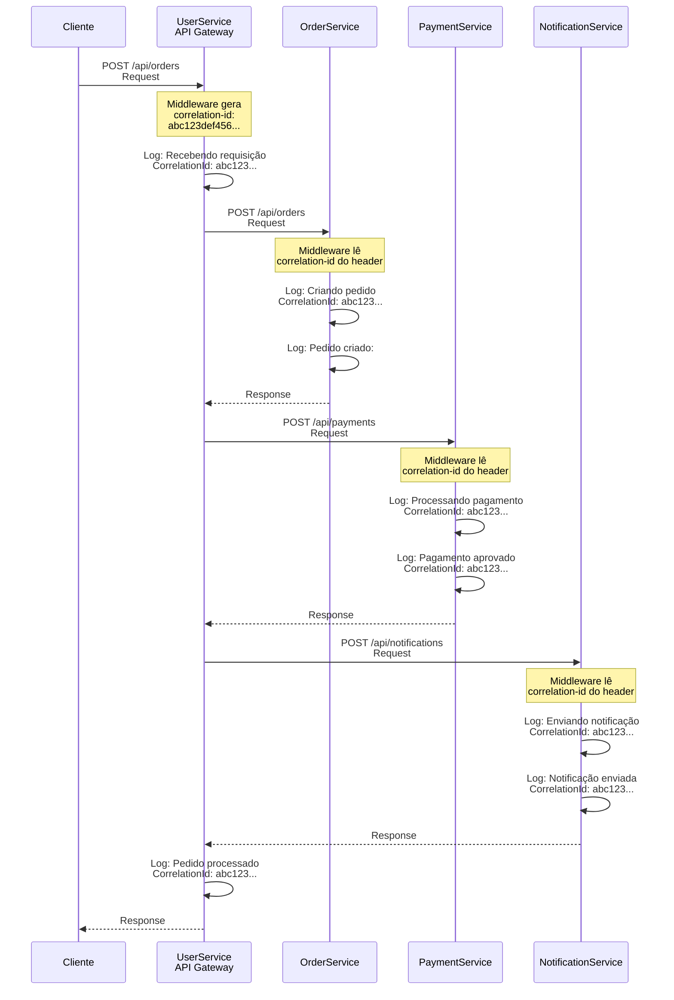

# Traceability

Pacote NuGet para gerenciamento automático de correlation-id em aplicações .NET, com suporte para .NET 8 e .NET Framework 4.8.

## Características

- ✅ Gerenciamento automático de correlation-id usando `AsyncLocal`
- ✅ Suporte para .NET 8.0 e .NET Framework 4.8
- ✅ Middleware para ASP.NET Core (.NET 8)
- ✅ HttpModule e MessageHandler para ASP.NET (.NET Framework 4.8)
- ✅ Integração automática com HttpClient
- ✅ Suporte para Serilog e Microsoft.Extensions.Logging
- ✅ Integração com Polly para políticas de resiliência
- ✅ Propagação automática em chamadas HTTP encadeadas

## Instalação

```bash
dotnet add package Traceability
```

## Quick Start

### ASP.NET Core (.NET 8)

```csharp
using Traceability.Extensions;

var builder = WebApplication.CreateBuilder(args);

// Adicionar serviços
builder.Services.AddTraceability();
builder.Services.AddControllers();

var app = builder.Build();

// Adicionar middleware (deve ser antes dos controllers)
app.UseCorrelationId();

app.MapControllers();
app.Run();
```

**Output Esperado:**

Quando uma requisição HTTP é feita, o middleware automaticamente:
- Gera um correlation-id se não existir no header `X-Correlation-Id`
- Adiciona o correlation-id no header de resposta `X-Correlation-Id`

**Exemplo de Requisição/Resposta:**

```http
GET /api/values HTTP/1.1
Host: localhost:5000
```

```http
HTTP/1.1 200 OK
Content-Type: application/json
X-Correlation-Id: a1b2c3d4e5f6789012345678901234ab

{
  "value": "test"
}
```

### ASP.NET Web API (.NET Framework 4.8)

```csharp
using System.Web.Http;
using Traceability.WebApi;

public class WebApiApplication : System.Web.HttpApplication
{
    protected void Application_Start()
    {
        GlobalConfiguration.Configure(config =>
        {
            config.MessageHandlers.Add(new CorrelationIdMessageHandler());
            config.MapHttpAttributeRoutes();
        });
    }
}
```

**Output Esperado:**

O MessageHandler automaticamente:
- Gera um correlation-id se não existir no header `X-Correlation-Id`
- Adiciona o correlation-id no header de resposta `X-Correlation-Id`

**Exemplo de Requisição/Resposta:**

```http
GET /api/values HTTP/1.1
Host: localhost:8080
```

```http
HTTP/1.1 200 OK
Content-Type: application/json
X-Correlation-Id: f1e2d3c4b5a6978012345678901234cd

{
  "value": "test"
}
```

### Console Application

```csharp
using Traceability;

// O correlation-id é gerado automaticamente quando necessário
var correlationId = CorrelationContext.Current;

// Usar em logs, chamadas HTTP, etc.
Console.WriteLine($"Correlation ID: {correlationId}");
```

**Output Esperado:**

```
Correlation ID: 1a2b3c4d5e6f7890123456789012345ef
```

O correlation-id é um GUID de 32 caracteres (sem hífens) gerado automaticamente.

## Exemplos de Uso

### 1. ASP.NET Core - Configuração Básica

```csharp
// Program.cs
var builder = WebApplication.CreateBuilder(args);

builder.Services.AddTraceability();
builder.Services.AddControllers();

var app = builder.Build();

app.UseCorrelationId();
app.MapControllers();

app.Run();
```

**Exemplo Completo - ASP.NET Core (.NET 8)**

Aqui está um exemplo completo com controller e output esperado:

**Program.cs:**

```csharp
using Traceability.Extensions;
using Traceability.Logging;
using Serilog;
using Serilog.Events;

var builder = WebApplication.CreateBuilder(args);

// Configurar Serilog com CorrelationIdEnricher
Log.Logger = new LoggerConfiguration()
    .MinimumLevel.Information()
    .Enrich.With<CorrelationIdEnricher>()
    .WriteTo.Console(
        outputTemplate: "[{Timestamp:HH:mm:ss} {Level:u3}] {CorrelationId} {Message:lj}{NewLine}{Exception}")
    .CreateLogger();

builder.Host.UseSerilog();

builder.Services.AddTraceability();
builder.Services.AddControllers();

// Configurar HttpClient com correlation-id
builder.Services.AddHttpClient("ExternalApi", client =>
{
    client.BaseAddress = new Uri("https://jsonplaceholder.typicode.com/");
})
.AddHttpMessageHandler<Traceability.HttpClient.CorrelationIdHandler>();

var app = builder.Build();

app.UseCorrelationId();
app.MapControllers();

app.Run();
```

**Controller:**

```csharp
using Microsoft.AspNetCore.Mvc;
using Traceability;
using Microsoft.Extensions.Logging;

[ApiController]
[Route("api/[controller]")]
public class ValuesController : ControllerBase
{
    private readonly IHttpClientFactory _httpClientFactory;
    private readonly ILogger<ValuesController> _logger;

    public ValuesController(IHttpClientFactory httpClientFactory, ILogger<ValuesController> logger)
    {
        _httpClientFactory = httpClientFactory;
        _logger = logger;
    }

    [HttpGet("test")]
    public async Task<IActionResult> Test()
    {
        var correlationId = CorrelationContext.Current;
        _logger.LogInformation("Processando requisição com CorrelationId: {CorrelationId}", correlationId);

        var client = _httpClientFactory.CreateClient("ExternalApi");
        var response = await client.GetAsync("posts/1");
        
        var content = await response.Content.ReadAsStringAsync();
        
        return Ok(new
        {
            CorrelationId = correlationId,
            Message = "Requisição processada com sucesso",
            Data = content
        });
    }
}
```

**Output Esperado:**

**1. Logs no Console (Serilog):**

```
[14:23:45 INF] UserService a1b2c3d4e5f6789012345678901234ab Processando requisição com CorrelationId: a1b2c3d4e5f6789012345678901234ab
[14:23:46 INF] UserService a1b2c3d4e5f6789012345678901234ab Requisição externa concluída
```

**2. Requisição HTTP (sem correlation-id):**

```bash
curl -X GET http://localhost:5000/api/values/test
```

**3. Resposta HTTP (com correlation-id no header):**

```http
HTTP/1.1 200 OK
Content-Type: application/json
X-Correlation-Id: a1b2c3d4e5f6789012345678901234ab

{
  "correlationId": "a1b2c3d4e5f6789012345678901234ab",
  "message": "Requisição processada com sucesso",
  "data": "{ ... }"
}
```

**4. Requisição HTTP Externa (chamada do HttpClient):**

O HttpClient automaticamente adiciona o correlation-id no header:

```http
GET /posts/1 HTTP/1.1
Host: jsonplaceholder.typicode.com
X-Correlation-Id: a1b2c3d4e5f6789012345678901234ab
```

### 2. ASP.NET Core - Com Serilog

```csharp
using Traceability.Logging;
using Serilog;

Log.Logger = new LoggerConfiguration()
    .Enrich.With<CorrelationIdEnricher>()
    .WriteTo.Console(
        outputTemplate: "[{Timestamp:HH:mm:ss} {Level:u3}] {CorrelationId} {Message:lj}{NewLine}{Exception}")
    .CreateLogger();

builder.Host.UseSerilog();
```

**Output Esperado nos Logs:**

```
[14:23:45 INF] a1b2c3d4e5f6789012345678901234ab Processando requisição GET /api/values
[14:23:45 INF] a1b2c3d4e5f6789012345678901234ab Chamada externa realizada com sucesso
[14:23:45 INF] a1b2c3d4e5f6789012345678901234ab Resposta enviada ao cliente
```

O correlation-id aparece automaticamente em todos os logs graças ao `CorrelationIdEnricher`.

### 3. ASP.NET Core - Com Microsoft.Extensions.Logging

```csharp
using Traceability.Logging;

builder.Services.AddLogging(builder =>
{
    builder.AddConsole();
    builder.AddScopeProvider(new CorrelationIdScopeProvider());
});
```

**Output Esperado nos Logs:**

```
info: Sample.WebApi.Net8.Controllers.ApiController[0]
      => CorrelationId: a1b2c3d4e5f6789012345678901234ab
      Iniciando chamada externa com CorrelationId: a1b2c3d4e5f6789012345678901234ab
```

O correlation-id aparece no scope do log automaticamente.

### 4. HttpClient com Correlation-id (RECOMENDADO - Previne Socket Exhaustion)

```csharp
// Program.cs - Configure o HttpClient no DI
using Traceability.Extensions;
using Traceability.HttpClient;

builder.Services.AddTraceableHttpClient("ExternalApi", client =>
{
    client.BaseAddress = new Uri("https://api.example.com/");
    client.Timeout = TimeSpan.FromSeconds(30);
});

// Controller ou Serviço
public class MyService
{
    private readonly IHttpClientFactory _httpClientFactory;

    public MyService(IHttpClientFactory httpClientFactory)
    {
        _httpClientFactory = httpClientFactory;
    }

    public async Task<string> CallApiAsync()
    {
        // IHttpClientFactory gerencia o pool de HttpClient, prevenindo socket exhaustion
        var client = _httpClientFactory.CreateClient("ExternalApi");
        // O correlation-id é automaticamente adicionado ao header X-Correlation-Id
        var response = await client.GetAsync("endpoint");
        return await response.Content.ReadAsStringAsync();
    }
}
```

### 5. HttpClient com Dependency Injection (ASP.NET Core)

```csharp
// Program.cs
builder.Services.AddHttpClient("ExternalApi", client =>
{
    client.BaseAddress = new Uri("https://api.example.com/");
})
.AddHttpMessageHandler<CorrelationIdHandler>();

// Controller
public class MyController : ControllerBase
{
    private readonly IHttpClientFactory _httpClientFactory;

    public MyController(IHttpClientFactory httpClientFactory)
    {
        _httpClientFactory = httpClientFactory;
    }

    public async Task<IActionResult> Get()
    {
        var client = _httpClientFactory.CreateClient("ExternalApi");
        // O correlation-id é automaticamente adicionado
        var response = await client.GetAsync("endpoint");
        return Ok(await response.Content.ReadAsStringAsync());
    }
}
```

### 6. HttpClient com Polly (RECOMENDADO)

```csharp
// Program.cs
using Traceability.Extensions;
using Traceability.HttpClient;
using Polly;
using Polly.Extensions.Http;

var retryPolicy = HttpPolicyExtensions
    .HandleTransientHttpError()
    .WaitAndRetryAsync(3, retryAttempt => 
        TimeSpan.FromSeconds(Math.Pow(2, retryAttempt)));

// Configure com IHttpClientFactory para prevenir socket exhaustion
builder.Services.AddTraceableHttpClient("ExternalApi", client =>
{
    client.BaseAddress = new Uri("https://api.example.com/");
})
.AddPolicyHandler(retryPolicy);

// No controller ou serviço
var client = _httpClientFactory.CreateClient("ExternalApi");
```

### 7. Uso Manual do CorrelationContext

```csharp
using Traceability;

// Obter correlation-id atual (cria se não existir)
var correlationId = CorrelationContext.Current;

// Verificar se existe
if (CorrelationContext.HasValue)
{
    var id = CorrelationContext.Current;
}

// Tentar obter sem criar (recomendado para evitar criação indesejada)
if (CorrelationContext.TryGetValue(out var correlationId))
{
    // Usar correlationId
}

// Obter ou criar explicitamente
var id = CorrelationContext.GetOrCreate();

// Limpar contexto
CorrelationContext.Clear();
```

**Exemplo Completo - Console Application**

Aqui está um exemplo completo de aplicação console com output esperado:

**Console Application (.NET 8):**

```csharp
using Traceability;
using Traceability.Logging;
using Microsoft.Extensions.Logging;
using Serilog;
using Serilog.Events;

// Configurar Serilog com SourceEnricher e CorrelationIdEnricher
Log.Logger = new LoggerConfiguration()
    .MinimumLevel.Information()
    .Enrich.With(new SourceEnricher("ConsoleApp"))
    .Enrich.With<CorrelationIdEnricher>()
    .WriteTo.Console(
        outputTemplate: "[{Timestamp:HH:mm:ss} {Level:u3}] {Source} {CorrelationId} {Message:lj}{NewLine}{Exception}")
    .CreateLogger();

var loggerFactory = LoggerFactory.Create(builder =>
{
    builder.AddSerilog();
});

var logger = loggerFactory.CreateLogger<Program>();

// Exemplo 1: Uso básico
Console.WriteLine("=== Exemplo 1: Uso básico do CorrelationContext ===");
var correlationId = CorrelationContext.GetOrCreate();
Console.WriteLine($"Correlation ID gerado: {correlationId}");
Console.WriteLine($"Correlation ID atual: {CorrelationContext.Current}");
Console.WriteLine();

// Exemplo 2: Logging com correlation-id
Console.WriteLine("=== Exemplo 2: Logging com correlation-id ===");
logger.LogInformation("Mensagem de log com correlation-id automático");
Console.WriteLine();

// Exemplo 3: Correlation-id preservado em operações assíncronas
Console.WriteLine("=== Exemplo 3: Correlation-id preservado em operações assíncronas ===");
var correlationIdBefore = CorrelationContext.Current;
logger.LogInformation("Correlation ID antes da operação assíncrona: {CorrelationId}", correlationIdBefore);

await Task.Delay(100);

var correlationIdAfter = CorrelationContext.Current;
logger.LogInformation("Correlation ID após operação assíncrona: {CorrelationId}", correlationIdAfter);
Console.WriteLine($"Correlation ID preservado: {correlationIdBefore == correlationIdAfter}");
Console.WriteLine();

Log.CloseAndFlush();
```

**Output Esperado (.NET 8):**

```
=== Exemplo 1: Uso básico do CorrelationContext ===
Correlation ID gerado: a1b2c3d4e5f6789012345678901234ab
Correlation ID atual: a1b2c3d4e5f6789012345678901234ab

=== Exemplo 2: Logging com correlation-id ===
[14:23:45 INF] a1b2c3d4e5f6789012345678901234ab Mensagem de log com correlation-id automático

=== Exemplo 3: Correlation-id preservado em operações assíncronas ===
[14:23:45 INF] a1b2c3d4e5f6789012345678901234ab Correlation ID antes da operação assíncrona: a1b2c3d4e5f6789012345678901234ab
[14:23:45 INF] a1b2c3d4e5f6789012345678901234ab Correlation ID após operação assíncrona: a1b2c3d4e5f6789012345678901234ab
Correlation ID preservado: True
```

**Console Application (.NET Framework 4.8):**

```csharp
using System;
using System.Threading.Tasks;
using Traceability;

namespace Sample.Console.NetFramework
{
    class Program
    {
        static async Task Main(string[] args)
        {
            // Exemplo 1: Uso básico
            Console.WriteLine("=== Exemplo 1: Uso básico do CorrelationContext ===");
            var correlationId = CorrelationContext.GetOrCreate();
            Console.WriteLine($"Correlation ID gerado: {correlationId}");
            Console.WriteLine($"Correlation ID atual: {CorrelationContext.Current}");
            Console.WriteLine();

            // Exemplo 2: Correlation-id preservado em operações assíncronas
            Console.WriteLine("=== Exemplo 2: Correlation-id preservado em operações assíncronas ===");
            var correlationIdBefore = CorrelationContext.Current;
            Console.WriteLine($"Correlation ID antes da operação assíncrona: {correlationIdBefore}");

            await Task.Delay(100);

            var correlationIdAfter = CorrelationContext.Current;
            Console.WriteLine($"Correlation ID após operação assíncrona: {correlationIdAfter}");
            Console.WriteLine($"Correlation ID preservado: {correlationIdBefore == correlationIdAfter}");
            Console.WriteLine();

            // Exemplo 3: Múltiplas operações com o mesmo correlation-id
            Console.WriteLine("=== Exemplo 3: Múltiplas operações com o mesmo correlation-id ===");
            var initialCorrelationId = CorrelationContext.Current;
            Console.WriteLine($"Operação 1 com CorrelationId: {initialCorrelationId}");

            await Task.Delay(100);

            Console.WriteLine($"Operação 2 com CorrelationId: {CorrelationContext.Current}");

            await Task.Delay(100);

            Console.WriteLine($"Operação 3 com CorrelationId: {CorrelationContext.Current}");
            Console.WriteLine($"Todas as operações usaram o mesmo Correlation ID: {CorrelationContext.Current == initialCorrelationId}");
            Console.WriteLine();

            Console.WriteLine("Exemplos concluídos!");
            Console.ReadKey();
        }
    }
}
```

**Output Esperado (.NET Framework 4.8):**

```
=== Exemplo 1: Uso básico do CorrelationContext ===
Correlation ID gerado: f1e2d3c4b5a6978012345678901234cd
Correlation ID atual: f1e2d3c4b5a6978012345678901234cd

=== Exemplo 2: Correlation-id preservado em operações assíncronas ===
Correlation ID antes da operação assíncrona: f1e2d3c4b5a6978012345678901234cd
Correlation ID após operação assíncrona: f1e2d3c4b5a6978012345678901234cd
Correlation ID preservado: True

=== Exemplo 3: Múltiplas operações com o mesmo correlation-id ===
Operação 1 com CorrelationId: f1e2d3c4b5a6978012345678901234cd
Operação 2 com CorrelationId: f1e2d3c4b5a6978012345678901234cd
Operação 3 com CorrelationId: f1e2d3c4b5a6978012345678901234cd
Todas as operações usaram o mesmo Correlation ID: True

Exemplos concluídos!
```

### 8. Logging Automático com Correlation-id

#### Serilog

```csharp
using Traceability.Logging;
using Serilog;

Log.Logger = new LoggerConfiguration()
    .Enrich.With<CorrelationIdEnricher>()
    .WriteTo.Console(
        outputTemplate: "[{Timestamp:HH:mm:ss} {Level:u3}] {CorrelationId} {Message:lj}{NewLine}{Exception}")
    .CreateLogger();

// Todos os logs automaticamente incluem CorrelationId
Log.Information("Mensagem de log");
```

**Output Esperado:**

```
[14:23:45 INF] a1b2c3d4e5f6789012345678901234ab Mensagem de log
```

#### Microsoft.Extensions.Logging

```csharp
using Traceability.Logging;

var loggerFactory = LoggerFactory.Create(builder =>
{
    builder.AddConsole();
    builder.AddScopeProvider(new CorrelationIdScopeProvider());
});

var logger = loggerFactory.CreateLogger<Program>();

// O correlation-id é automaticamente incluído no scope
logger.LogInformation("Mensagem de log");
```

**Output Esperado:**

```
info: Program[0]
      => CorrelationId: a1b2c3d4e5f6789012345678901234ab
      Mensagem de log
```

### 9. ASP.NET Tradicional (.NET Framework 4.8)

#### Configuração no web.config

```xml
<system.webServer>
  <modules>
    <add name="CorrelationIdHttpModule" 
         type="Traceability.Middleware.CorrelationIdHttpModule, Traceability" />
  </modules>
</system.webServer>
```

#### Uso no código

```csharp
using Traceability;

public class MyPage : System.Web.UI.Page
{
    protected void Page_Load(object sender, EventArgs e)
    {
        var correlationId = CorrelationContext.Current;
        // Usar correlation-id
    }
}
```

**Exemplo Completo - ASP.NET Web API (.NET Framework 4.8)**

Aqui está um exemplo completo com Global.asax, Controller e output esperado:

**Global.asax.cs:**

```csharp
using System.Web.Http;
using Traceability.WebApi;

public class WebApiApplication : System.Web.HttpApplication
{
    protected void Application_Start()
    {
        GlobalConfiguration.Configure(config =>
        {
            // Adicionar CorrelationIdMessageHandler
            config.MessageHandlers.Add(new CorrelationIdMessageHandler());
            
            config.MapHttpAttributeRoutes();
            config.Routes.MapHttpRoute(
                name: "DefaultApi",
                routeTemplate: "api/{controller}/{id}",
                defaults: new { id = RouteParameter.Optional }
            );
        });
    }
}
```

**Controller:**

```csharp
using System.Net.Http;
using System.Threading.Tasks;
using System.Web.Http;
using Traceability;
using Traceability.HttpClient;

public class ValuesController : ApiController
{
    // Reutilizar HttpClient para evitar socket exhaustion
    private static readonly HttpClient _httpClient = CreateHttpClient();
    
    private static HttpClient CreateHttpClient()
    {
        var handler = new CorrelationIdHandler
        {
            InnerHandler = new HttpClientHandler()
        };
        return new HttpClient(handler)
        {
            BaseAddress = new System.Uri("https://jsonplaceholder.typicode.com/")
        };
    }

    [HttpGet]
    [Route("api/values/test")]
    public async Task<IHttpActionResult> Test()
    {
        var correlationId = CorrelationContext.Current;
        
        // HttpClient automaticamente adiciona correlation-id no header
        var response = await _httpClient.GetAsync("posts/1");
        var content = await response.Content.ReadAsStringAsync();
        
        return Ok(new
        {
            CorrelationId = correlationId,
            Message = "Requisição processada com sucesso",
            Data = content
        });
    }
}
```

**Output Esperado:**

**1. Requisição HTTP (sem correlation-id):**

```bash
curl -X GET http://localhost:8080/api/values/test
```

**2. Resposta HTTP (com correlation-id no header):**

```http
HTTP/1.1 200 OK
Content-Type: application/json
X-Correlation-Id: f1e2d3c4b5a6978012345678901234cd

{
  "correlationId": "f1e2d3c4b5a6978012345678901234cd",
  "message": "Requisição processada com sucesso",
  "data": "{ ... }"
}
```

**3. Requisição HTTP Externa (chamada do HttpClient):**

O HttpClient automaticamente adiciona o correlation-id no header:

```http
GET /posts/1 HTTP/1.1
Host: jsonplaceholder.typicode.com
X-Correlation-Id: f1e2d3c4b5a6978012345678901234cd
```

**Nota:** No .NET Framework 4.8, é importante reutilizar o mesmo `HttpClient` para evitar socket exhaustion. Crie uma instância estática ou use um padrão singleton.

## Exemplos de Requisições HTTP

Esta seção mostra exemplos práticos de como o correlation-id é gerenciado em requisições HTTP.

### Requisição sem Correlation-ID (Gera Novo)

Quando uma requisição é feita sem o header `X-Correlation-Id`, o middleware/handler gera automaticamente um novo correlation-id.

**Requisição:**

```bash
curl -X GET http://localhost:5000/api/values/test
```

Ou via HTTP:

```http
GET /api/values/test HTTP/1.1
Host: localhost:5000
```

**Resposta (.NET 8 - ASP.NET Core):**

```http
HTTP/1.1 200 OK
Content-Type: application/json
X-Correlation-Id: a1b2c3d4e5f6789012345678901234ab

{
  "correlationId": "a1b2c3d4e5f6789012345678901234ab",
  "message": "Requisição processada com sucesso"
}
```

**Resposta (.NET Framework 4.8 - Web API):**

```http
HTTP/1.1 200 OK
Content-Type: application/json
X-Correlation-Id: f1e2d3c4b5a6978012345678901234cd

{
  "correlationId": "f1e2d3c4b5a6978012345678901234cd",
  "message": "Requisição processada com sucesso"
}
```

### Requisição com Correlation-ID (Reutiliza Existente)

Quando uma requisição é feita com o header `X-Correlation-Id`, o middleware/handler reutiliza o valor fornecido.

**Requisição:**

```bash
curl -X GET http://localhost:5000/api/values/test \
  -H "X-Correlation-Id: 12345678901234567890123456789012"
```

Ou via HTTP:

```http
GET /api/values/test HTTP/1.1
Host: localhost:5000
X-Correlation-Id: 12345678901234567890123456789012
```

**Resposta (.NET 8 - ASP.NET Core):**

```http
HTTP/1.1 200 OK
Content-Type: application/json
X-Correlation-Id: 12345678901234567890123456789012

{
  "correlationId": "12345678901234567890123456789012",
  "message": "Requisição processada com sucesso"
}
```

**Resposta (.NET Framework 4.8 - Web API):**

```http
HTTP/1.1 200 OK
Content-Type: application/json
X-Correlation-Id: 12345678901234567890123456789012

{
  "correlationId": "12345678901234567890123456789012",
  "message": "Requisição processada com sucesso"
}
```

**Observação:** O mesmo correlation-id é retornado na resposta, garantindo rastreabilidade em toda a cadeia de chamadas.

### Propagação em Cadeia de Chamadas

O correlation-id é automaticamente propagado em chamadas HTTP encadeadas. Veja o exemplo:

**Cenário:** Serviço A → Serviço B → Serviço C

**1. Cliente chama Serviço A (sem correlation-id):**

```http
GET /api/service-a/process HTTP/1.1
Host: service-a.example.com
```

**Resposta do Serviço A:**

```http
HTTP/1.1 200 OK
X-Correlation-Id: a1b2c3d4e5f6789012345678901234ab
```

**2. Serviço A chama Serviço B (correlation-id propagado automaticamente):**

O HttpClient do Serviço A automaticamente adiciona o correlation-id:

```http
GET /api/service-b/data HTTP/1.1
Host: service-b.example.com
X-Correlation-Id: a1b2c3d4e5f6789012345678901234ab
```

**3. Serviço B chama Serviço C (correlation-id propagado automaticamente):**

```http
GET /api/service-c/process HTTP/1.1
Host: service-c.example.com
X-Correlation-Id: a1b2c3d4e5f6789012345678901234ab
```

**Resultado:** Todos os serviços na cadeia usam o mesmo correlation-id (`a1b2c3d4e5f6789012345678901234ab`), permitindo rastrear toda a requisição através dos logs de todos os serviços.

### Exemplo com Postman

**Configuração no Postman:**

1. Crie uma nova requisição
2. Na aba "Headers", adicione:
   - Key: `X-Correlation-Id`
   - Value: `12345678901234567890123456789012` (opcional - se não fornecer, será gerado)

**Requisição:**

```
GET http://localhost:5000/api/values/test
Headers:
  X-Correlation-Id: 12345678901234567890123456789012
```

**Resposta:**

```json
{
  "correlationId": "12345678901234567890123456789012",
  "message": "Requisição processada com sucesso"
}
```

E no header da resposta:

```
X-Correlation-Id: 12345678901234567890123456789012
```

## Exemplos de Logs

Esta seção mostra exemplos de como o correlation-id aparece nos logs com diferentes frameworks de logging.

### Serilog com CorrelationIdEnricher

**Configuração:**

```csharp
using Traceability.Logging;
using Serilog;

Log.Logger = new LoggerConfiguration()
    .Enrich.With<CorrelationIdEnricher>()
    .WriteTo.Console(
        outputTemplate: "[{Timestamp:HH:mm:ss} {Level:u3}] {CorrelationId} {Message:lj}{NewLine}{Exception}")
    .CreateLogger();
```

**Código de Exemplo:**

```csharp
var correlationId = CorrelationContext.GetOrCreate();
Log.Information("Processando requisição");
Log.Information("Chamando serviço externo");
Log.Information("Requisição concluída");
```

**Output Esperado (.NET 8):**

```
[14:23:45 INF] a1b2c3d4e5f6789012345678901234ab Processando requisição
[14:23:45 INF] a1b2c3d4e5f6789012345678901234ab Chamando serviço externo
[14:23:46 INF] a1b2c3d4e5f6789012345678901234ab Requisição concluída
```

**Output Esperado (.NET Framework 4.8):**

```
[14:23:45 INF] f1e2d3c4b5a6978012345678901234cd Processando requisição
[14:23:45 INF] f1e2d3c4b5a6978012345678901234cd Chamando serviço externo
[14:23:46 INF] f1e2d3c4b5a6978012345678901234cd Requisição concluída
```

**Template Customizado:**

Você pode customizar o template de output para incluir mais informações:

```csharp
Log.Logger = new LoggerConfiguration()
    .Enrich.With<CorrelationIdEnricher>()
    .WriteTo.Console(
        outputTemplate: "[{Timestamp:yyyy-MM-dd HH:mm:ss.fff}] [{Level:u3}] [{CorrelationId}] {Message:lj}{NewLine}{Exception}")
    .CreateLogger();
```

**Output com Template Customizado:**

```
[2024-01-15 14:23:45.123] [INF] [a1b2c3d4e5f6789012345678901234ab] Processando requisição
[2024-01-15 14:23:45.456] [INF] [a1b2c3d4e5f6789012345678901234ab] Chamando serviço externo
[2024-01-15 14:23:46.789] [INF] [a1b2c3d4e5f6789012345678901234ab] Requisição concluída
```

### Microsoft.Extensions.Logging com CorrelationIdScopeProvider e SourceScopeProvider

**Configuração (.NET 8):**

```csharp
using Traceability.Logging;

builder.Services.AddLogging(builder =>
{
    builder.AddConsole();
    // SourceScopeProvider deve ser o provider externo, CorrelationIdScopeProvider como interno
    builder.AddScopeProvider(new SourceScopeProvider("UserService", new CorrelationIdScopeProvider()));
});
```

**Código de Exemplo:**

```csharp
var logger = loggerFactory.CreateLogger<MyService>();
var correlationId = CorrelationContext.GetOrCreate();

logger.LogInformation("Processando requisição");
logger.LogInformation("Chamando serviço externo");
logger.LogInformation("Requisição concluída");
```

**Output Esperado (.NET 8):**

```
info: MyApp.MyService[0]
      => Source: UserService
      => CorrelationId: a1b2c3d4e5f6789012345678901234ab
      Processando requisição
info: MyApp.MyService[0]
      => Source: UserService
      => CorrelationId: a1b2c3d4e5f6789012345678901234ab
      Chamando serviço externo
info: MyApp.MyService[0]
      => Source: UserService
      => CorrelationId: a1b2c3d4e5f6789012345678901234ab
      Requisição concluída
```

**Configuração (.NET Framework 4.8):**

No .NET Framework 4.8, você pode usar Microsoft.Extensions.Logging com o CorrelationIdScopeProvider e SourceScopeProvider:

```csharp
using Traceability.Logging;
using Microsoft.Extensions.Logging;

var loggerFactory = LoggerFactory.Create(builder =>
{
    builder.AddConsole();
    builder.AddScopeProvider(new SourceScopeProvider("UserService", new CorrelationIdScopeProvider()));
});

var logger = loggerFactory.CreateLogger<MyService>();
var correlationId = CorrelationContext.GetOrCreate();

logger.LogInformation("Processando requisição");
```

**Output Esperado (.NET Framework 4.8):**

```
info: MyApp.MyService[0]
      => Source: UserService
      => CorrelationId: f1e2d3c4b5a6978012345678901234cd
      Processando requisição
```

### Comparação: Serilog vs Microsoft.Extensions.Logging

**Serilog (Mais Compacto):**

```
[14:23:45 INF] UserService a1b2c3d4e5f6789012345678901234ab Processando requisição
```

**Microsoft.Extensions.Logging (Mais Detalhado):**

```
info: MyApp.MyService[0]
      => Source: UserService
      => CorrelationId: a1b2c3d4e5f6789012345678901234ab
      Processando requisição
```

**Vantagens de cada um:**

- **Serilog:** Output mais compacto, ideal para logs em produção, fácil de parsear
- **Microsoft.Extensions.Logging:** Mais informações contextuais, integração nativa com .NET, suporte a scopes aninhados

### Exemplo de Logs em Cadeia de Chamadas

Quando você tem uma cadeia de chamadas (Serviço A → Serviço B → Serviço C), todos os logs terão o mesmo correlation-id:

**Serviço A (Logs):**

```
[14:23:45 INF] UserService a1b2c3d4e5f6789012345678901234ab Recebendo requisição
[14:23:45 INF] UserService a1b2c3d4e5f6789012345678901234ab Chamando Serviço B
[14:23:46 INF] UserService a1b2c3d4e5f6789012345678901234ab Resposta recebida do Serviço B
```

**Serviço B (Logs):**

```
[14:23:45 INF] OrderService a1b2c3d4e5f6789012345678901234ab Recebendo requisição do Serviço A
[14:23:45 INF] OrderService a1b2c3d4e5f6789012345678901234ab Chamando Serviço C
[14:23:46 INF] OrderService a1b2c3d4e5f6789012345678901234ab Resposta recebida do Serviço C
```

**Serviço C (Logs):**

```
[14:23:45 INF] PaymentService a1b2c3d4e5f6789012345678901234ab Recebendo requisição do Serviço B
[14:23:46 INF] a1b2c3d4e5f6789012345678901234ab Processamento concluído
```

**Benefício:** Você pode buscar por `a1b2c3d4e5f6789012345678901234ab` em todos os logs e rastrear toda a cadeia de execução!

### Exemplo de Logs com Erros

Quando ocorre um erro, o correlation-id ajuda a rastrear toda a requisição que falhou:

**Serilog:**

```
[14:23:45 INF] a1b2c3d4e5f6789012345678901234ab Processando requisição
[14:23:45 ERR] a1b2c3d4e5f6789012345678901234ab Erro ao chamar serviço externo
System.Net.Http.HttpRequestException: Connection timeout
   at MyApp.MyService.CallExternalServiceAsync()
   at MyApp.MyService.ProcessRequestAsync()
```

**Microsoft.Extensions.Logging:**

```
info: MyApp.MyService[0]
      => CorrelationId: a1b2c3d4e5f6789012345678901234ab
      Processando requisição
fail: MyApp.MyService[0]
      => CorrelationId: a1b2c3d4e5f6789012345678901234ab
      Erro ao chamar serviço externo
      System.Net.Http.HttpRequestException: Connection timeout
         at MyApp.MyService.CallExternalServiceAsync()
         at MyApp.MyService.ProcessRequestAsync()
```

## Cenário Real: Rastreamento em Múltiplos Serviços

Este exemplo demonstra como o Traceability funciona em um cenário real de arquitetura de microsserviços, onde um serviço faz chamadas para múltiplos outros serviços, e como o correlation-id permite rastrear toda a requisição através de todos os serviços.

### Fluxo de Requisições

O diagrama abaixo mostra o fluxo completo de uma requisição que passa por 4 serviços diferentes:



### Implementação

**Program.cs (UserService):**

```csharp
using Traceability.Extensions;
using Traceability.Logging;
using Serilog;

var builder = WebApplication.CreateBuilder(args);

// Configurar Serilog com SourceEnricher e CorrelationIdEnricher
Log.Logger = new LoggerConfiguration()
    .MinimumLevel.Information()
    .Enrich.With(new SourceEnricher("UserService"))
    .Enrich.With<CorrelationIdEnricher>()
    .WriteTo.Console(
        outputTemplate: "[{Timestamp:HH:mm:ss} {Level:u3}] {Source} {CorrelationId} {Message:lj}{NewLine}{Exception}")
    .CreateLogger();

builder.Host.UseSerilog();

// Configurar traceability
builder.Services.AddTraceabilityLogging("UserService");

// Configurar HttpClients para cada serviço com correlation-id automático
builder.Services.AddTraceableHttpClient("OrderService", client =>
{
    client.BaseAddress = new Uri("https://order-service.example.com/");
    client.Timeout = TimeSpan.FromSeconds(30);
});

builder.Services.AddTraceableHttpClient("PaymentService", client =>
{
    client.BaseAddress = new Uri("https://payment-service.example.com/");
    client.Timeout = TimeSpan.FromSeconds(30);
});

builder.Services.AddTraceableHttpClient("NotificationService", client =>
{
    client.BaseAddress = new Uri("https://notification-service.example.com/");
    client.Timeout = TimeSpan.FromSeconds(30);
});

builder.Services.AddControllers();

var app = builder.Build();

app.UseCorrelationId();
app.MapControllers();

app.Run();
```

**OrderController.cs (UserService):**

```csharp
using Microsoft.AspNetCore.Mvc;
using Microsoft.Extensions.Logging;
using Traceability;

[ApiController]
[Route("api/[controller]")]
public class OrdersController : ControllerBase
{
    private readonly IHttpClientFactory _httpClientFactory;
    private readonly ILogger<OrdersController> _logger;

    public OrdersController(
        IHttpClientFactory httpClientFactory,
        ILogger<OrdersController> logger)
    {
        _httpClientFactory = httpClientFactory;
        _logger = logger;
    }

    [HttpPost]
    public async Task<IActionResult> CreateOrder([FromBody] CreateOrderRequest request)
    {
        var correlationId = CorrelationContext.Current;
        _logger.LogInformation("Recebendo requisição para criar pedido. UserId: {UserId}", request.UserId);

        // Request #1: Criar pedido no OrderService
        var orderClient = _httpClientFactory.CreateClient("OrderService");
        var orderResponse = await orderClient.PostAsJsonAsync("api/orders", new
        {
            userId = request.UserId,
            items = request.Items
        });
        orderResponse.EnsureSuccessStatusCode();
        var orderResult = await orderResponse.Content.ReadFromJsonAsync<OrderResponse>();
        _logger.LogInformation("Pedido criado no OrderService. OrderId: {OrderId}", orderResult.OrderId);

        // Request #2: Processar pagamento no PaymentService
        var paymentClient = _httpClientFactory.CreateClient("PaymentService");
        var paymentResponse = await paymentClient.PostAsJsonAsync("api/payments", new
        {
            orderId = orderResult.OrderId,
            amount = request.TotalAmount,
            paymentMethod = request.PaymentMethod
        });
        paymentResponse.EnsureSuccessStatusCode();
        var paymentResult = await paymentResponse.Content.ReadFromJsonAsync<PaymentResponse>();
        _logger.LogInformation("Pagamento processado. PaymentId: {PaymentId}, Status: {Status}", 
            paymentResult.PaymentId, paymentResult.Status);

        // Request #3: Enviar notificação no NotificationService
        var notificationClient = _httpClientFactory.CreateClient("NotificationService");
        var notificationResponse = await notificationClient.PostAsJsonAsync("api/notifications", new
        {
            userId = request.UserId,
            orderId = orderResult.OrderId,
            message = $"Pedido #{orderResult.OrderId} criado com sucesso!"
        });
        notificationResponse.EnsureSuccessStatusCode();
        var notificationResult = await notificationResponse.Content.ReadFromJsonAsync<NotificationResponse>();
        _logger.LogInformation("Notificação enviada. NotificationId: {NotificationId}", notificationResult.NotificationId);

        _logger.LogInformation("Pedido processado com sucesso. OrderId: {OrderId}", orderResult.OrderId);

        return Ok(new
        {
            orderId = orderResult.OrderId,
            paymentId = paymentResult.PaymentId,
            notificationId = notificationResult.NotificationId,
            correlationId = correlationId
        });
    }
}
```

### Logs Gerados

Todos os serviços geram logs com o **mesmo correlation-id**, permitindo rastrear toda a requisição através de todos os serviços:

**UserService (Logs):**

```
[14:23:45 INF] UserService abc123def4567890123456789012345678 Recebendo requisição para criar pedido. UserId: 1001
[14:23:45 INF] UserService abc123def4567890123456789012345678 Pedido criado no OrderService. OrderId: 12345
[14:23:46 INF] UserService abc123def4567890123456789012345678 Pagamento processado. PaymentId: 789, Status: Approved
[14:23:46 INF] UserService abc123def4567890123456789012345678 Notificação enviada. NotificationId: 456
[14:23:46 INF] UserService abc123def4567890123456789012345678 Pedido processado com sucesso. OrderId: 12345
```

**OrderService (Logs):**

```
[14:23:45 INF] OrderService abc123def4567890123456789012345678 Recebendo requisição para criar pedido
[14:23:45 INF] OrderService abc123def4567890123456789012345678 Validando itens do pedido
[14:23:45 INF] OrderService abc123def4567890123456789012345678 Pedido criado com sucesso. OrderId: 12345, Total: 299.99
[14:23:45 INF] OrderService abc123def4567890123456789012345678 Retornando resposta ao UserService
```

**PaymentService (Logs):**

```
[14:23:45 INF] PaymentService abc123def4567890123456789012345678 Recebendo requisição de pagamento. OrderId: 12345
[14:23:45 INF] PaymentService abc123def4567890123456789012345678 Validando método de pagamento
[14:23:46 INF] PaymentService abc123def4567890123456789012345678 Processando pagamento no gateway
[14:23:46 INF] PaymentService abc123def4567890123456789012345678 Pagamento aprovado. PaymentId: 789, Amount: 299.99
[14:23:46 INF] PaymentService abc123def4567890123456789012345678 Retornando resposta ao UserService
```

**NotificationService (Logs):**

```
[14:23:46 INF] NotificationService abc123def4567890123456789012345678 Recebendo requisição de notificação. OrderId: 12345
[14:23:46 INF] NotificationService abc123def4567890123456789012345678 Preparando notificação para envio
[14:23:46 INF] NotificationService abc123def4567890123456789012345678 Notificação enviada com sucesso. NotificationId: 456
[14:23:46 INF] NotificationService abc123def4567890123456789012345678 Retornando resposta ao UserService
```

### Outputs e Respostas

**Request #0 - Cliente → UserService:**

```http
POST /api/orders HTTP/1.1
Host: user-service.example.com
Content-Type: application/json

{
  "userId": 1001,
  "items": [
    { "productId": 1, "quantity": 2, "price": 99.99 }
  ],
  "totalAmount": 199.98,
  "paymentMethod": "credit_card"
}
```

**Response #0 - UserService → Cliente:**

```http
HTTP/1.1 200 OK
Content-Type: application/json
X-Correlation-Id: abc123def4567890123456789012345678

{
  "orderId": 12345,
  "paymentId": 789,
  "notificationId": 456,
  "correlationId": "abc123def4567890123456789012345678"
}
```

**Request #1 - UserService → OrderService (automático via CorrelationIdHandler):**

```http
POST /api/orders HTTP/1.1
Host: order-service.example.com
Content-Type: application/json
X-Correlation-Id: abc123def4567890123456789012345678

{
  "userId": 1001,
  "items": [
    { "productId": 1, "quantity": 2, "price": 99.99 }
  ]
}
```

**Response #1 - OrderService → UserService:**

```http
HTTP/1.1 200 OK
Content-Type: application/json
X-Correlation-Id: abc123def4567890123456789012345678

{
  "orderId": 12345,
  "status": "created",
  "total": 199.98
}
```

**Request #2 - UserService → PaymentService (automático via CorrelationIdHandler):**

```http
POST /api/payments HTTP/1.1
Host: payment-service.example.com
Content-Type: application/json
X-Correlation-Id: abc123def4567890123456789012345678

{
  "orderId": 12345,
  "amount": 199.98,
  "paymentMethod": "credit_card"
}
```

**Response #2 - PaymentService → UserService:**

```http
HTTP/1.1 200 OK
Content-Type: application/json
X-Correlation-Id: abc123def4567890123456789012345678

{
  "paymentId": 789,
  "status": "approved",
  "amount": 199.98
}
```

**Request #3 - UserService → NotificationService (automático via CorrelationIdHandler):**

```http
POST /api/notifications HTTP/1.1
Host: notification-service.example.com
Content-Type: application/json
X-Correlation-Id: abc123def4567890123456789012345678

{
  "userId": 1001,
  "orderId": 12345,
  "message": "Pedido #12345 criado com sucesso!"
}
```

**Response #3 - NotificationService → UserService:**

```http
HTTP/1.1 200 OK
Content-Type: application/json
X-Correlation-Id: abc123def4567890123456789012345678

{
  "notificationId": 456,
  "status": "sent",
  "deliveredAt": "2024-01-15T14:23:46Z"
}
```

### Vantagens do Traceability

#### 1. Rastreamento Completo da Requisição

Com o correlation-id `abc123def4567890123456789012345678`, você pode buscar em todos os logs de todos os serviços e ver exatamente o que aconteceu em cada etapa:

```bash
# Buscar todos os logs relacionados a esta requisição
grep "abc123def4567890123456789012345678" /var/log/*.log

# Resultado mostra logs de todos os 4 serviços na ordem cronológica
```

#### 2. Debugging Simplificado

Quando um erro ocorre, você pode identificar rapidamente em qual serviço e em qual etapa:

**Exemplo de Erro:**

```
[14:23:45 INF] UserService abc123... Recebendo requisição
[14:23:45 INF] OrderService abc123... Pedido criado
[14:23:46 ERR] PaymentService abc123... Erro ao processar pagamento: Card declined
[14:23:46 ERR] UserService abc123... Falha ao processar pedido
```

Com o mesmo correlation-id, você vê que o problema ocorreu no `PaymentService` durante o processamento do pagamento.

#### 3. Análise de Performance

Você pode medir o tempo total de uma requisição através de múltiplos serviços:

```
[14:23:45.123 INF] UserService abc123... Recebendo requisição
[14:23:45.456 INF] OrderService abc123... Pedido criado (333ms)
[14:23:46.123 INF] PaymentService abc123... Pagamento processado (667ms)
[14:23:46.234 INF] NotificationService abc123... Notificação enviada (111ms)
[14:23:46.250 INF] UserService abc123... Pedido processado (1127ms total)
```

#### 4. Correlação em Sistemas Distribuídos

Em ambientes com múltiplos servidores, load balancers e filas de mensageria, o correlation-id permite rastrear uma requisição mesmo quando ela passa por diferentes instâncias do mesmo serviço.

#### 5. Integração com Ferramentas de Observabilidade

O correlation-id pode ser usado com ferramentas como:
- **Application Insights**: Filtrar traces por correlation-id
- **ELK Stack**: Buscar logs por correlation-id
- **Grafana**: Criar dashboards baseados em correlation-id
- **Jaeger/Zipkin**: Rastrear distributed traces

#### 6. Sem Código Adicional

O Traceability faz tudo automaticamente:
- ✅ Gera correlation-id quando necessário
- ✅ Propaga em todas as chamadas HTTP
- ✅ Adiciona aos logs automaticamente
- ✅ Retorna no header da resposta

Você não precisa se preocupar em passar o correlation-id manualmente entre serviços!

## API Reference

### CorrelationContext

Classe estática para gerenciar o correlation-id no contexto assíncrono.

#### Propriedades

- `Current` (string): Obtém ou define o correlation-id atual. Cria um novo se não existir.
- `HasValue` (bool): Verifica se existe um correlation-id no contexto.

#### Métodos

- `TryGetValue(out string? value)`: Tenta obter o correlation-id existente sem criar um novo se não existir. Retorna `true` se existe, `false` caso contrário.
- `GetOrCreate()`: Obtém o correlation-id existente ou cria um novo.
- `Clear()`: Limpa o correlation-id do contexto.

### CorrelationIdMiddleware (ASP.NET Core)

Middleware que gerencia correlation-id automaticamente.

**Uso:**
```csharp
app.UseCorrelationId();
```

### CorrelationIdMessageHandler (ASP.NET Web API)

MessageHandler para ASP.NET Web API.

**Uso:**
```csharp
config.MessageHandlers.Add(new CorrelationIdMessageHandler());
```

### CorrelationIdHttpModule (ASP.NET Tradicional)

HttpModule para aplicações ASP.NET tradicionais.

**Configuração:** Via web.config (veja exemplo acima)

### TraceableHttpClientFactory

Factory para criar HttpClient com correlation-id usando IHttpClientFactory. Previne socket exhaustion ao reutilizar conexões HTTP.

**Métodos (.NET 8):**
- `CreateFromFactory(IHttpClientFactory factory, string? clientName = null, string? baseAddress = null)`: Cria HttpClient usando IHttpClientFactory que gerencia o pool de conexões.
- `AddTraceableHttpClient(this IServiceCollection services, string clientName, Action<HttpClient>? configureClient = null)`: Método de extensão para configurar HttpClient no DI com CorrelationIdHandler automaticamente.

**Exemplo de uso:**
```csharp
// Configure no Program.cs
builder.Services.AddTraceableHttpClient("ExternalApi", client =>
{
    client.BaseAddress = new Uri("https://api.example.com/");
});

// Use no serviço ou controller
var client = _httpClientFactory.CreateClient("ExternalApi");
```

### CorrelationIdHandler

DelegatingHandler que adiciona correlation-id aos headers HTTP.

**Uso:**
```csharp
services.AddHttpClient("MyClient")
    .AddHttpMessageHandler<CorrelationIdHandler>();
```

### Logging

#### CorrelationIdEnricher (Serilog)

Enricher que adiciona correlation-id aos logs do Serilog. **Importante**: Este enricher não cria um correlation-id se não existir no contexto (usa `TryGetValue` para evitar criação indesejada).

**Uso:**
```csharp
Log.Logger = new LoggerConfiguration()
    .Enrich.With<CorrelationIdEnricher>()
    .CreateLogger();
```

#### SourceEnricher (Serilog)

Enricher que adiciona o campo `Source` aos logs do Serilog. O campo `Source` identifica a origem/serviço que está gerando os logs, essencial para unificar logs em ambientes distribuídos.

**Uso:**
```csharp
Log.Logger = new LoggerConfiguration()
    .Enrich.With(new SourceEnricher("UserService"))
    .Enrich.With<CorrelationIdEnricher>()
    .WriteTo.Console(
        outputTemplate: "[{Timestamp:HH:mm:ss} {Level:u3}] {Source} {CorrelationId} {Message:lj}")
    .CreateLogger();
```

**Nota:** O campo `Source` sempre será adicionado aos logs, independentemente da presença de correlation-id.

#### CorrelationIdScopeProvider (Microsoft.Extensions.Logging)

Provider que adiciona correlation-id ao scope de logging. **Importante**: Este provider não cria um correlation-id se não existir no contexto (usa `TryGetValue` para evitar criação indesejada).

**Uso:**
```csharp
builder.Services.AddLogging(builder =>
{
    builder.AddScopeProvider(new CorrelationIdScopeProvider());
});
```

#### SourceScopeProvider (Microsoft.Extensions.Logging)

Provider que adiciona o campo `Source` ao scope de logging. O campo `Source` identifica a origem/serviço que está gerando os logs.

**Uso:**
```csharp
builder.Services.AddLogging(builder =>
{
    builder.AddScopeProvider(new SourceScopeProvider("UserService"));
});
```

**Nota:** O campo `Source` sempre será adicionado ao scope, independentemente da presença de correlation-id.

#### AddTraceabilityLogging (Método de Extensão)

Método de conveniência que configura traceability com logging, incluindo o campo `Source`.

**Uso (.NET 8):**
```csharp
// Program.cs
builder.Services.AddTraceabilityLogging("UserService", options =>
{
    options.HeaderName = "X-Correlation-Id";
});

// Para Serilog, ainda é necessário configurar o SourceEnricher manualmente:
Log.Logger = new LoggerConfiguration()
    .Enrich.With(new SourceEnricher("UserService"))
    .Enrich.With<CorrelationIdEnricher>()
    .WriteTo.Console()
    .CreateLogger();
```

## Prevenção de Socket Exhaustion

Este pacote foi projetado para prevenir socket exhaustion desde o início. Todos os métodos de criação de HttpClient usam `IHttpClientFactory`, que gerencia o pool de conexões HTTP e reutiliza sockets, evitando o esgotamento.

### Como Funciona

O `IHttpClientFactory` gerencia o ciclo de vida dos `HttpClient`:
- Reutiliza conexões HTTP quando possível
- Gerencia o pool de sockets automaticamente
- Previne socket exhaustion mesmo em alta carga

### Uso Correto

```csharp
// Configure no Program.cs
builder.Services.AddTraceableHttpClient("ExternalApi", client =>
{
    client.BaseAddress = new Uri("https://api.example.com/");
});

// Use no serviço ou controller
public class MyService
{
    private readonly IHttpClientFactory _httpClientFactory;

    public MyService(IHttpClientFactory httpClientFactory)
    {
        _httpClientFactory = httpClientFactory;
    }

    public async Task CallApiAsync()
    {
        // IHttpClientFactory reutiliza conexões, prevenindo socket exhaustion
        var client = _httpClientFactory.CreateClient("ExternalApi");
        await client.GetAsync("endpoint");
    }
}
```

## Limitações

1. **.NET Framework 4.8**: Não tem DI nativo, então `TraceabilityOptions` deve ser configurado via métodos estáticos `Configure()` em `CorrelationIdHttpModule` e `CorrelationIdMessageHandler`.
2. **Validação de Formato**: A validação de formato do correlation-id é opcional e deve ser habilitada via `TraceabilityOptions.ValidateCorrelationIdFormat`.
3. **IHttpClientFactory**: Os métodos de criação de HttpClient requerem `IHttpClientFactory` (disponível apenas em .NET 8 para este pacote). Para .NET Framework, use `CorrelationIdHandler` diretamente com seu próprio gerenciamento de HttpClient.

## Troubleshooting

### O correlation-id não está sendo propagado

1. Certifique-se de que o middleware/handler está configurado corretamente.
2. Verifique se está usando `IHttpClientFactory` com `AddTraceableHttpClient()` ou `AddHttpMessageHandler<CorrelationIdHandler>()` para chamadas HTTP.
3. Em aplicações assíncronas, certifique-se de que o contexto assíncrono está sendo preservado.

### Correlation-id não aparece nos logs

1. Para Serilog: Certifique-se de que `CorrelationIdEnricher` está configurado.
2. Para Microsoft.Extensions.Logging: Certifique-se de que `CorrelationIdScopeProvider` está configurado.
3. Verifique o template de output do logger para incluir `{CorrelationId}`.

### Problemas com .NET Framework 4.8

1. Certifique-se de que as versões corretas das dependências estão instaladas.
2. Para Web API, adicione o `CorrelationIdMessageHandler` no `Global.asax.cs`.
3. Para ASP.NET tradicional, configure o `CorrelationIdHttpModule` no `web.config`.
4. Para configurar opções, use `CorrelationIdHttpModule.Configure()` ou `CorrelationIdMessageHandler.Configure()` antes de usar.

## Contribuindo

Contribuições são bem-vindas! Por favor, abra uma issue ou pull request.

## Licença

MIT

## Versão

1.0.0


