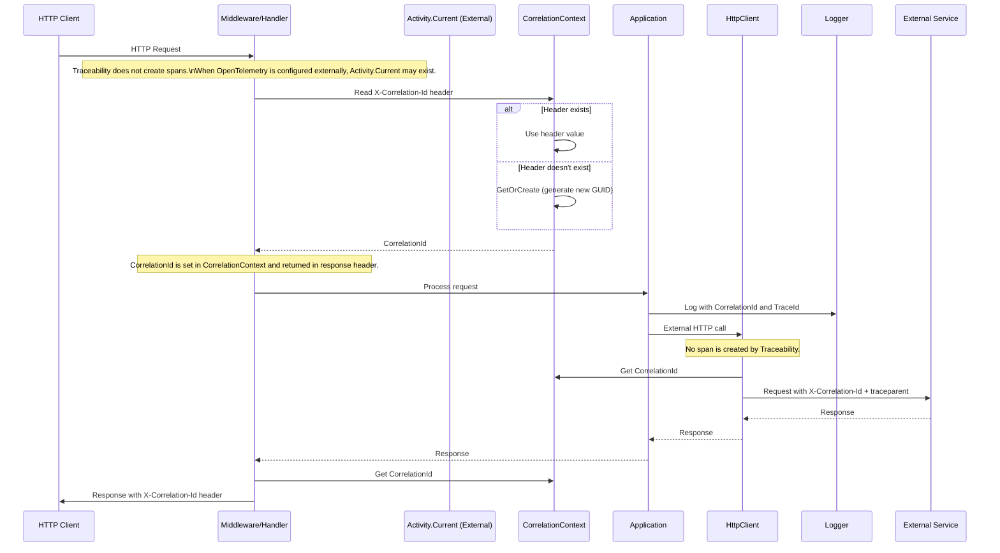
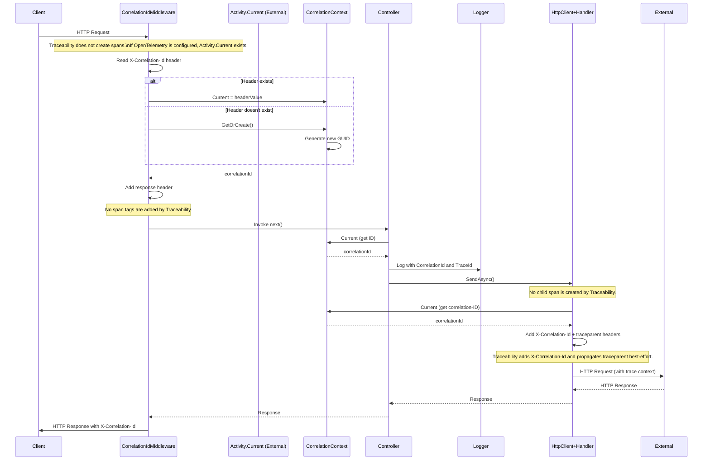
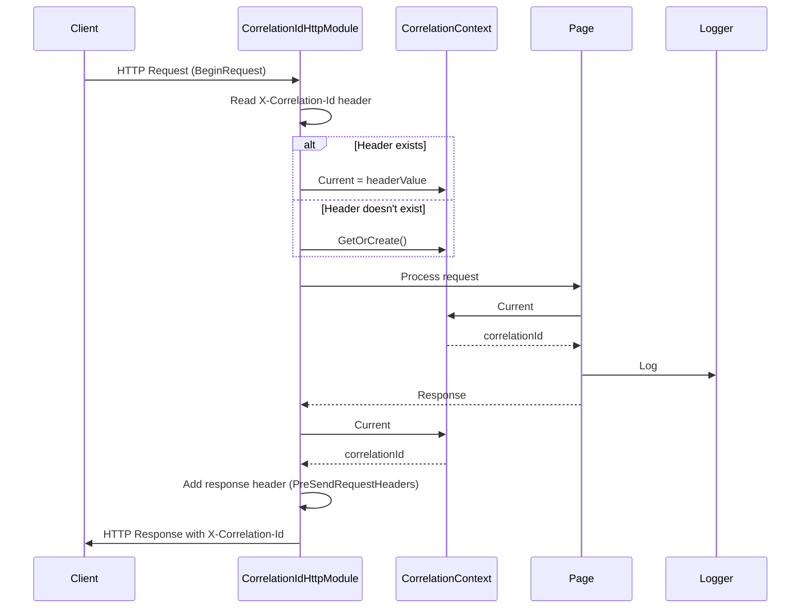
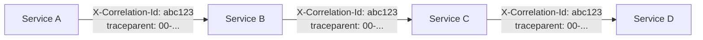
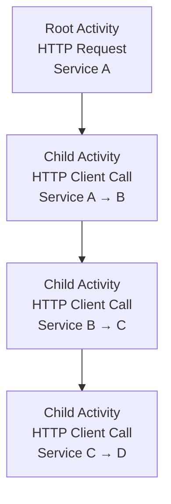
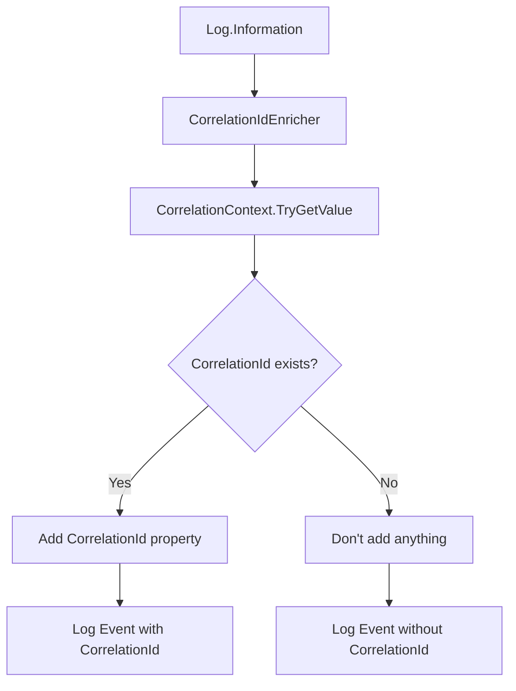
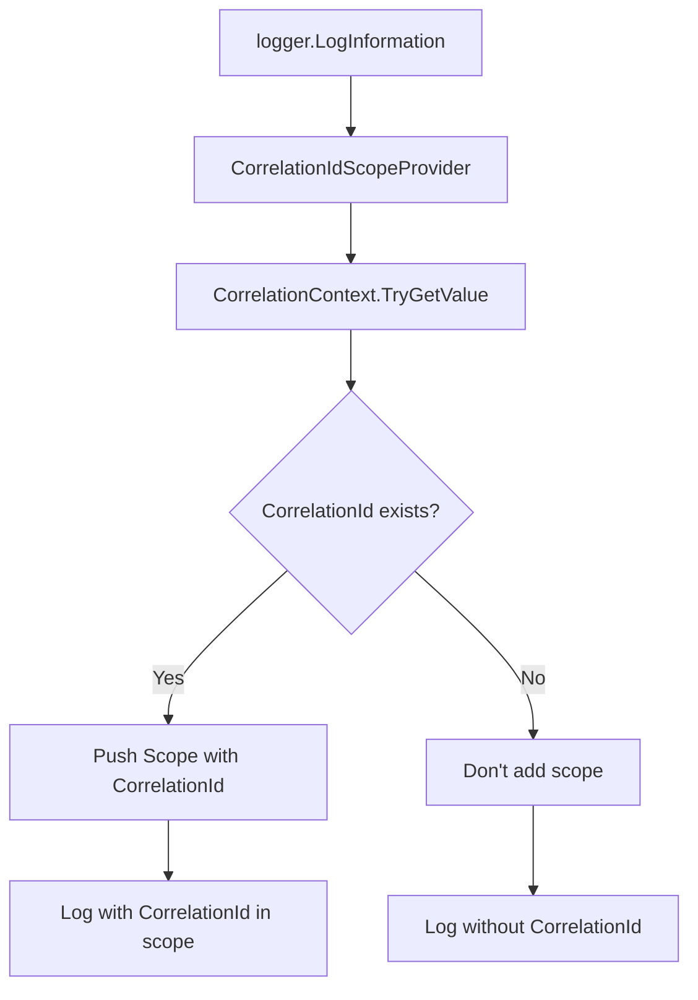

# High-Level Architecture

## Component Diagram

```mermaid
graph TB
    subgraph "Entry Points"
        ASPNETCore[ASP.NET Core<br/>Middleware]
        ASPNETWebAPI[ASP.NET Web API<br/>MessageHandler]
        ASPNETTraditional[ASP.NET Traditional<br/>HttpModule]
        ConsoleApp[Console Application<br/>Direct Usage]
    end

    subgraph "Core Layer"
        CorrelationContext[CorrelationContext<br/>AsyncLocal (independent)]
        ActivityCurrent[Activity.Current (External)<br/>Trace Context]
    end

    subgraph "HTTP Integration"
        HttpClientHandler[CorrelationIdHandler<br/>DelegatingHandler]
        HttpClientFactory[TraceableHttpClientFactory<br/>Factory Pattern]
    end

    subgraph "Logging Integration"
        SerilogEnricher[CorrelationIdEnricher<br/>Serilog]
        MELScopeProvider[CorrelationIdScopeProvider<br/>Microsoft.Extensions.Logging]
    end

    subgraph "Configuration"
        TraceabilityOptions[TraceabilityOptions<br/>Configuration]
    end

    ASPNETCore --> CorrelationContext
    ASPNETWebAPI --> CorrelationContext
    ASPNETTraditional --> CorrelationContext
    ConsoleApp --> CorrelationContext

    ASPNETCore -.-> ActivityCurrent
    HttpClientHandler -.-> ActivityCurrent

    CorrelationContext --> HttpClientHandler
    CorrelationContext --> SerilogEnricher
    CorrelationContext --> MELScopeProvider
    ActivitySource --> CorrelationContext

    HttpClientFactory --> HttpClientHandler
    TraceabilityOptions -.-> ASPNETCore
```

## Main Data Flow



## Flow: ASP.NET Core Request (.NET 8)



## Flow: ASP.NET Framework 4.8 Request



## Propagation in Chained HTTP Calls



**Behavior**:
1. Service A receives request without header → creates Activity with TraceId `4bf92f...` and generates correlation-ID `abc123...`
2. Service A calls Service B with headers:
   - `X-Correlation-Id: abc123...` (correlation-ID)
   - `traceparent: 00-4bf92f...` (W3C Trace Context / trace ID)
3. Service B reads headers and uses correlation-ID `abc123...` (doesn't generate new one)
4. Service B creates child Activity (span) maintaining trace hierarchy
5. Service B calls Service C with same headers
6. Process continues until the end of the chain

**Rule**: Never generate a new correlation-id if one already exists in the request header. Always propagate W3C Trace Context for distributed tracing compatibility.

## Activity Hierarchy (Spans)



**Behavior**:
- Traceability does not create spans. Activity hierarchy is owned by OpenTelemetry SDK/instrumentation.
- W3C Trace Context: Traceability propagates `traceparent` when trace context is available via `Activity.Current` (best-effort W3C-valid only). Traceability does not emit `tracestate`.

## Logging Integration

### Serilog



### Microsoft.Extensions.Logging


