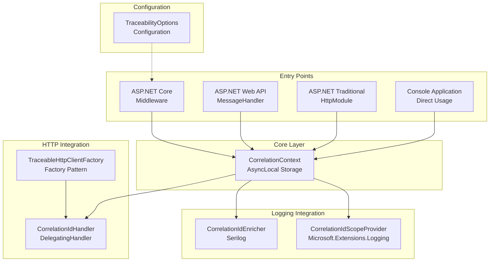
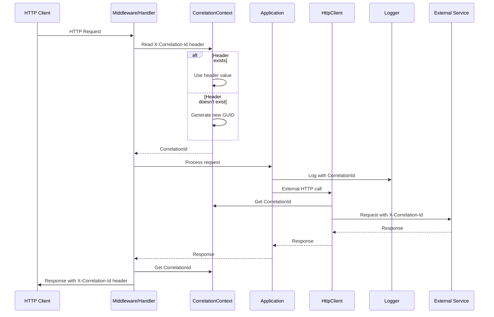
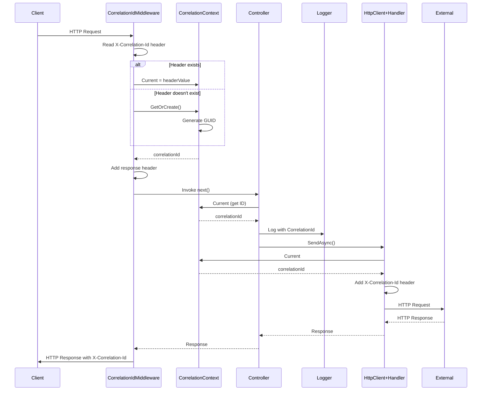
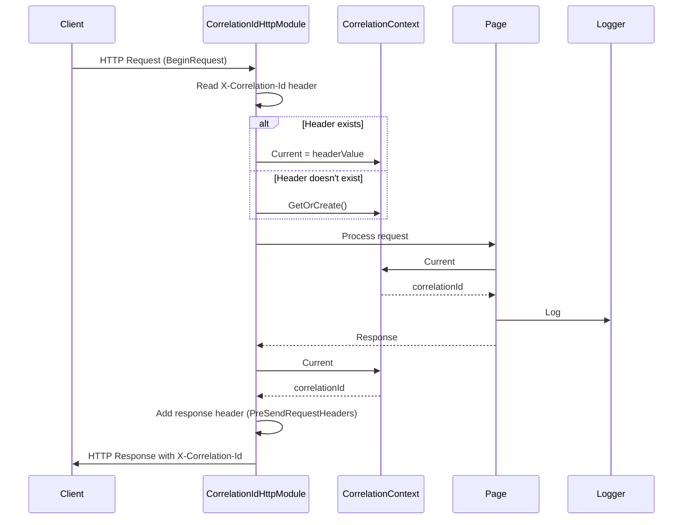
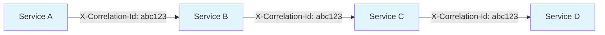
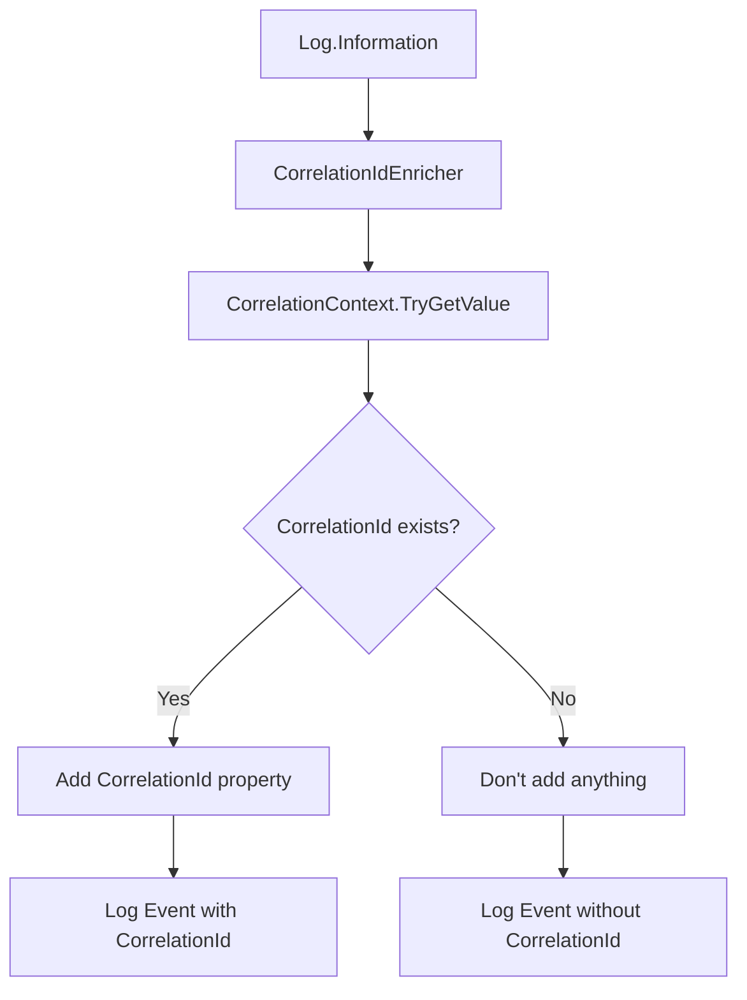
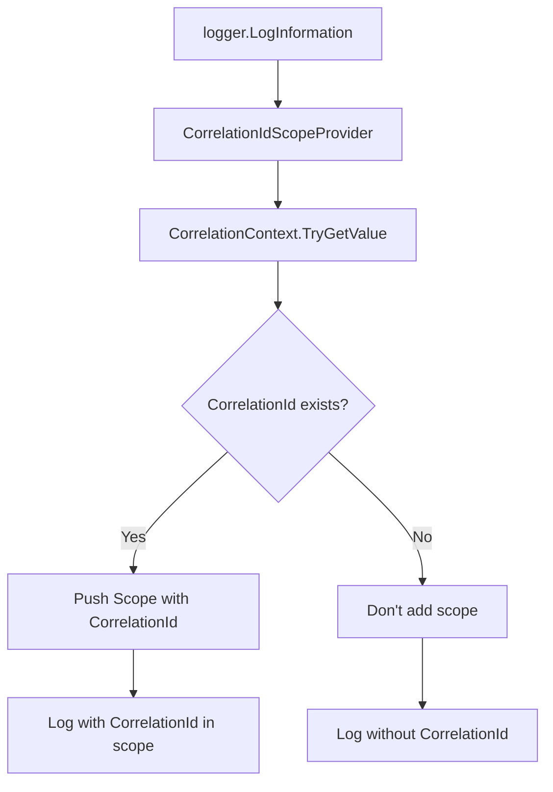

# High-Level Architecture

## Component Diagram

## Main Data Flow

## Flow: ASP.NET Core Request (.NET 8)

## Flow: ASP.NET Framework 4.8 Request

## Propagation in Chained HTTP Calls

**Behavior**:
1. Service A receives request without header → generates `abc123`
2. Service A calls Service B with header `X-Correlation-Id: abc123`
3. Service B reads header and uses `abc123` (doesn't generate new one)
4. Service B calls Service C with same header
5. Process continues until the end of the chain

**Rule**: Never generate a new correlation-id if one already exists in the request header.

## Logging Integration

### Serilog

### Microsoft.Extensions.Logging

