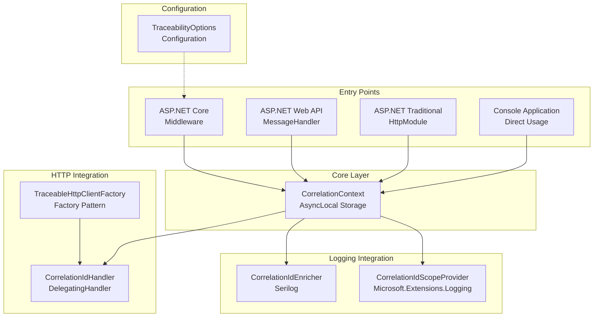
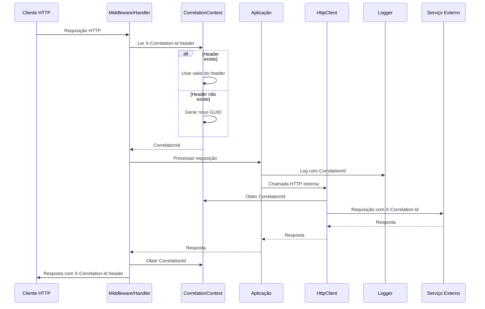
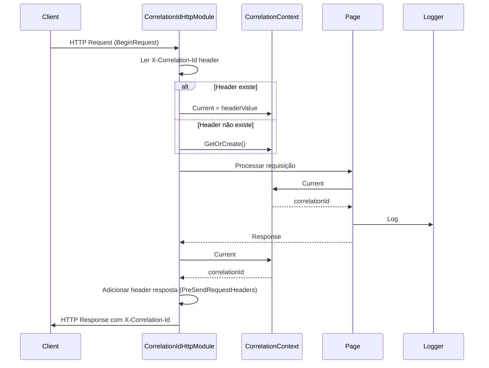
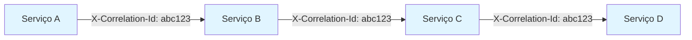
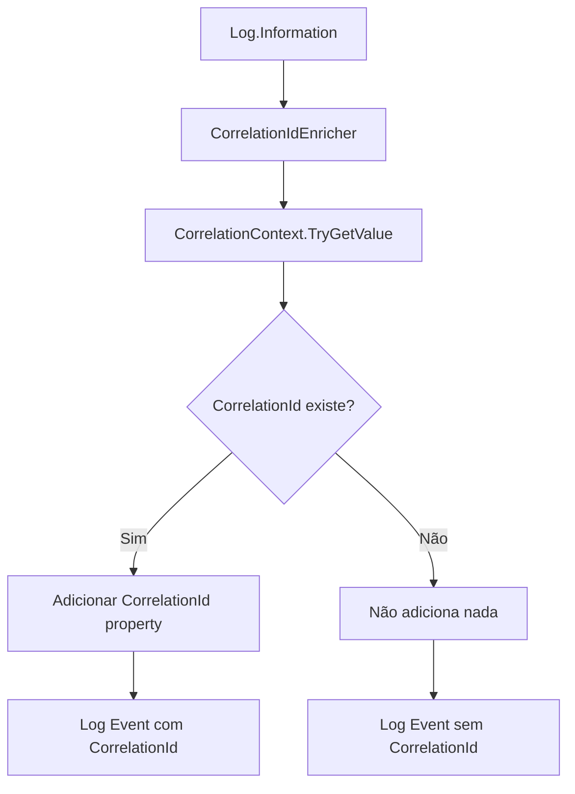
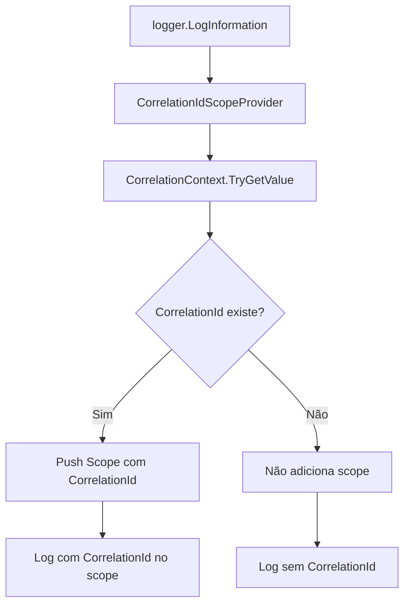

# Arquitetura de Alto Nível

## Diagrama de Componentes

## Fluxo de Dados Principal

## Fluxo: Requisição ASP.NET Core (.NET 8)

## Fluxo: Requisição ASP.NET Framework 4.8

## Propagação em Chamadas HTTP Encadeadas

**Comportamento**:
1. Serviço A recebe requisição sem header → gera `abc123`
2. Serviço A chama Serviço B com header `X-Correlation-Id: abc123`
3. Serviço B lê header e usa `abc123` (não gera novo)
4. Serviço B chama Serviço C com mesmo header
5. Processo continua até o fim da cadeia

**Regra**: Nunca gerar novo correlation-id se já existir no header da requisição.

## Integração com Logging

### Serilog

### Microsoft.Extensions.Logging

