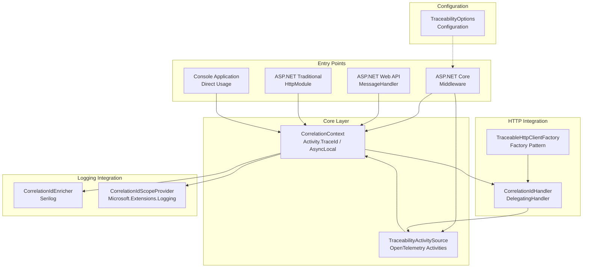
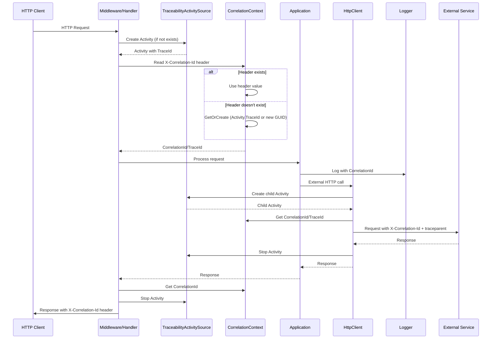
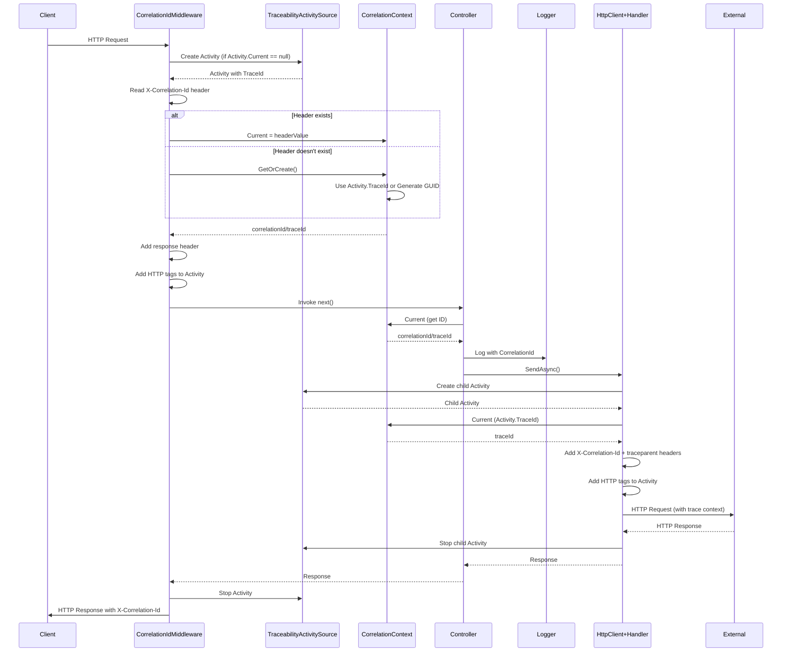
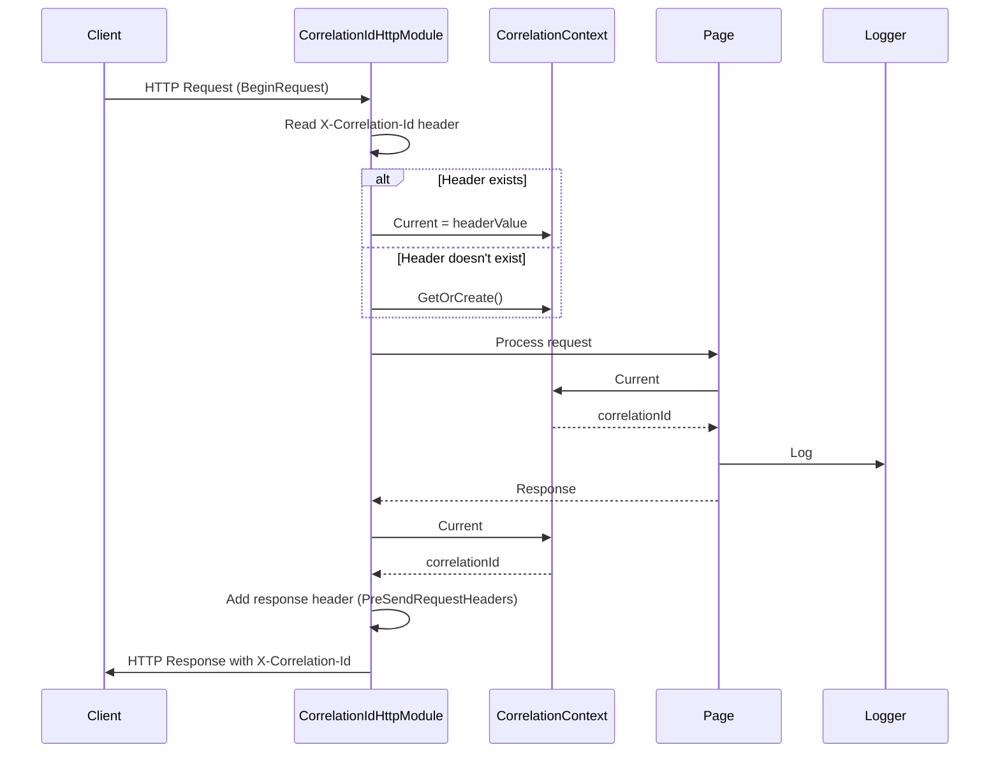
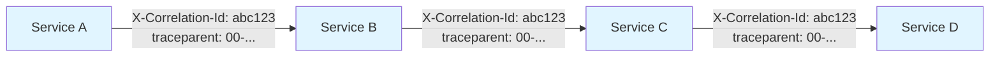
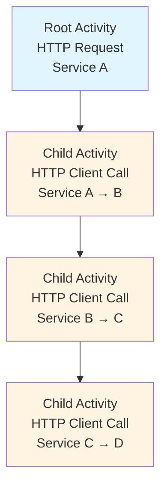
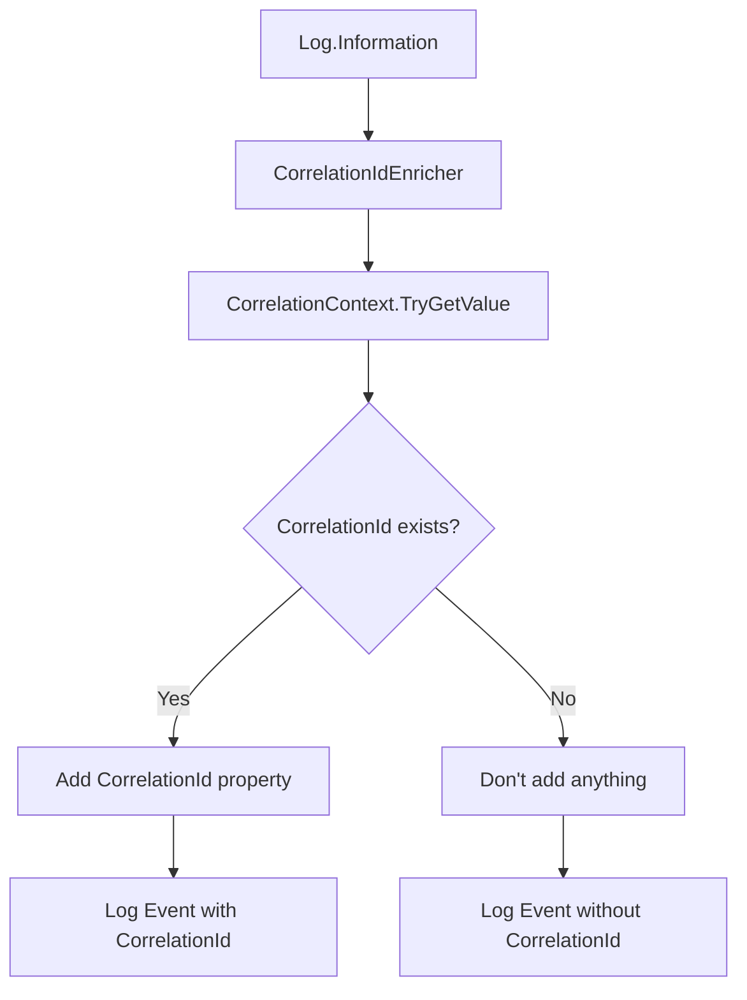
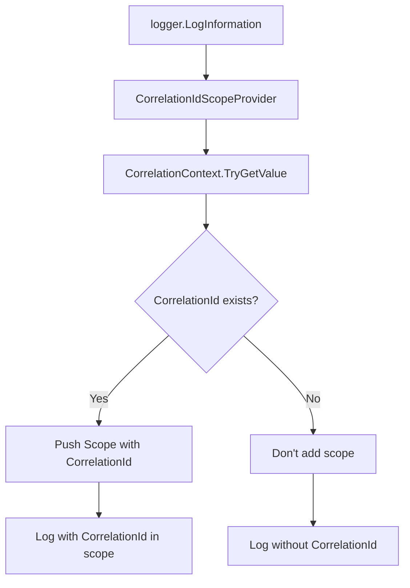

# High-Level Architecture

## Component Diagram

## Main Data Flow

## Flow: ASP.NET Core Request (.NET 8)

## Flow: ASP.NET Framework 4.8 Request

## Propagation in Chained HTTP Calls

**Behavior**:
1. Service A receives request without header → creates Activity with TraceId `abc123`
2. Service A calls Service B with headers:
   - `X-Correlation-Id: abc123` (backward compatibility)
   - `traceparent: 00-abc123...` (W3C Trace Context)
3. Service B reads headers and uses `abc123` (doesn't generate new one)
4. Service B creates child Activity (span) maintaining trace hierarchy
5. Service B calls Service C with same headers
6. Process continues until the end of the chain

**Rule**: Never generate a new correlation-id if one already exists in the request header. Always propagate W3C Trace Context for distributed tracing compatibility.

## Activity Hierarchy (Spans)

**Behavior**:
- Each HTTP request creates a root Activity (span)
- Each outgoing HTTP call creates a child Activity (span)
- Activities maintain parent-child relationships for hierarchical tracing
- All Activities share the same TraceId for correlation
- W3C Trace Context headers (`traceparent`, `tracestate`) propagate across services

## Logging Integration

### Serilog

### Microsoft.Extensions.Logging

