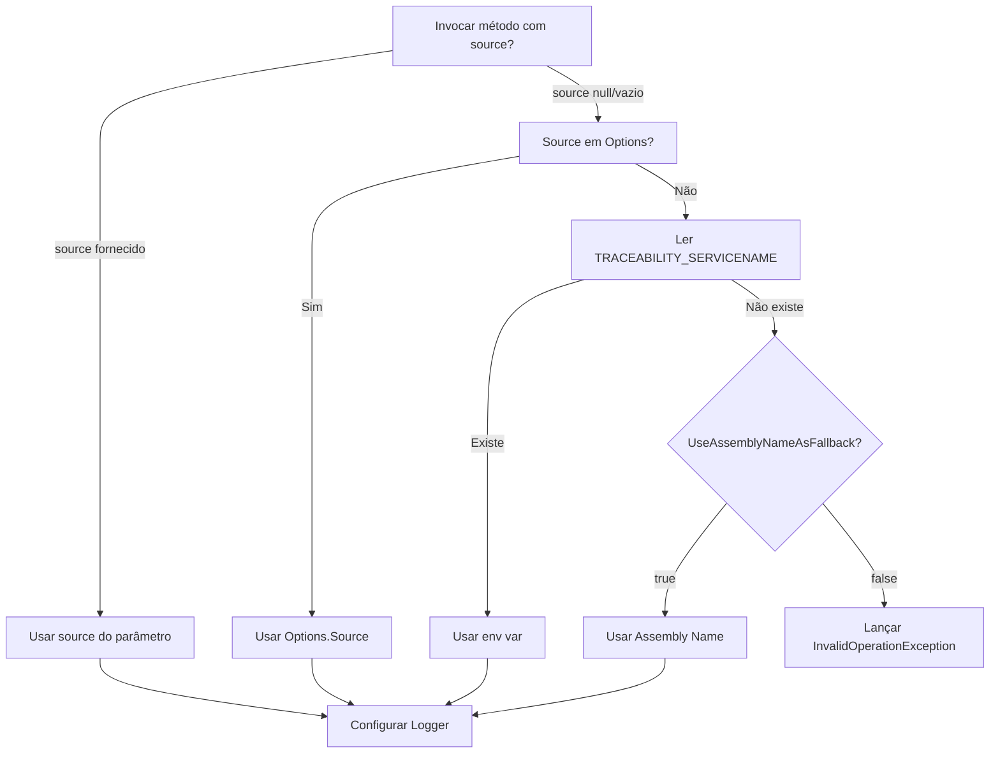

# Componentes Core - Detalhamento Técnico

## 1. CorrelationContext

**Localização**: `src/Traceability/CorrelationContext.cs`

**Responsabilidade**: Gerenciar o correlation-id no contexto assíncrono da thread atual usando `AsyncLocal<string>`.

**API Pública**:
```csharp
public static class CorrelationContext
{
    // Propriedades
    public static string Current { get; set; }
    public static bool HasValue { get; }
    
    // Métodos
    public static bool TryGetValue(out string? value);
    public static string GetOrCreate();
    public static void Clear();
}
```

**Dependências**: Nenhuma (classe estática pura)

**Comportamento**:
- Usa `AsyncLocal<string>` para isolamento entre contextos assíncronos
- Gera GUID formatado sem hífens (32 caracteres) quando necessário
- Thread-safe e async-safe
- Isolamento automático entre diferentes contextos assíncronos

**Exemplo de Uso**:
```csharp
// Obter ou criar correlation-id
var correlationId = CorrelationContext.Current;

// Verificar se existe
if (CorrelationContext.HasValue)
{
    var id = CorrelationContext.Current;
}

// Tentar obter sem criar (recomendado para evitar criação indesejada)
if (CorrelationContext.TryGetValue(out var correlationId))
{
    // Usar correlationId
}

// Limpar contexto
CorrelationContext.Clear();
```

**Decisões de Design**:
- `AsyncLocal` ao invés de `ThreadLocal` para suportar async/await corretamente
- GUID sem hífens para compatibilidade e legibilidade em logs
- Propriedade `Current` cria automaticamente se não existir (lazy initialization)

## 2. CorrelationIdMiddleware (ASP.NET Core)

**Localização**: `src/Traceability/Middleware/CorrelationIdMiddleware.cs`

**Condição de Compilação**: `#if NET8_0`

**Responsabilidade**: Middleware para ASP.NET Core que gerencia correlation-id automaticamente em requisições HTTP.

**API Pública**:
```csharp
public class CorrelationIdMiddleware
{
    public CorrelationIdMiddleware(RequestDelegate next, IOptions<TraceabilityOptions>? options = null);
    public Task InvokeAsync(HttpContext context);
}
```

**Dependências**:
- `Microsoft.AspNetCore.Http`
- `Traceability.CorrelationContext`

**Comportamento**:
1. Lê header `X-Correlation-Id` da requisição (ou header customizado via `HeaderName`)
2. Se existir, valida formato (se `ValidateCorrelationIdFormat = true`) e usa o valor
3. Se não existir ou for inválido, gera novo via `CorrelationContext.GetOrCreate()`
4. Adiciona correlation-id no header da resposta
- **Validação de HeaderName**: Se `HeaderName` for null ou vazio, usa "X-Correlation-Id" como padrão
- **Validação de CorrelationId**: Se habilitada, valida tamanho máximo (128 caracteres)

**Header Padrão**: `X-Correlation-Id`

**Exemplo de Uso**:
```csharp
// Program.cs
app.UseCorrelationId();
```

## 3. CorrelationIdMessageHandler (ASP.NET Web API)

**Localização**: `src/Traceability/WebApi/CorrelationIdMessageHandler.cs`

**Condição de Compilação**: `#if NET48`

**Responsabilidade**: MessageHandler para ASP.NET Web API que gerencia correlation-id.

**API Pública**:
```csharp
public class CorrelationIdMessageHandler : DelegatingHandler
{
    public static void Configure(TraceabilityOptions options);
    protected override Task<HttpResponseMessage> SendAsync(
        HttpRequestMessage request,
        CancellationToken cancellationToken);
}
```

**Dependências**:
- `System.Net.Http`
- `System.Web.Http`
- `Traceability.CorrelationContext`
- `Traceability.Configuration`

**Comportamento**: Similar ao Middleware, mas adaptado para o pipeline do Web API. Como .NET Framework não tem DI nativo, usa configuração estática via `Configure()`.

**Exemplo de Uso**:
```csharp
// Global.asax.cs - Configurar opções (opcional)
CorrelationIdMessageHandler.Configure(new TraceabilityOptions
{
    HeaderName = "X-Correlation-Id",
    ValidateCorrelationIdFormat = true
});

GlobalConfiguration.Configure(config =>
{
    config.MessageHandlers.Add(new CorrelationIdMessageHandler());
});
```

## 4. CorrelationIdHttpModule (ASP.NET Tradicional)

**Localização**: `src/Traceability/Middleware/CorrelationIdHttpModule.cs`

**Condição de Compilação**: `#if NET48`

**Responsabilidade**: HttpModule para ASP.NET tradicional que gerencia correlation-id.

**API Pública**:
```csharp
public class CorrelationIdHttpModule : IHttpModule
{
    public static void Configure(TraceabilityOptions options);
    public void Init(HttpApplication context);
    public void Dispose();
}
```

**Dependências**:
- `System.Web`
- `Traceability.CorrelationContext`
- `Traceability.Configuration`

**Comportamento**: Intercepta eventos `BeginRequest` e `PreSendRequestHeaders` do pipeline do IIS. Como .NET Framework não tem DI nativo, usa configuração estática via `Configure()`.

**Exemplo de Uso**:
```csharp
// Global.asax.cs - Configurar opções (opcional, antes do módulo ser usado)
CorrelationIdHttpModule.Configure(new TraceabilityOptions
{
    HeaderName = "X-Correlation-Id",
    ValidateCorrelationIdFormat = true
});
```

```xml
<!-- web.config -->
<system.webServer>
  <modules>
    <add name="CorrelationIdHttpModule" 
         type="Traceability.Middleware.CorrelationIdHttpModule, Traceability" />
  </modules>
</system.webServer>
```

## 5. CorrelationIdHandler (HttpClient)

**Localização**: `src/Traceability/HttpClient/CorrelationIdHandler.cs`

**Responsabilidade**: DelegatingHandler que adiciona automaticamente correlation-id nos headers das requisições HTTP.

**API Pública**:
```csharp
public class CorrelationIdHandler : DelegatingHandler
{
    // .NET 8.0 apenas
    public CorrelationIdHandler(IOptions<TraceabilityOptions>? options = null);
    
    protected override Task<HttpResponseMessage> SendAsync(
        HttpRequestMessage request,
        CancellationToken cancellationToken);
    
    // .NET 8.0 apenas
    protected override HttpResponseMessage Send(
        HttpRequestMessage request,
        CancellationToken cancellationToken);
}
```

**Dependências**:
- `System.Net.Http`
- `Traceability.CorrelationContext`
- `.NET 8`: `Microsoft.Extensions.Options`, `Traceability.Configuration`

**Comportamento**:
- Usa `CorrelationContext.TryGetValue()` para obter correlation-id sem criar um novo se não existir
- Remove header existente (se houver)
- Adiciona `X-Correlation-Id` ao header da requisição apenas se correlation-id existir no contexto
- **Validação de HeaderName**: Se `HeaderName` for null ou vazio, usa "X-Correlation-Id" como padrão

**Exemplo de Uso**:
```csharp
// Com IHttpClientFactory
services.AddHttpClient("MyClient")
    .AddHttpMessageHandler<CorrelationIdHandler>();

// Ou diretamente
var handler = new CorrelationIdHandler();
var client = new HttpClient(handler);
```

## 6. TraceableHttpClientFactory

**Localização**: `src/Traceability/HttpClient/TraceableHttpClientFactory.cs`

**Responsabilidade**: Factory para criar HttpClient configurado com correlation-id usando IHttpClientFactory. Previne socket exhaustion ao reutilizar conexões HTTP.

**API Pública**:
```csharp
public class TraceableHttpClientFactory
{
    // ✅ RECOMENDADO - Previne socket exhaustion (.NET 8)
    public static HttpClient CreateFromFactory(
        IHttpClientFactory factory,
        string? clientName = null,
        string? baseAddress = null);
}

// Método de extensão para IServiceCollection (.NET 8)
public static IHttpClientBuilder AddTraceableHttpClient(
    this IServiceCollection services,
    string clientName,
    Action<HttpClient>? configureClient = null);
```

**Dependências**:
- `Traceability.HttpClient.CorrelationIdHandler`
- `.NET 8`: `Microsoft.Extensions.Http`, `Microsoft.Extensions.DependencyInjection`

**Comportamento**:
- Usa `IHttpClientFactory` que gerencia pool de conexões HTTP
- Reutiliza sockets, prevenindo socket exhaustion
- Suporta políticas Polly via `.AddPolicyHandler()` do IHttpClientBuilder

**Exemplo de Uso**:
```csharp
// ✅ RECOMENDADO - Previne socket exhaustion
// Program.cs
builder.Services.AddTraceableHttpClient("ExternalApi", client =>
{
    client.BaseAddress = new Uri("https://api.example.com/");
    client.Timeout = TimeSpan.FromSeconds(30);
})
.AddPolicyHandler(retryPolicy); // Com Polly

// No serviço ou controller
var client = _httpClientFactory.CreateClient("ExternalApi");
```

## 7. CorrelationIdEnricher (Serilog)

**Localização**: `src/Traceability/Logging/CorrelationIdEnricher.cs`

**Responsabilidade**: Enricher do Serilog que adiciona correlation-id aos logs.

**API Pública**:
```csharp
public class CorrelationIdEnricher : ILogEventEnricher
{
    public void Enrich(LogEvent logEvent, ILogEventPropertyFactory propertyFactory);
}
```

**Dependências**:
- `Serilog`
- `Traceability.CorrelationContext`

**Comportamento**:
- Adiciona propriedade `CorrelationId` a todos os eventos de log se existir no contexto
- Usa `CorrelationContext.TryGetValue()` para evitar criar correlation-id indesejadamente
- Se não houver correlation-id no contexto, não adiciona nada ao log (não cria um novo)

**Exemplo de Uso**:
```csharp
Log.Logger = new LoggerConfiguration()
    .Enrich.With<CorrelationIdEnricher>()
    .WriteTo.Console(
        outputTemplate: "[{Timestamp:HH:mm:ss} {Level:u3}] {CorrelationId} {Message:lj}")
    .CreateLogger();
```

## 8. CorrelationIdScopeProvider (Microsoft.Extensions.Logging)

**Localização**: `src/Traceability/Logging/CorrelationIdScopeProvider.cs`

**Responsabilidade**: Provider de scope para Microsoft.Extensions.Logging que adiciona correlation-id.

**API Pública**:
```csharp
public class CorrelationIdScopeProvider : IExternalScopeProvider
{
    public CorrelationIdScopeProvider(IExternalScopeProvider? innerProvider = null);
    public void ForEachScope<TState>(Action<object?, TState> callback, TState state);
    public IDisposable Push(object? state);
}
```

**Dependências**:
- `Microsoft.Extensions.Logging`
- `Traceability.CorrelationContext`

**Comportamento**:
- Adiciona `CorrelationId` ao scope de logging se existir no contexto
- Usa `CorrelationContext.TryGetValue()` para evitar criar correlation-id indesejadamente
- Se não houver correlation-id no contexto, não adiciona ao scope (não cria um novo)
- Suporta provider interno para encadeamento

**Exemplo de Uso**:
```csharp
// RECOMENDADO (.NET 8): AddTraceability decora o IExternalScopeProvider do logging
// para incluir CorrelationId nos scopes.
builder.Services.AddTraceability("UserService");
builder.Logging.AddConsole(options => options.IncludeScopes = true);
```

## 9. SourceEnricher (Serilog)

**Localização**: `src/Traceability/Logging/SourceEnricher.cs`

**Responsabilidade**: Enricher do Serilog que adiciona o campo `Source` aos logs. O campo `Source` identifica a origem/serviço que está gerando os logs, essencial para unificar logs em ambientes distribuídos.

**API Pública**:
```csharp
public class SourceEnricher : ILogEventEnricher
{
    public SourceEnricher(string source);
    public void Enrich(LogEvent logEvent, ILogEventPropertyFactory propertyFactory);
}
```

**Dependências**:
- `Serilog`
- Nenhuma dependência de `CorrelationContext` (Source sempre é adicionado)

**Comportamento**:
- Sempre adiciona propriedade `Source` a todos os eventos de log
- Usa cache para reduzir alocações (similar ao `CorrelationIdEnricher`)
- Source é obrigatório no construtor (não pode ser null ou vazio)
- **Sanitização automática**: Source é automaticamente sanitizado para remover caracteres inválidos e limitar tamanho (100 caracteres)

**Exemplo de Uso**:
```csharp
Log.Logger = new LoggerConfiguration()
    .WithTraceability("UserService")
    .WriteTo.Console(
        outputTemplate: "[{Timestamp:HH:mm:ss} {Level:u3}] {Source} {CorrelationId} {Message:lj}")
    .CreateLogger();
```

**Nota**: O campo `Source` sempre será adicionado aos logs, independentemente da presença de correlation-id.

## 10. SourceScopeProvider (Microsoft.Extensions.Logging)

**Localização**: `src/Traceability/Logging/SourceScopeProvider.cs`

**Responsabilidade**: Provider de scope para Microsoft.Extensions.Logging que adiciona o campo `Source`. O campo `Source` identifica a origem/serviço que está gerando os logs.

**API Pública**:
```csharp
public class SourceScopeProvider : IExternalScopeProvider
{
    public SourceScopeProvider(string source, IExternalScopeProvider? innerProvider = null);
    public void ForEachScope<TState>(Action<object?, TState> callback, TState state);
    public IDisposable Push(object? state);
}
```

**Dependências**:
- `Microsoft.Extensions.Logging`
- Nenhuma dependência de `CorrelationContext` (Source sempre é adicionado)

**Comportamento**:
- Sempre adiciona `Source` ao scope de logging
- Suporta provider interno para encadeamento (decorator pattern)
- Source é obrigatório no construtor (não pode ser null ou vazio)
- **Sanitização automática**: Source é automaticamente sanitizado para remover caracteres inválidos e limitar tamanho (100 caracteres)

**Exemplo de Uso**:
```csharp
// RECOMENDADO (.NET 8): Source + CorrelationId via AddTraceability
builder.Services.AddTraceability("UserService");
builder.Logging.AddConsole(options => options.IncludeScopes = true);
```

**Nota**: O campo `Source` sempre será adicionado ao scope, independentemente da presença de correlation-id.

## 11. DataEnricher (Serilog)

**Localização**: `src/Traceability/Logging/DataEnricher.cs`

**Responsabilidade**: Enricher do Serilog que detecta objetos complexos nas propriedades do log e os serializa em um campo `data`. Identifica objetos não primitivos e os agrupa em um único campo `data` no JSON de saída.

**API Pública**:
```csharp
public class DataEnricher : ILogEventEnricher
{
    public void Enrich(LogEvent logEvent, ILogEventPropertyFactory propertyFactory);
}
```

**Dependências**:
- `Serilog`
- Nenhuma dependência de `CorrelationContext`

**Comportamento**:
- Analisa todas as propriedades do LogEvent
- Identifica objetos complexos (StructureValue, DictionaryValue, SequenceValue)
- Ignora propriedades primitivas (strings, números, DateTime, etc.)
- Ignora propriedades conhecidas (Source, CorrelationId, Message, etc.)
- Serializa objetos complexos em um campo `data`
- Se múltiplos objetos, combina em um único objeto `data`
- **Proteções implementadas**:
  - Limite de profundidade: 10 níveis (previne stack overflow)
  - Limite de tamanho: 1000 elementos por coleção (previne OutOfMemoryException)
  - Detecção de ciclos: identifica referências circulares e as marca como "[Circular reference detected]"

**Exemplo de Uso**:
```csharp
Log.Logger = new LoggerConfiguration()
    .Enrich.With<DataEnricher>()
    .WriteTo.Console(new JsonFormatter())
    .CreateLogger();

var user = new { UserId = 123, UserName = "john.doe" };
Log.Information("Processando requisição {@User}", user);
// Output: JSON com campo "data" contendo o objeto serializado
```

**Nota**: O `DataEnricher` é adicionado automaticamente quando você usa `WithTraceabilityJson()` com `LogIncludeData = true`.

## 12. JsonFormatter (Serilog)

**Localização**: `src/Traceability/Logging/JsonFormatter.cs`

**Responsabilidade**: Formatter JSON customizado para Serilog que formata logs em JSON estruturado. Suporta configuração via TraceabilityOptions para incluir/excluir campos específicos.

**API Pública**:
```csharp
public class JsonFormatter : ITextFormatter
{
    public JsonFormatter(TraceabilityOptions? options = null, bool indent = false);
    public void Format(LogEvent logEvent, TextWriter output);
}
```

**Dependências**:
- `Serilog`
- `Traceability.Configuration`

**Comportamento**:
- Formata logs em JSON estruturado
- Respeita as opções de `TraceabilityOptions` para incluir/excluir campos
- Suporta JSON compacto ou indentado
- Inclui automaticamente: Timestamp, Level, Source, CorrelationId, Message, Data, Exception (conforme configuração)
- **Proteções implementadas**:
  - Limite de profundidade em exceções: 10 níveis de InnerException (previne stack overflow)
  - Escape JSON robusto: suporta caracteres Unicode, incluindo surrogate pairs
  - Validação de estrutura JSON: verifica balanceamento de chaves/colchetes antes de incluir no output

**Exemplo de Uso**:
```csharp
var options = new TraceabilityOptions
{
    Source = "UserService",
    LogIncludeData = true,
    LogIncludeTimestamp = true
};

Log.Logger = new LoggerConfiguration()
    .WithTraceabilityJson(options)
    .WriteTo.Console(new JsonFormatter(options, indent: true))
    .CreateLogger();
```

**Output Esperado (JSON Indentado)**:
```json
{
  "Timestamp": "2024-01-15T14:23:45.123Z",
  "Level": "Information",
  "Source": "UserService",
  "CorrelationId": "a1b2c3d4e5f6789012345678901234ab",
  "Message": "Processando requisição",
  "Data": {
    "UserId": 123,
    "UserName": "john.doe"
  }
}
```

## 13. TraceabilityUtilities

**Localização**: `src/Traceability/Utilities/TraceabilityUtilities.cs`

**Responsabilidade**: Utilitários compartilhados para o pacote Traceability, incluindo lógica centralizada para obtenção e sanitização de Source.

**API Pública**:
```csharp
internal static class TraceabilityUtilities
{
    public static string GetServiceName(string? source, TraceabilityOptions? options = null);
    public static string SanitizeSource(string source);
}
```

**Dependências**:
- `System.Reflection` (para Assembly.GetEntryAssembly)
- `Traceability.Configuration`

**Comportamento**:
- `GetServiceName()`: Centraliza a lógica de obtenção de Source seguindo ordem de prioridade (parâmetro > options > env var > assembly name)
- `SanitizeSource()`: Remove caracteres inválidos, substitui espaços por underscore, limita tamanho máximo (100 caracteres)
- Source é automaticamente sanitizado quando obtido via `GetServiceName()`

**Exemplo de Uso**:
```csharp
// Usado internamente por ServiceCollectionExtensions e LoggerConfigurationExtensions
// Não é necessário uso direto - a sanitização é automática
```

**Decisões de Design**:
- Classe `internal` pois é utilitário interno do pacote
- Sanitização automática garante segurança em logs e headers HTTP
- Lógica centralizada previne duplicação e divergência

## 14. TraceabilityOptions

**Localização**: `src/Traceability/Configuration/TraceabilityOptions.cs`

**Responsabilidade**: Opções de configuração para o pacote.

**API Pública**:
```csharp
public enum LogOutputFormat
{
    JsonCompact,
    JsonIndented,
    Text
}

public class TraceabilityOptions
{
    public string HeaderName { get; set; } = "X-Correlation-Id";
    public bool AlwaysGenerateNew { get; set; } = false;
    public bool ValidateCorrelationIdFormat { get; set; } = false;
    public string? Source { get; set; }
    public LogOutputFormat LogOutputFormat { get; set; } = LogOutputFormat.JsonCompact;
    public bool LogIncludeTimestamp { get; set; } = true;
    public bool LogIncludeLevel { get; set; } = true;
    public bool LogIncludeSource { get; set; } = true;
    public bool LogIncludeCorrelationId { get; set; } = true;
    public bool LogIncludeMessage { get; set; } = true;
    public bool LogIncludeData { get; set; } = true;
    public bool LogIncludeException { get; set; } = true;
    public bool AutoRegisterMiddleware { get; set; } = true;
    public bool AutoConfigureHttpClient { get; set; } = true;
    public bool UseAssemblyNameAsFallback { get; set; } = true;
}
```

**Propriedades**:
- `HeaderName`: Nome do header HTTP para correlation-id (padrão: "X-Correlation-Id")
- `AlwaysGenerateNew`: Se true, gera um novo correlation-id mesmo se já existir um no contexto (padrão: false)
- `ValidateCorrelationIdFormat`: Se true, valida o formato do correlation-id recebido no header (padrão: false)
- `Source`: Nome da origem/serviço que está gerando os logs (opcional, mas recomendado para unificar logs distribuídos)
- `LogOutputFormat`: Formato de saída para logs (padrão: JsonCompact)
- `LogIncludeTimestamp`: Se deve incluir timestamp nos logs (padrão: true)
- `LogIncludeLevel`: Se deve incluir level nos logs (padrão: true)
- `LogIncludeSource`: Se deve incluir Source nos logs (padrão: true)
- `LogIncludeCorrelationId`: Se deve incluir CorrelationId nos logs (padrão: true)
- `LogIncludeMessage`: Se deve incluir Message nos logs (padrão: true)
- `LogIncludeData`: Se deve incluir campo Data para objetos serializados nos logs (padrão: true)
- `LogIncludeException`: Se deve incluir Exception nos logs (padrão: true)
- `AutoRegisterMiddleware`: Se false, desabilita o registro automático do middleware via IStartupFilter (padrão: true)
- `AutoConfigureHttpClient`: Se false, desabilita a configuração automática de todos os HttpClients com CorrelationIdHandler (padrão: true)
- `UseAssemblyNameAsFallback`: Se false, desabilita o uso do assembly name como fallback para Source (padrão: true)

## 15. Extensions

### ServiceCollectionExtensions

**Localização**: `src/Traceability/Extensions/ServiceCollectionExtensions.cs`

**Condição de Compilação**: `#if NET8_0`

**Métodos**:
```csharp
// Sobrecarga 1: Configuração via Action (Source pode vir de options ou env var)
public static IServiceCollection AddTraceability(
    this IServiceCollection services,
    Action<TraceabilityOptions>? configureOptions = null);

// Sobrecarga 2: Configuração com Source direto (opcional - pode vir de env var)
public static IServiceCollection AddTraceability(
    this IServiceCollection services,
    string? source = null,
    Action<TraceabilityOptions>? configureOptions = null);

public static IServiceCollection AddTraceabilityLogging(
    this IServiceCollection services,
    string? source = null,
    Action<TraceabilityOptions>? configureOptions = null);

public static IServiceCollection AddTraceableHttpClient<TClient>(
    this IServiceCollection services,
    string? baseAddress = null)
    where TClient : class;

public static IHttpClientBuilder AddTraceableHttpClient(
    this IServiceCollection services,
    string clientName,
    Action<HttpClient>? configureClient = null);
```

**Comportamento**:
- `AddTraceability()` e `AddTraceabilityLogging()` agora aceitam `source` como opcional
- Se `source` não for fornecido, será lido de `TraceabilityOptions.Source`, variável de ambiente `TRACEABILITY_SERVICENAME`, ou assembly name (se `UseAssemblyNameAsFallback = true`)
- Se nenhum source estiver disponível, uma exceção `InvalidOperationException` será lançada
- Prioridade: Parâmetro > Options.Source > Env Var > Assembly Name > Erro
- **Sanitização automática**: Source é automaticamente sanitizado via `TraceabilityUtilities.SanitizeSource()` para garantir segurança
- **Auto-configuração**: Por padrão, `AddTraceability()` automaticamente:
  - Registra o middleware `CorrelationIdMiddleware` via `IStartupFilter` (se `AutoRegisterMiddleware = true`)
  - Configura todos os HttpClients criados via `IHttpClientFactory` com `CorrelationIdHandler` (se `AutoConfigureHttpClient = true`)
- **Opt-out**: Defina `AutoRegisterMiddleware = false` ou `AutoConfigureHttpClient = false` nas opções para desabilitar auto-configuração

### ApplicationBuilderExtensions

**Localização**: `src/Traceability/Extensions/ApplicationBuilderExtensions.cs`

**Condição de Compilação**: `#if NET8_0`

**Métodos**:
```csharp
public static IApplicationBuilder UseCorrelationId(this IApplicationBuilder app);
```

### HttpClientExtensions

**Localização**: `src/Traceability/Extensions/HttpClientExtensions.cs`

**Métodos**:
```csharp
public static HttpClient AddCorrelationIdHeader(
    this HttpClient client,
    HttpRequestMessage request);
```

### LoggerConfigurationExtensions

**Localização**: `src/Traceability/Extensions/LoggerConfigurationExtensions.cs`

**Responsabilidade**: Extensões para LoggerConfiguration do Serilog que facilitam a configuração de traceability.

**Métodos**:
```csharp
// Método original - adiciona Source e CorrelationId (source opcional)
public static LoggerConfiguration WithTraceability(
    this LoggerConfiguration config,
    string? source = null);

// Novo método - adiciona Source, CorrelationId e DataEnricher para template JSON (source opcional)
public static LoggerConfiguration WithTraceabilityJson(
    this LoggerConfiguration config,
    string? source = null,
    Action<TraceabilityOptions>? configureOptions = null);

// Sobrecarga com TraceabilityOptions
public static LoggerConfiguration WithTraceabilityJson(
    this LoggerConfiguration config,
    TraceabilityOptions options);
```

**Comportamento**:
- `WithTraceability()`: Adiciona automaticamente `SourceEnricher` e `CorrelationIdEnricher` ao Serilog
- `WithTraceabilityJson()`: Adiciona `SourceEnricher`, `CorrelationIdEnricher` e `DataEnricher` (se `LogIncludeData = true`)
- Source é opcional e pode vir de variável de ambiente `TRACEABILITY_SERVICENAME` ou `TraceabilityOptions.Source`
- Se nenhum source estiver disponível (nem parâmetro, nem options, nem env var), uma exceção `InvalidOperationException` será lançada
- Prioridade: Parâmetro > Options.Source > Env Var > Erro
- Output sempre em formato JSON para garantir uniformização
- Facilita configuração de traceability em uma única chamada
- `WithTraceabilityJson()` é otimizado para uso com template JSON padrão

**Exemplo de Uso**:
```csharp
// Configuração básica
Log.Logger = new LoggerConfiguration()
    .WithTraceability("UserService")
    .WriteTo.Console()
    .CreateLogger();

// Configuração com template JSON padrão
Log.Logger = new LoggerConfiguration()
    .WithTraceabilityJson("UserService")
    .WriteTo.Console(new JsonFormatter())
    .CreateLogger();

// Configuração customizada
Log.Logger = new LoggerConfiguration()
    .WithTraceabilityJson("UserService", options =>
    {
        options.LogIncludeData = true;
        options.LogOutputFormat = LogOutputFormat.JsonIndented;
    })
    .WriteTo.Console(new JsonFormatter(options, indent: true))
    .CreateLogger();
```

## Variáveis de Ambiente e Prioridade de Configuração

**Localização**: Implementado em `src/Traceability/Extensions/LoggerConfigurationExtensions.cs` e `src/Traceability/Extensions/ServiceCollectionExtensions.cs`

**Responsabilidade**: Suportar variáveis de ambiente para reduzir verbosidade na configuração e garantir uniformização de logs em todas as aplicações e serviços.

**Variáveis de Ambiente Suportadas**:

1. **`TRACEABILITY_SERVICENAME`**: Define o nome do serviço/origem que está gerando os logs. Este valor será adicionado ao campo `Source` em todos os logs.

2. **`LOG_LEVEL`**: Define o nível mínimo de log (Verbose, Debug, Information, Warning, Error, Fatal).

**Fluxo de Decisão para Source (ServiceName)**:



**Prioridade de Configuração**:

1. **Source (ServiceName)**:
   - Prioridade 1: Parâmetro `source` fornecido explicitamente (prioridade máxima)
   - Prioridade 2: `TraceabilityOptions.Source` definido nas opções
   - Prioridade 3: Variável de ambiente `TRACEABILITY_SERVICENAME`
   - Prioridade 4: Assembly name (se `UseAssemblyNameAsFallback = true`, padrão: true)
   - Se nenhum estiver disponível, uma exceção `InvalidOperationException` será lançada para forçar o padrão único

2. **LogLevel**:
   - Prioridade 1: Variável de ambiente `LOG_LEVEL` (prioridade máxima)
   - Prioridade 2: `TraceabilityOptions.MinimumLogLevel` definido nas opções
   - Prioridade 3: Information (padrão)

3. **Output Format**: Sempre JSON (JsonCompact ou JsonIndented, nunca Text)

**Output JSON Obrigatório**:

Todos os logs gerados pelo Traceability são sempre em formato JSON para garantir uniformização entre diferentes aplicações e serviços, independente do framework (.NET 8 ou .NET Framework 4.8). O formato JSON padrão inclui:
- `Timestamp`: Data e hora do log
- `Level`: Nível do log (Information, Warning, Error, etc.)
- `Source`: Nome do serviço (obtido de `TRACEABILITY_SERVICENAME` ou parâmetro)
- `CorrelationId`: ID de correlação (quando disponível)
- `Message`: Mensagem do log
- `Data`: Objetos serializados (quando presente)
- `Exception`: Informações de exceção (quando presente)

**Exemplo de Uso**:

```csharp
// Com variável de ambiente TRACEABILITY_SERVICENAME="UserService" definida
Log.Logger = new LoggerConfiguration()
    .WithTraceability() // source opcional - lê de TRACEABILITY_SERVICENAME
    .WriteTo.Console(new JsonFormatter())
    .CreateLogger();

// Com parâmetro explícito (sobrescreve env var)
Log.Logger = new LoggerConfiguration()
    .WithTraceability("CustomService") // parâmetro tem prioridade
    .WriteTo.Console(new JsonFormatter())
    .CreateLogger();

// Com AddTraceability
builder.Services.AddTraceability(); // source opcional - lê de TRACEABILITY_SERVICENAME
// ou
builder.Services.AddTraceability("CustomService"); // sobrescreve env var
```

**Racional**:

- **Reduzir Verbosidade**: Permite configurar ServiceName e LogLevel via variáveis de ambiente, reduzindo a necessidade de código repetitivo
- **Forçar Padrão Único**: Se Source não estiver disponível (nem parâmetro, nem options, nem env var), uma exceção é lançada para garantir que todos os serviços sigam o mesmo padrão
- **Uniformização de Logs**: Output sempre em JSON garante que todos os logs de diferentes aplicações e serviços tenham o mesmo formato, facilitando análise e correlação


