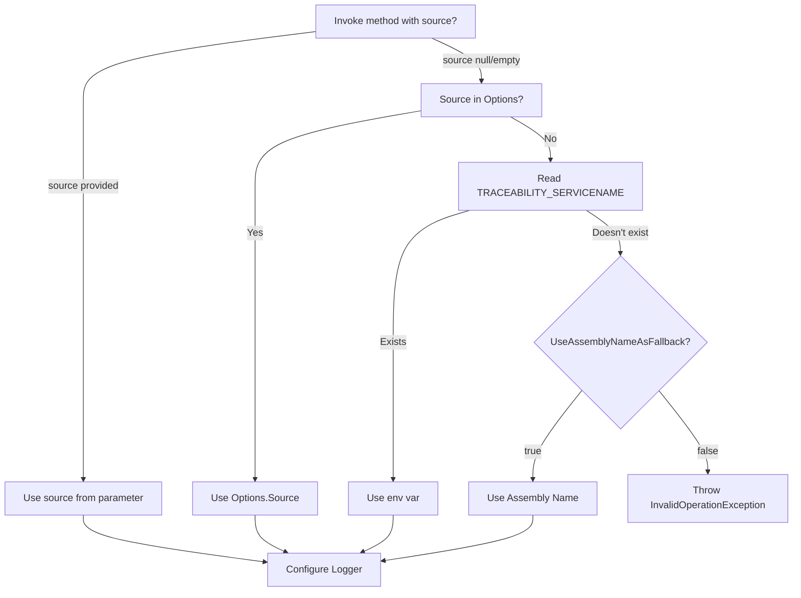

# Core Components - Technical Details

## 1. CorrelationContext

**Location**: `src/Traceability/CorrelationContext.cs`

**Responsibility**: Manage correlation-id/trace-id in the current thread's asynchronous context. Uses OpenTelemetry `Activity.TraceId` when available (priority 1), with `AsyncLocal<string>` as fallback (priority 2).

**Public API**:
```csharp
public static class CorrelationContext
{
    // Properties
    public static string Current { get; set; }
    public static bool HasValue { get; }
    
    // Methods
    public static bool TryGetValue(out string? value);
    public static string GetOrCreate();
    public static void Clear();
}
```

**Dependencies**: 
- `System.Diagnostics` (for Activity)
- `System.Threading` (for AsyncLocal)

**Behavior**:
- **Priority 1**: Uses `Activity.TraceId` (OpenTelemetry) when available - industry standard for distributed tracing
- **Priority 2**: Falls back to `AsyncLocal<string>` when Activity is not available
- Generates GUID formatted without hyphens (32 characters) when needed (fallback mode)
- Thread-safe and async-safe
- Automatic isolation between different asynchronous contexts
- Synchronizes Activity.TraceId with AsyncLocal fallback for compatibility

**Usage Example**:
```csharp
// Get or create correlation-id
var correlationId = CorrelationContext.Current;

// Check if exists
if (CorrelationContext.HasValue)
{
    var id = CorrelationContext.Current;
}

// Try to get without creating (recommended to avoid unwanted creation)
if (CorrelationContext.TryGetValue(out var correlationId))
{
    // Use correlationId
}

// Clear context
CorrelationContext.Clear();
```

**Design Decisions**:
- **OpenTelemetry Integration**: Uses `Activity.TraceId` as primary source for industry-standard distributed tracing compatibility
- **Fallback Strategy**: `AsyncLocal<string>` as fallback ensures compatibility when OpenTelemetry is not configured
- `AsyncLocal` instead of `ThreadLocal` to correctly support async/await
- GUID without hyphens for compatibility and readability in logs
- `Current` property automatically creates if it doesn't exist (lazy initialization)
- Synchronization between Activity and AsyncLocal ensures consistent behavior across different scenarios

## 2. CorrelationIdMiddleware (ASP.NET Core)

**Location**: `src/Traceability/Middleware/CorrelationIdMiddleware.cs`

**Compilation Condition**: `#if NET8_0`

**Responsibility**: Middleware for ASP.NET Core that automatically manages correlation-id in HTTP requests and creates OpenTelemetry Activities (spans) when OpenTelemetry is not configured.

**Public API**:
```csharp
public class CorrelationIdMiddleware
{
    public CorrelationIdMiddleware(RequestDelegate next, IOptions<TraceabilityOptions>? options = null);
    public Task InvokeAsync(HttpContext context);
}
```

**Dependencies**:
- `Microsoft.AspNetCore.Http`
- `Traceability.CorrelationContext`
- `Traceability.OpenTelemetry.TraceabilityActivitySource`

**Behavior**:
1. **Creates Activity automatically**: If `Activity.Current` is null (OpenTelemetry not configured), creates a new Activity (span) using `TraceabilityActivitySource`
2. **Adds HTTP tags**: Automatically adds standard HTTP tags to Activity (method, url, scheme, host, status_code, etc.)
3. Reads `X-Correlation-Id` header from request (or custom header via `HeaderName`)
4. If it exists, validates format (if `ValidateCorrelationIdFormat = true`) and uses the value
5. If it doesn't exist or is invalid, generates new one via `CorrelationContext.GetOrCreate()`
6. Adds correlation-id to response header
7. **Error tracking**: Marks Activity with error tags if exception occurs
- **HeaderName Validation**: If `HeaderName` is null or empty, uses "X-Correlation-Id" as default
- **CorrelationId Validation**: If enabled, validates maximum size (128 characters)
- **Activity Lifecycle**: Activity is automatically stopped when request completes

**Default Header**: `X-Correlation-Id`

**Usage Example**:
```csharp
// Program.cs
app.UseCorrelationId();
```

## 3. CorrelationIdMessageHandler (ASP.NET Web API)

**Location**: `src/Traceability/WebApi/CorrelationIdMessageHandler.cs`

**Compilation Condition**: `#if NET48`

**Responsibility**: MessageHandler for ASP.NET Web API that manages correlation-id.

**Public API**:
```csharp
public class CorrelationIdMessageHandler : DelegatingHandler
{
    public static void Configure(TraceabilityOptions options);
    protected override Task<HttpResponseMessage> SendAsync(
        HttpRequestMessage request,
        CancellationToken cancellationToken);
}
```

**Dependencies**:
- `System.Net.Http`
- `System.Web.Http`
- `Traceability.CorrelationContext`
- `Traceability.Configuration`

**Behavior**: Similar to Middleware, but adapted for Web API pipeline. Since .NET Framework doesn't have native DI, uses static configuration via `Configure()`.

**Usage Example**:
```csharp
// Global.asax.cs - Configure options (optional)
CorrelationIdMessageHandler.Configure(new TraceabilityOptions
{
    HeaderName = "X-Correlation-Id",
    ValidateCorrelationIdFormat = true
});

GlobalConfiguration.Configure(config =>
{
    config.MessageHandlers.Add(new CorrelationIdMessageHandler());
});
```

## 4. CorrelationIdHttpModule (Traditional ASP.NET)

**Location**: `src/Traceability/Middleware/CorrelationIdHttpModule.cs`

**Compilation Condition**: `#if NET48`

**Responsibility**: HttpModule for traditional ASP.NET that manages correlation-id.

**Public API**:
```csharp
public class CorrelationIdHttpModule : IHttpModule
{
    public static void Configure(TraceabilityOptions options);
    public void Init(HttpApplication context);
    public void Dispose();
}
```

**Dependencies**:
- `System.Web`
- `Traceability.CorrelationContext`
- `Traceability.Configuration`

**Behavior**: Intercepts `BeginRequest` and `PreSendRequestHeaders` events from IIS pipeline. Since .NET Framework doesn't have native DI, uses static configuration via `Configure()`.

**Usage Example**:
```csharp
// Global.asax.cs - Configure options (optional, before module is used)
CorrelationIdHttpModule.Configure(new TraceabilityOptions
{
    HeaderName = "X-Correlation-Id",
    ValidateCorrelationIdFormat = true
});
```

```xml
<!-- web.config -->
<system.webServer>
  <modules>
    <add name="CorrelationIdHttpModule" 
         type="Traceability.Middleware.CorrelationIdHttpModule, Traceability" />
  </modules>
</system.webServer>
```

## 5. CorrelationIdHandler (HttpClient)

**Location**: `src/Traceability/HttpClient/CorrelationIdHandler.cs`

**Responsibility**: DelegatingHandler that automatically adds correlation-id to HTTP request headers and creates OpenTelemetry child Activities (spans) for distributed tracing. Propagates W3C Trace Context headers.

**Public API**:
```csharp
public class CorrelationIdHandler : DelegatingHandler
{
    // .NET 8.0 only
    public CorrelationIdHandler(IOptions<TraceabilityOptions>? options = null);
    
    protected override Task<HttpResponseMessage> SendAsync(
        HttpRequestMessage request,
        CancellationToken cancellationToken);
    
    // .NET 8.0 only
    protected override HttpResponseMessage Send(
        HttpRequestMessage request,
        CancellationToken cancellationToken);
}
```

**Dependencies**:
- `System.Net.Http`
- `Traceability.CorrelationContext`
- `Traceability.OpenTelemetry.TraceabilityActivitySource`
- `.NET 8`: `Microsoft.Extensions.Options`, `Traceability.Configuration`

**Behavior**:
- **Creates child Activity**: Creates a child Activity (span) for each HTTP request, maintaining hierarchical trace structure
- **Adds HTTP tags**: Automatically adds standard HTTP tags to Activity (method, url, scheme, host, status_code)
- **W3C Trace Context propagation**: Automatically propagates `traceparent` header (W3C Trace Context standard)
- **Baggage propagation**: Propagates `tracestate` header when Activity has baggage
- Uses `CorrelationContext.TryGetValue()` to get correlation-id without creating a new one if it doesn't exist
- Removes existing header (if any)
- Adds `X-Correlation-Id` to request header only if correlation-id exists in context (for backward compatibility)
- **HeaderName Validation**: If `HeaderName` is null or empty, uses "X-Correlation-Id" as default
- **Error tracking**: Marks Activity with error tags if exception occurs

**Usage Example**:
```csharp
// With IHttpClientFactory
services.AddHttpClient("MyClient")
    .AddHttpMessageHandler<CorrelationIdHandler>();

// Or directly
var handler = new CorrelationIdHandler();
var client = new HttpClient(handler);
```

## 6. TraceabilityActivitySource

**Location**: `src/Traceability/OpenTelemetry/TraceabilityActivitySource.cs`

**Compilation Condition**: `#if NET48 || NET8_0`

**Responsibility**: Centralized ActivitySource for creating OpenTelemetry Activities (spans). Provides functionality that OpenTelemetry does automatically in .NET 8, but needs to be implemented manually in .NET Framework 4.8.

**Public API**:
```csharp
public static class TraceabilityActivitySource
{
    public static ActivitySource Source { get; }
    public static Activity? StartActivity(string name, ActivityKind kind = ActivityKind.Server);
    public static Activity? StartActivity(string name, ActivityKind kind, Activity? parent);
}
```

**Dependencies**:
- `System.Diagnostics` (for Activity and ActivitySource)

**Behavior**:
- Creates Activities (spans) for distributed tracing
- Supports hierarchical spans (parent/child relationships)
- Used automatically by `CorrelationIdMiddleware` when OpenTelemetry is not configured
- Used automatically by `CorrelationIdHandler` to create child spans for HTTP calls
- **ActivityKind**: 
  - `ActivityKind.Server` for incoming HTTP requests (middleware)
  - `ActivityKind.Client` for outgoing HTTP requests (handler)

**Usage Example**:
```csharp
// Create a root Activity (span)
using var activity = TraceabilityActivitySource.StartActivity("HTTP Request", ActivityKind.Server);

// Create a child Activity (span)
var parentActivity = Activity.Current;
using var childActivity = TraceabilityActivitySource.StartActivity("HTTP Client", ActivityKind.Client, parentActivity);
```

**Design Decisions**:
- Centralized ActivitySource ensures consistent naming and behavior
- Supports both .NET 8 and .NET Framework 4.8
- Automatically creates Activities when OpenTelemetry is not configured
- Maintains compatibility with OpenTelemetry when it is configured

## 7. TraceableHttpClientFactory

**Location**: `src/Traceability/HttpClient/TraceableHttpClientFactory.cs`

**Responsibility**: Factory for creating HttpClient configured with correlation-id using IHttpClientFactory. Prevents socket exhaustion by reusing HTTP connections.

**Public API**:
```csharp
public class TraceableHttpClientFactory
{
    // ✅ RECOMMENDED - Prevents socket exhaustion (.NET 8)
    public static HttpClient CreateFromFactory(
        IHttpClientFactory factory,
        string? clientName = null,
        string? baseAddress = null);
}

// Extension method for IServiceCollection (.NET 8)
public static IHttpClientBuilder AddTraceableHttpClient(
    this IServiceCollection services,
    string clientName,
    Action<HttpClient>? configureClient = null);
```

**Dependencies**:
- `Traceability.HttpClient.CorrelationIdHandler`
- `.NET 8`: `Microsoft.Extensions.Http`, `Microsoft.Extensions.DependencyInjection`

**Behavior**:
- Uses `IHttpClientFactory` which manages HTTP connection pool
- Reuses sockets, preventing socket exhaustion
- Supports Polly policies via `.AddPolicyHandler()` of IHttpClientBuilder

**Usage Example**:
```csharp
// ✅ RECOMMENDED - Prevents socket exhaustion
// Program.cs
builder.Services.AddTraceableHttpClient("ExternalApi", client =>
{
    client.BaseAddress = new Uri("https://api.example.com/");
    client.Timeout = TimeSpan.FromSeconds(30);
})
.AddPolicyHandler(retryPolicy); // With Polly

// In service or controller
var client = _httpClientFactory.CreateClient("ExternalApi");
```

## 8. CorrelationIdEnricher (Serilog)

**Location**: `src/Traceability/Logging/CorrelationIdEnricher.cs`

**Responsibility**: Serilog enricher that adds correlation-id to logs.

**Public API**:
```csharp
public class CorrelationIdEnricher : ILogEventEnricher
{
    public void Enrich(LogEvent logEvent, ILogEventPropertyFactory propertyFactory);
}
```

**Dependencies**:
- `Serilog`
- `Traceability.CorrelationContext`

**Behavior**:
- Adds `CorrelationId` property to all log events if it exists in context
- Uses `CorrelationContext.TryGetValue()` to avoid creating correlation-id unintentionally
- If there's no correlation-id in context, doesn't add anything to log (doesn't create a new one)

**Usage Example**:
```csharp
Log.Logger = new LoggerConfiguration()
    .Enrich.With<CorrelationIdEnricher>()
    .WriteTo.Console(
        outputTemplate: "[{Timestamp:HH:mm:ss} {Level:u3}] {CorrelationId} {Message:lj}")
    .CreateLogger();
```

## 9. CorrelationIdScopeProvider (Microsoft.Extensions.Logging)

**Location**: `src/Traceability/Logging/CorrelationIdScopeProvider.cs`

**Responsibility**: Scope provider for Microsoft.Extensions.Logging that adds correlation-id.

**Public API**:
```csharp
public class CorrelationIdScopeProvider : IExternalScopeProvider
{
    public CorrelationIdScopeProvider(IExternalScopeProvider? innerProvider = null);
    public void ForEachScope<TState>(Action<object?, TState> callback, TState state);
    public IDisposable Push(object? state);
}
```

**Dependencies**:
- `Microsoft.Extensions.Logging`
- `Traceability.CorrelationContext`

**Behavior**:
- Adds `CorrelationId` to logging scope if it exists in context
- Uses `CorrelationContext.TryGetValue()` to avoid creating correlation-id unintentionally
- If there's no correlation-id in context, doesn't add to scope (doesn't create a new one)
- Supports internal provider for chaining

**Usage Example**:
```csharp
// RECOMMENDED (.NET 8): AddTraceability decorates the logging IExternalScopeProvider
// to include CorrelationId in scopes.
builder.Services.AddTraceability("UserService");
builder.Logging.AddConsole(options => options.IncludeScopes = true);
```

## 10. SourceEnricher (Serilog)

**Location**: `src/Traceability/Logging/SourceEnricher.cs`

**Responsibility**: Serilog enricher that adds the `Source` field to logs. The `Source` field identifies the origin/service that is generating the logs, essential for unifying logs in distributed environments.

**Public API**:
```csharp
public class SourceEnricher : ILogEventEnricher
{
    public SourceEnricher(string source);
    public void Enrich(LogEvent logEvent, ILogEventPropertyFactory propertyFactory);
}
```

**Dependencies**:
- `Serilog`
- No dependency on `CorrelationContext` (Source is always added)

**Behavior**:
- Always adds `Source` property to all log events
- Uses cache to reduce allocations (similar to `CorrelationIdEnricher`)
- Source is required in constructor (cannot be null or empty)
- **Automatic sanitization**: Source is automatically sanitized to remove invalid characters and limit size (100 characters)

**Usage Example**:
```csharp
Log.Logger = new LoggerConfiguration()
    .WithTraceability("UserService")
    .WriteTo.Console(
        outputTemplate: "[{Timestamp:HH:mm:ss} {Level:u3}] {Source} {CorrelationId} {Message:lj}")
    .CreateLogger();
```

**Note**: The `Source` field will always be added to logs, regardless of correlation-id presence.

## 11. SourceScopeProvider (Microsoft.Extensions.Logging)

**Location**: `src/Traceability/Logging/SourceScopeProvider.cs`

**Responsibility**: Scope provider for Microsoft.Extensions.Logging that adds the `Source` field. The `Source` field identifies the origin/service that is generating the logs.

**Public API**:
```csharp
public class SourceScopeProvider : IExternalScopeProvider
{
    public SourceScopeProvider(string source, IExternalScopeProvider? innerProvider = null);
    public void ForEachScope<TState>(Action<object?, TState> callback, TState state);
    public IDisposable Push(object? state);
}
```

**Dependencies**:
- `Microsoft.Extensions.Logging`
- No dependency on `CorrelationContext` (Source is always added)

**Behavior**:
- Always adds `Source` to logging scope
- Supports internal provider for chaining (decorator pattern)
- Source is required in constructor (cannot be null or empty)
- **Automatic sanitization**: Source is automatically sanitized to remove invalid characters and limit size (100 characters)

**Usage Example**:
```csharp
// RECOMMENDED (.NET 8): Source + CorrelationId via AddTraceability
builder.Services.AddTraceability("UserService");
builder.Logging.AddConsole(options => options.IncludeScopes = true);
```

**Note**: The `Source` field will always be added to scope, regardless of correlation-id presence.

## 12. DataEnricher (Serilog)

**Location**: `src/Traceability/Logging/DataEnricher.cs`

**Responsibility**: Serilog enricher that detects complex objects in log properties and serializes them in a `data` field. Identifies non-primitive objects and groups them in a single `data` field in JSON output.

**Public API**:
```csharp
public class DataEnricher : ILogEventEnricher
{
    public void Enrich(LogEvent logEvent, ILogEventPropertyFactory propertyFactory);
}
```

**Dependencies**:
- `Serilog`
- No dependency on `CorrelationContext`

**Behavior**:
- Analyzes all LogEvent properties
- Identifies complex objects (StructureValue, DictionaryValue, SequenceValue)
- Ignores primitive properties (strings, numbers, DateTime, etc.)
- Ignores known properties (Source, CorrelationId, Message, etc.)
- Serializes complex objects in a `data` field
- If multiple objects, combines into a single `data` object
- **Implemented protections**:
  - Depth limit: 10 levels (prevents stack overflow)
  - Size limit: 1000 elements per collection (prevents OutOfMemoryException)
  - Cycle detection: identifies circular references and marks them as "[Circular reference detected]"

**Usage Example**:
```csharp
Log.Logger = new LoggerConfiguration()
    .Enrich.With<DataEnricher>()
    .WriteTo.Console(new JsonFormatter())
    .CreateLogger();

var user = new { UserId = 123, UserName = "john.doe" };
Log.Information("Processing request {@User}", user);
// Output: JSON with "data" field containing serialized object
```

**Note**: `DataEnricher` is automatically added when you use `WithTraceabilityJson()` with `LogIncludeData = true`.

## 13. JsonFormatter (Serilog)

**Location**: `src/Traceability/Logging/JsonFormatter.cs`

**Responsibility**: Custom JSON formatter for Serilog that formats logs in structured JSON. Supports configuration via TraceabilityOptions to include/exclude specific fields.

**Public API**:
```csharp
public class JsonFormatter : ITextFormatter
{
    public JsonFormatter(TraceabilityOptions? options = null, bool indent = false);
    public void Format(LogEvent logEvent, TextWriter output);
}
```

**Dependencies**:
- `Serilog`
- `Traceability.Configuration`

**Behavior**:
- Formats logs in structured JSON
- Respects `TraceabilityOptions` options to include/exclude fields
- Supports compact or indented JSON
- Automatically includes: Timestamp, Level, Source, CorrelationId, Message, Data, Exception (according to configuration)
- **Implemented protections**:
  - Exception depth limit: 10 levels of InnerException (prevents stack overflow)
  - Robust JSON escaping: supports Unicode characters, including surrogate pairs
  - JSON structure validation: checks key/bracket balancing before including in output

**Usage Example**:
```csharp
var options = new TraceabilityOptions
{
    Source = "UserService",
    LogIncludeData = true,
    LogIncludeTimestamp = true
};

Log.Logger = new LoggerConfiguration()
    .WithTraceabilityJson(options)
    .WriteTo.Console(new JsonFormatter(options, indent: true))
    .CreateLogger();
```

**Expected Output (Indented JSON)**:
```json
{
  "Timestamp": "2024-01-15T14:23:45.123Z",
  "Level": "Information",
  "Source": "UserService",
  "CorrelationId": "a1b2c3d4e5f6789012345678901234ab",
  "Message": "Processing request",
  "Data": {
    "UserId": 123,
    "UserName": "john.doe"
  }
}
```

## 14. TraceabilityUtilities

**Location**: `src/Traceability/Utilities/TraceabilityUtilities.cs`

**Responsibility**: Shared utilities for the Traceability package, including centralized logic for Source retrieval and sanitization.

**Public API**:
```csharp
internal static class TraceabilityUtilities
{
    public static string GetServiceName(string? source, TraceabilityOptions? options = null);
    public static string SanitizeSource(string source);
}
```

**Dependencies**:
- `System.Reflection` (for Assembly.GetEntryAssembly)
- `Traceability.Configuration`

**Behavior**:
- `GetServiceName()`: Centralizes Source retrieval logic following priority order (parameter > options > env var > assembly name)
- `SanitizeSource()`: Removes invalid characters, replaces spaces with underscore, limits maximum size (100 characters)
- Source is automatically sanitized when retrieved via `GetServiceName()`

**Usage Example**:
```csharp
// Used internally by ServiceCollectionExtensions and LoggerConfigurationExtensions
// Direct use not necessary - sanitization is automatic
```

**Design Decisions**:
- `internal` class as it's an internal package utility
- Automatic sanitization ensures security in logs and HTTP headers
- Centralized logic prevents duplication and divergence

## 15. TraceabilityOptions

**Location**: `src/Traceability/Configuration/TraceabilityOptions.cs`

**Responsibility**: Configuration options for the package.

**Public API**:
```csharp
public enum LogOutputFormat
{
    JsonCompact,
    JsonIndented,
    Text
}

public class TraceabilityOptions
{
    public string HeaderName { get; set; } = "X-Correlation-Id";
    public bool AlwaysGenerateNew { get; set; } = false;
    public bool ValidateCorrelationIdFormat { get; set; } = false;
    public string? Source { get; set; }
    public LogOutputFormat LogOutputFormat { get; set; } = LogOutputFormat.JsonCompact;
    public bool LogIncludeTimestamp { get; set; } = true;
    public bool LogIncludeLevel { get; set; } = true;
    public bool LogIncludeSource { get; set; } = true;
    public bool LogIncludeCorrelationId { get; set; } = true;
    public bool LogIncludeMessage { get; set; } = true;
    public bool LogIncludeData { get; set; } = true;
    public bool LogIncludeException { get; set; } = true;
    public bool AutoRegisterMiddleware { get; set; } = true;
    public bool AutoConfigureHttpClient { get; set; } = true;
    public bool UseAssemblyNameAsFallback { get; set; } = true;
}
```

**Properties**:
- `HeaderName`: HTTP header name for correlation-id (default: "X-Correlation-Id")
- `AlwaysGenerateNew`: If true, generates a new correlation-id even if one already exists in context (default: false)
- `ValidateCorrelationIdFormat`: If true, validates the format of correlation-id received in header (default: false)
- `Source`: Name of the origin/service that is generating the logs (optional, but recommended for unifying distributed logs)
- `LogOutputFormat`: Output format for logs (default: JsonCompact)
- `LogIncludeTimestamp`: Whether to include timestamp in logs (default: true)
- `LogIncludeLevel`: Whether to include level in logs (default: true)
- `LogIncludeSource`: Whether to include Source in logs (default: true)
- `LogIncludeCorrelationId`: Whether to include CorrelationId in logs (default: true)
- `LogIncludeMessage`: Whether to include Message in logs (default: true)
- `LogIncludeData`: Whether to include Data field for serialized objects in logs (default: true)
- `LogIncludeException`: Whether to include Exception in logs (default: true)
- `AutoRegisterMiddleware`: If false, disables automatic middleware registration via IStartupFilter (default: true)
- `AutoConfigureHttpClient`: If false, disables automatic configuration of all HttpClients with CorrelationIdHandler (default: true)
- `UseAssemblyNameAsFallback`: If false, disables using assembly name as fallback for Source (default: true)

## 16. Extensions

### ServiceCollectionExtensions

**Location**: `src/Traceability/Extensions/ServiceCollectionExtensions.cs`

**Compilation Condition**: `#if NET8_0`

**Methods**:
```csharp
// Single method with optional parameters (Source can come from parameter, options or env var)
public static IServiceCollection AddTraceability(
    this IServiceCollection services,
    string? source = null,
    Action<TraceabilityOptions>? configureOptions = null);

public static IServiceCollection AddTraceabilityLogging(
    this IServiceCollection services,
    string? source = null,
    Action<TraceabilityOptions>? configureOptions = null);

public static IServiceCollection AddTraceableHttpClient<TClient>(
    this IServiceCollection services,
    string? baseAddress = null)
    where TClient : class;

public static IHttpClientBuilder AddTraceableHttpClient(
    this IServiceCollection services,
    string clientName,
    Action<HttpClient>? configureClient = null);
```

**Behavior**:
- `AddTraceability()` and `AddTraceabilityLogging()` now accept `source` as optional
- If `source` is not provided, it will be read from `TraceabilityOptions.Source`, `TRACEABILITY_SERVICENAME` environment variable, or assembly name (if `UseAssemblyNameAsFallback = true`)
- If no source is available, an `InvalidOperationException` will be thrown
- Priority: Parameter > Options.Source > Env Var > Assembly Name > Error
- **Automatic sanitization**: Source is automatically sanitized via `TraceabilityUtilities.SanitizeSource()` to ensure security
- **Auto-configuration**: By default, `AddTraceability()` automatically:
  - Registers `CorrelationIdMiddleware` via `IStartupFilter` (if `AutoRegisterMiddleware = true`)
  - Configures all HttpClients created via `IHttpClientFactory` with `CorrelationIdHandler` (if `AutoConfigureHttpClient = true`)
- **Opt-out**: Set `AutoRegisterMiddleware = false` or `AutoConfigureHttpClient = false` in options to disable auto-configuration

### ApplicationBuilderExtensions

**Location**: `src/Traceability/Extensions/ApplicationBuilderExtensions.cs`

**Compilation Condition**: `#if NET8_0`

**Methods**:
```csharp
public static IApplicationBuilder UseCorrelationId(this IApplicationBuilder app);
```

### HttpClientExtensions

**Location**: `src/Traceability/Extensions/HttpClientExtensions.cs`

**Methods**:
```csharp
public static HttpClient AddCorrelationIdHeader(
    this HttpClient client,
    HttpRequestMessage request);
```

### LoggerConfigurationExtensions

**Location**: `src/Traceability/Extensions/LoggerConfigurationExtensions.cs`

**Responsibility**: Extensions for Serilog's LoggerConfiguration that facilitate traceability configuration.

**Methods**:
```csharp
// Original method - adds Source and CorrelationId (source optional)
public static LoggerConfiguration WithTraceability(
    this LoggerConfiguration config,
    string? source = null);

// New method - adds Source, CorrelationId and DataEnricher for JSON template (source optional)
public static LoggerConfiguration WithTraceabilityJson(
    this LoggerConfiguration config,
    string? source = null,
    Action<TraceabilityOptions>? configureOptions = null);

// Overload with TraceabilityOptions
public static LoggerConfiguration WithTraceabilityJson(
    this LoggerConfiguration config,
    TraceabilityOptions options);
```

**Behavior**:
- `WithTraceability()`: Automatically adds `SourceEnricher` and `CorrelationIdEnricher` to Serilog
- `WithTraceabilityJson()`: Adds `SourceEnricher`, `CorrelationIdEnricher` and `DataEnricher` (if `LogIncludeData = true`)
- Source is optional and can come from `TRACEABILITY_SERVICENAME` environment variable or `TraceabilityOptions.Source`
- If no source is available (neither parameter, nor options, nor env var), an `InvalidOperationException` will be thrown
- Priority: Parameter > Options.Source > Env Var > Error
- Output always in JSON format to ensure uniformization
- Facilitates traceability configuration in a single call
- `WithTraceabilityJson()` is optimized for use with default JSON template

**Usage Example**:
```csharp
// Basic configuration
Log.Logger = new LoggerConfiguration()
    .WithTraceability("UserService")
    .WriteTo.Console()
    .CreateLogger();

// Configuration with default JSON template
Log.Logger = new LoggerConfiguration()
    .WithTraceabilityJson("UserService")
    .WriteTo.Console(new JsonFormatter())
    .CreateLogger();

// Custom configuration
Log.Logger = new LoggerConfiguration()
    .WithTraceabilityJson("UserService", options =>
    {
        options.LogIncludeData = true;
        options.LogOutputFormat = LogOutputFormat.JsonIndented;
    })
    .WriteTo.Console(new JsonFormatter(options, indent: true))
    .CreateLogger();
```

## Environment Variables and Configuration Priority

**Location**: Implemented in `src/Traceability/Extensions/LoggerConfigurationExtensions.cs` and `src/Traceability/Extensions/ServiceCollectionExtensions.cs`

**Responsibility**: Support environment variables to reduce verbosity in configuration and ensure log uniformization across all applications and services.

**Supported Environment Variables**:

1. **`TRACEABILITY_SERVICENAME`**: Defines the name of the service/origin that is generating the logs. This value will be added to the `Source` field in all logs.

2. **`LOG_LEVEL`**: Defines the minimum log level (Verbose, Debug, Information, Warning, Error, Fatal).

**Decision Flow for Source (ServiceName)**:



**Configuration Priority**:

1. **Source (ServiceName)**:
   - Priority 1: `source` parameter provided explicitly (highest priority)
   - Priority 2: `TraceabilityOptions.Source` defined in options
   - Priority 3: `TRACEABILITY_SERVICENAME` environment variable
   - Priority 4: Assembly name (if `UseAssemblyNameAsFallback = true`, default: true)
   - If none is available, an `InvalidOperationException` will be thrown to enforce unique standard

2. **LogLevel**:
   - Priority 1: `LOG_LEVEL` environment variable (highest priority)
   - Priority 2: `TraceabilityOptions.MinimumLogLevel` defined in options
   - Priority 3: Information (default)

3. **Output Format**: Always JSON (JsonCompact or JsonIndented, never Text)

**Mandatory JSON Output**:

All logs generated by Traceability are always in JSON format to ensure uniformization across different applications and services, regardless of framework (.NET 8 or .NET Framework 4.8). The default JSON format includes:
- `Timestamp`: Log date and time
- `Level`: Log level (Information, Warning, Error, etc.)
- `Source`: Service name (obtained from `TRACEABILITY_SERVICENAME` or parameter)
- `CorrelationId`: Correlation ID (when available)
- `Message`: Log message
- `Data`: Serialized objects (when present)
- `Exception`: Exception information (when present)

**Usage Example**:

```csharp
// With TRACEABILITY_SERVICENAME="UserService" environment variable set
Log.Logger = new LoggerConfiguration()
    .WithTraceability() // source optional - reads from TRACEABILITY_SERVICENAME
    .WriteTo.Console(new JsonFormatter())
    .CreateLogger();

// With explicit parameter (overrides env var)
Log.Logger = new LoggerConfiguration()
    .WithTraceability("CustomService") // parameter has priority
    .WriteTo.Console(new JsonFormatter())
    .CreateLogger();

// With AddTraceability
builder.Services.AddTraceability(); // source optional - reads from TRACEABILITY_SERVICENAME
// or
builder.Services.AddTraceability("CustomService"); // overrides env var
```

**Rationale**:

- **Reduce Verbosity**: Allows configuring ServiceName and LogLevel via environment variables, reducing the need for repetitive code
- **Enforce Unique Standard**: If Source is not available (neither parameter, nor options, nor env var), an exception is thrown to ensure all services follow the same standard
- **Log Uniformization**: Output always in JSON ensures all logs from different applications and services have the same format, facilitating analysis and correlation
