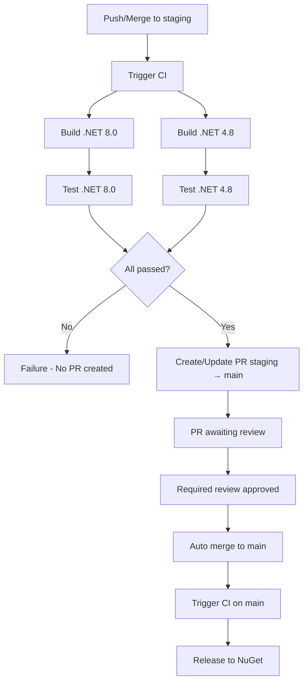
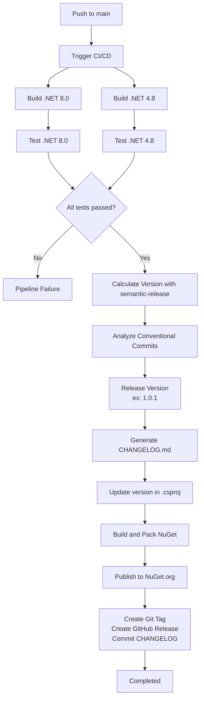

# CI/CD and Release Process

This document describes the CI/CD pipeline of the Traceability project, including the semantic versioning process, changelog generation, and automatic publication to NuGet.org.

## Overview

The project uses `semantic-release` to completely automate the versioning and publishing process. The system analyzes commits following the [Conventional Commits](https://www.conventionalcommits.org/) pattern to automatically determine the next version, generate changelog, and publish to NuGet.org.

## Workflow

### Flow for Staging Branch



### Flow for Main Branch



## Branches and Strategies

### `main` Branch

- **Release Type**: Stable versions (e.g., `1.0.0`, `1.1.0`, `2.0.0`)
- **When it publishes**: On each push containing Conventional Commits (after merging PR from staging)
- **Actions performed**:
  - Calculates version based on commits
  - Generates/updates `CHANGELOG.md`
  - Updates version in `.csproj`
  - Creates NuGet package
  - Publishes to NuGet.org as stable release
  - Creates Git tag (e.g., `v1.0.1`)
  - Creates GitHub release
  - Commits updated `CHANGELOG.md` and `.csproj`

### `staging` Branch

- **Release Type**: Does not publish automatic releases
- **When CI runs**: On each push/merge to staging
- **Actions performed**:
  - Executes build and tests (.NET 8.0 and .NET 4.8)
  - If CI passes, creates/updates PR `staging → main` automatically
  - PR awaits required approval
  - After approval, automatic merge to `main`
  - Release only happens when code reaches `main`

## Staging → Main Flow

The project uses an automated flow to ensure the `main` branch always has the same code as `staging`, but only after required approval:

1. **Developer pushes/merges to `staging`**
   - CI runs automatically (build + tests)

2. **If CI passes, creates/updates PR `staging → main`**
   - PR is created automatically with label `staging-sync`
   - Previous PR is closed if it exists

3. **Reviewer approves the PR**
   - Required review is enforced (via Branch Protection Rules)
   - Security validations:
     - Author cannot approve their own PR
     - Cannot have pending "request changes"
     - PR must be up to date with base branch
     - All required checks must pass

4. **Automatic merge happens when PR is approved**
   - `auto-merge-staging-pr.yml` workflow detects approval
   - Verifies all security conditions
   - Performs automatic merge to `main`

5. **CI on `main` executes release to NuGet**
   - After merge, CI on `main` triggers release
   - Stable version is published to NuGet.org

## Conventional Commits

`semantic-release` analyzes commit messages to determine the version type:

### Commit Types

- **`feat:`** - New feature → Increments **minor** version (1.0.0 → 1.1.0)
- **`fix:`** - Bug fix → Increments **patch** version (1.0.0 → 1.0.1)
- **`BREAKING CHANGE:`** or `!` in scope → Increments **major** version (1.0.0 → 2.0.0)
- **`perf:`**, **`refactor:`**, **`docs:`**, **`test:`**, **`build:`**, **`ci:`**, **`chore:`** → Does not increment version (unless they contain `BREAKING CHANGE`)

### Examples

```bash
# Increments minor (1.0.0 → 1.1.0)
git commit -m "feat: add support for header customization"

# Increments patch (1.0.0 → 1.0.1)
git commit -m "fix: fix correlation-id propagation in async/await"

# Increments major (1.0.0 → 2.0.0)
git commit -m "feat!: remove support for .NET Framework 4.7"

# Or using BREAKING CHANGE in body
git commit -m "feat: refactor configuration API

BREAKING CHANGE: Remove AddTraceability(string) method in favor of AddTraceability(options)"
```

## Configuration

### Configuration Files

- **`.releaserc.json`** - semantic-release configuration
- **`package.json`** - semantic-release dependencies and scripts
- **`.github/workflows/ci.yml`** - GitHub Actions pipeline

### GitHub Secrets

The pipeline requires the following secrets configured in GitHub:

- **`NUGET_API_KEY`** - NuGet.org API key for publishing
  - Get it at: https://www.nuget.org/account/apikeys
  - Configure at: Settings → Secrets and variables → Actions

- **`GITHUB_TOKEN`** - Automatic token provided by GitHub Actions (no need to configure)

## Manual Release Process

### To Publish a Stable Version

1. Make sure you're on the `main` branch
2. Make commits following Conventional Commits:
   ```bash
   git checkout main
   git pull origin main
   # Make your changes
   git commit -m "feat: add new feature"
   git push origin main
   ```
3. The pipeline will automatically execute:
   - Build and tests
   - Version calculation
   - Changelog generation
   - Publication to NuGet.org
   - GitHub release creation

### To Publish a Stable Version via Staging

1. Make sure you're on the `staging` branch
2. Make commits following Conventional Commits:
   ```bash
   git checkout staging
   git pull origin staging
   # Make your changes
   git commit -m "feat: add new feature"
   git push origin staging
   ```
3. The pipeline will automatically execute:
   - Build and tests
   - If it passes, creates/updates PR `staging → main`
4. Approve the PR (required review)
5. Automatic merge will happen after approval
6. CI on `main` will execute release to NuGet

## Pipeline Structure

### GitHub Actions Jobs

1. **`build-and-test-net8`**
   - Runs on: `ubuntu-latest`
   - Actions: Restore, Build and Test for .NET 8.0

2. **`build-and-test-net48`**
   - Runs on: `windows-latest`
   - Actions: Restore, Build and Test for .NET Framework 4.8

3. **`create-pr-staging-to-main`** (new)
   - Runs on: `ubuntu-latest`
   - Depends on: `build-and-test-net8` and `build-and-test-net48`
   - Condition: Only on push to `staging`
   - Actions:
     - Creates or updates PR `staging → main` automatically
     - Closes previous PR if it exists
     - Adds labels `automated` and `staging-sync`

4. **`release`**
   - Runs on: `ubuntu-latest`
   - Depends on: `build-and-test-net8` and `build-and-test-net48`
   - Condition: Only on push to `main`
   - Actions:
     - Setup Node.js and .NET
     - Installs npm dependencies
     - Runs `semantic-release`

### Auto-Merge Workflow

**`.github/workflows/auto-merge-staging-pr.yml`**

- **Trigger**: When a PR `staging → main` receives approval
- **Validations**:
  - Checks if PR has label `staging-sync`
  - Checks if reviewer is not the author (self-approval)
  - Checks if there are no pending "request changes"
  - Checks if PR is up to date with base branch
  - Waits for all required checks to pass (with 5 minute timeout)
- **Actions**:
  - Performs automatic merge of PR
  - Deletes branch after merge
  - Notifies success/error in PR

### semantic-release Plugins

1. **`@semantic-release/commit-analyzer`** - Analyzes commits to determine version
2. **`@semantic-release/release-notes-generator`** - Generates release notes
3. **`@semantic-release/changelog`** - Generates/updates `CHANGELOG.md`
4. **`@semantic-release/exec`** - Executes custom commands:
   - `prepareCmd`: Updates version in `.csproj`, build and pack
   - `publishCmd`: Publishes to NuGet.org
5. **`@semantic-release/git`** - Commits updated `CHANGELOG.md` and `.csproj`
6. **`@semantic-release/github`** - Creates GitHub release

## Branch Protection Rules

To ensure security and quality, configure the following protection rules for the `main` branch on GitHub:

1. **Require pull request reviews before merging**: ✅
   - Required number of approvals: 1
   - Dismiss stale reviews: ✅

2. **Require status checks to pass before merging**: ✅
   - Require branches to be up to date: ✅
   - Status checks: `build-and-test-net8`, `build-and-test-net48`

3. **Require conversation resolution before merging**: ✅

4. **Do not allow bypassing the above settings**: ✅ (including admins)

## Troubleshooting

### Pipeline is not publishing

1. Check if commits follow Conventional Commits
2. Check if `NUGET_API_KEY` is configured correctly
3. Check GitHub Actions logs for specific errors
4. Make sure you're pushing to `main` (after merging PR from staging)

### PR staging → main is not being created

1. Check if CI passed on staging
2. Check logs from `create-pr-staging-to-main` job
3. Make sure you're pushing to `staging` (not `main`)

### Automatic merge is not working

1. Check if PR has the `staging-sync` label
2. Check if PR was approved by someone other than the author
3. Check if all required checks passed
4. Check if PR is up to date with `main`
5. Check logs from `auto-merge-staging-pr` workflow

### Version is not being incremented

- Commits that don't follow Conventional Commits don't increment version
- Commits of type `chore`, `docs`, `test` (without `BREAKING CHANGE`) don't increment version
- Check commit message in format: `type(scope): description`

### Error publishing to NuGet

- Check if API key is valid
- Check if version already exists on NuGet (use `--skip-duplicate` if necessary)
- Check if package was built correctly

## Additional Resources

- [Conventional Commits](https://www.conventionalcommits.org/)
- [semantic-release Documentation](https://semantic-release.gitbook.io/)
- [GitHub Actions Documentation](https://docs.github.com/en/actions)
