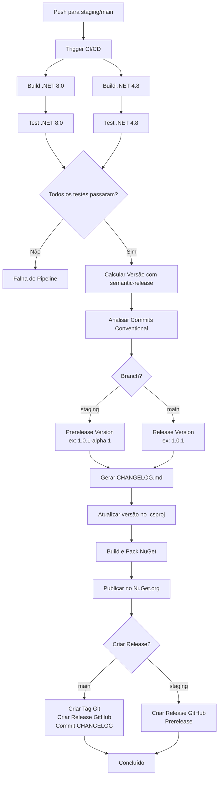

# CI/CD e Processo de Release

Este documento descreve o pipeline de CI/CD do projeto Traceability, incluindo o processo de versionamento semântico, geração de changelog e publicação automática no NuGet.org.

## Visão Geral

O projeto utiliza `semantic-release` para automatizar completamente o processo de versionamento e publicação. O sistema analisa commits seguindo o padrão [Conventional Commits](https://www.conventionalcommits.org/) para determinar automaticamente a próxima versão, gerar changelog e publicar no NuGet.org.

## Fluxo de Trabalho



## Branches e Estratégias

### Branch `main`

- **Tipo de Release**: Versões estáveis (ex: `1.0.0`, `1.1.0`, `2.0.0`)
- **Quando publica**: A cada push que contém commits com Conventional Commits
- **Ações realizadas**:
  - Calcula versão baseada nos commits
  - Gera/atualiza `CHANGELOG.md`
  - Atualiza versão no `.csproj`
  - Cria pacote NuGet
  - Publica no NuGet.org como release estável
  - Cria tag Git (ex: `v1.0.1`)
  - Cria release no GitHub
  - Commita `CHANGELOG.md` e `.csproj` atualizado

### Branch `staging`

- **Tipo de Release**: Versões pré-release (ex: `1.0.1-alpha.1`, `1.0.1-alpha.2`)
- **Quando publica**: A cada push que contém commits com Conventional Commits
- **Ações realizadas**:
  - Calcula versão pré-release baseada nos commits
  - Gera/atualiza `CHANGELOG.md`
  - Atualiza versão no `.csproj`
  - Cria pacote NuGet
  - Publica no NuGet.org como prerelease
  - Cria release no GitHub marcado como prerelease

## Conventional Commits

O `semantic-release` analisa mensagens de commit para determinar o tipo de versão:

### Tipos de Commit

- **`feat:`** - Nova funcionalidade → Incrementa versão **minor** (1.0.0 → 1.1.0)
- **`fix:`** - Correção de bug → Incrementa versão **patch** (1.0.0 → 1.0.1)
- **`BREAKING CHANGE:`** ou `!` no escopo → Incrementa versão **major** (1.0.0 → 2.0.0)
- **`perf:`**, **`refactor:`**, **`docs:`**, **`test:`**, **`build:`**, **`ci:`**, **`chore:`** → Não incrementa versão (a menos que contenham `BREAKING CHANGE`)

### Exemplos

```bash
# Incrementa minor (1.0.0 → 1.1.0)
git commit -m "feat: adiciona suporte para customização de header"

# Incrementa patch (1.0.0 → 1.0.1)
git commit -m "fix: corrige propagação de correlation-id em async/await"

# Incrementa major (1.0.0 → 2.0.0)
git commit -m "feat!: remove suporte para .NET Framework 4.7"

# Ou usando BREAKING CHANGE no corpo
git commit -m "feat: refatora API de configuração

BREAKING CHANGE: Remove método AddTraceability(string) em favor de AddTraceability(options)"
```

## Configuração

### Arquivos de Configuração

- **`.releaserc.json`** - Configuração do semantic-release
- **`package.json`** - Dependências do semantic-release e scripts
- **`.github/workflows/ci.yml`** - Pipeline do GitHub Actions

### Secrets do GitHub

O pipeline requer os seguintes secrets configurados no GitHub:

- **`NUGET_API_KEY`** - API key do NuGet.org para publicação
  - Obtenha em: https://www.nuget.org/account/apikeys
  - Configure em: Settings → Secrets and variables → Actions

- **`GITHUB_TOKEN`** - Token automático fornecido pelo GitHub Actions (não precisa configurar)

## Processo de Release Manual

### Para Publicar uma Versão Estável

1. Certifique-se de estar na branch `main`
2. Faça commits seguindo Conventional Commits:
   ```bash
   git checkout main
   git pull origin main
   # Faça suas alterações
   git commit -m "feat: adiciona nova funcionalidade"
   git push origin main
   ```
3. O pipeline executará automaticamente:
   - Build e testes
   - Cálculo de versão
   - Geração de changelog
   - Publicação no NuGet.org
   - Criação de release no GitHub

### Para Publicar uma Versão Pré-release

1. Certifique-se de estar na branch `staging`
2. Faça commits seguindo Conventional Commits:
   ```bash
   git checkout staging
   git pull origin staging
   # Faça suas alterações
   git commit -m "feat: adiciona nova funcionalidade"
   git push origin staging
   ```
3. O pipeline executará automaticamente criando uma versão pré-release

## Estrutura do Pipeline

### Jobs do GitHub Actions

1. **`build-and-test-net8`**
   - Executa em: `ubuntu-latest`
   - Ações: Restore, Build e Test para .NET 8.0

2. **`build-and-test-net48`**
   - Executa em: `windows-latest`
   - Ações: Restore, Build e Test para .NET Framework 4.8

3. **`release`**
   - Executa em: `ubuntu-latest`
   - Depende de: `build-and-test-net8` e `build-and-test-net48`
   - Condição: Apenas em push para `main` ou `staging`
   - Ações:
     - Setup Node.js e .NET
     - Instala dependências npm
     - Executa `semantic-release`

### Plugins do semantic-release

1. **`@semantic-release/commit-analyzer`** - Analisa commits para determinar versão
2. **`@semantic-release/release-notes-generator`** - Gera notas de release
3. **`@semantic-release/changelog`** - Gera/atualiza `CHANGELOG.md`
4. **`@semantic-release/exec`** - Executa comandos customizados:
   - `prepareCmd`: Atualiza versão no `.csproj`, build e pack
   - `publishCmd`: Publica no NuGet.org
5. **`@semantic-release/git`** - Commita `CHANGELOG.md` e `.csproj` atualizado
6. **`@semantic-release/github`** - Cria release no GitHub

## Troubleshooting

### Pipeline não está publicando

1. Verifique se os commits seguem Conventional Commits
2. Verifique se `NUGET_API_KEY` está configurado corretamente
3. Verifique os logs do GitHub Actions para erros específicos
4. Certifique-se de que está fazendo push para `main` ou `staging`

### Versão não está sendo incrementada

- Commits que não seguem Conventional Commits não incrementam versão
- Commits de tipo `chore`, `docs`, `test` (sem `BREAKING CHANGE`) não incrementam versão
- Verifique a mensagem do commit no formato: `tipo(escopo): descrição`

### Erro ao publicar no NuGet

- Verifique se a API key está válida
- Verifique se a versão já existe no NuGet (use `--skip-duplicate` se necessário)
- Verifique se o pacote foi buildado corretamente

## Recursos Adicionais

- [Conventional Commits](https://www.conventionalcommits.org/)
- [semantic-release Documentation](https://semantic-release.gitbook.io/)
- [GitHub Actions Documentation](https://docs.github.com/en/actions)


