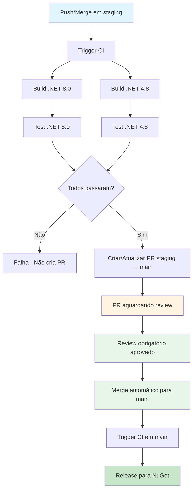
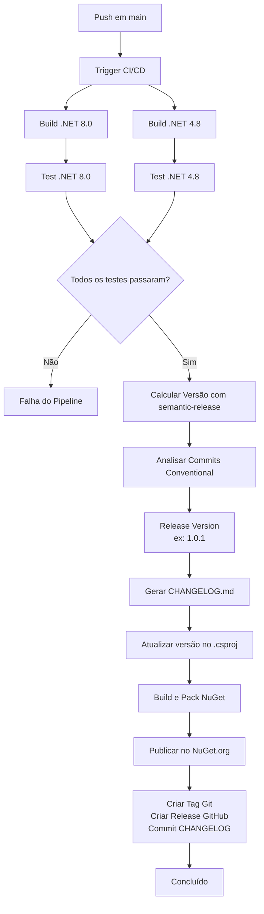

# CI/CD e Processo de Release

Este documento descreve o pipeline de CI/CD do projeto Traceability, incluindo o processo de versionamento semântico, geração de changelog e publicação automática no NuGet.org.

## Visão Geral

O projeto utiliza `semantic-release` para automatizar completamente o processo de versionamento e publicação. O sistema analisa commits seguindo o padrão [Conventional Commits](https://www.conventionalcommits.org/) para determinar automaticamente a próxima versão, gerar changelog e publicar no NuGet.org.

## Fluxo de Trabalho

### Fluxo para Branch Staging



### Fluxo para Branch Main



## Branches e Estratégias

### Branch `main`

- **Tipo de Release**: Versões estáveis (ex: `1.0.0`, `1.1.0`, `2.0.0`)
- **Quando publica**: A cada push que contém commits com Conventional Commits (após merge de PR de staging)
- **Ações realizadas**:
  - Calcula versão baseada nos commits
  - Gera/atualiza `CHANGELOG.md`
  - Atualiza versão no `.csproj`
  - Cria pacote NuGet
  - Publica no NuGet.org como release estável
  - Cria tag Git (ex: `v1.0.1`)
  - Cria release no GitHub
  - Commita `CHANGELOG.md` e `.csproj` atualizado

### Branch `staging`

- **Tipo de Release**: Não publica releases automáticos
- **Quando executa CI**: A cada push/merge em staging
- **Ações realizadas**:
  - Executa build e testes (.NET 8.0 e .NET 4.8)
  - Se CI passar, cria/atualiza PR `staging → main` automaticamente
  - PR aguarda aprovação obrigatória
  - Após aprovação, merge automático para `main`
  - Release acontece apenas quando código chega em `main`

## Fluxo Staging → Main

O projeto utiliza um fluxo automatizado para garantir que a branch `main` sempre tenha o mesmo código que `staging`, mas apenas após aprovação obrigatória:

1. **Desenvolvedor faz push/merge em `staging`**
   - CI executa automaticamente (build + testes)

2. **Se CI passar, cria/atualiza PR `staging → main`**
   - PR é criada automaticamente com label `staging-sync`
   - PR anterior é fechada se existir

3. **Revisor aprova a PR**
   - Review obrigatório é exigido (via Branch Protection Rules)
   - Validações de segurança:
     - Autor não pode aprovar sua própria PR
     - Não pode haver "request changes" pendentes
     - PR deve estar atualizada com base branch
     - Todos os checks obrigatórios devem passar

4. **Merge automático acontece quando PR é aprovada**
   - Workflow `auto-merge-staging-pr.yml` detecta aprovação
   - Verifica todas as condições de segurança
   - Faz merge automático para `main`

5. **CI em `main` executa release para NuGet**
   - Após merge, CI em `main` dispara release
   - Versão estável é publicada no NuGet.org

## Conventional Commits

O `semantic-release` analisa mensagens de commit para determinar o tipo de versão:

### Tipos de Commit

- **`feat:`** - Nova funcionalidade → Incrementa versão **minor** (1.0.0 → 1.1.0)
- **`fix:`** - Correção de bug → Incrementa versão **patch** (1.0.0 → 1.0.1)
- **`BREAKING CHANGE:`** ou `!` no escopo → Incrementa versão **major** (1.0.0 → 2.0.0)
- **`perf:`**, **`refactor:`**, **`docs:`**, **`test:`**, **`build:`**, **`ci:`**, **`chore:`** → Não incrementa versão (a menos que contenham `BREAKING CHANGE`)

### Exemplos

```bash
# Incrementa minor (1.0.0 → 1.1.0)
git commit -m "feat: adiciona suporte para customização de header"

# Incrementa patch (1.0.0 → 1.0.1)
git commit -m "fix: corrige propagação de correlation-id em async/await"

# Incrementa major (1.0.0 → 2.0.0)
git commit -m "feat!: remove suporte para .NET Framework 4.7"

# Ou usando BREAKING CHANGE no corpo
git commit -m "feat: refatora API de configuração

BREAKING CHANGE: Remove método AddTraceability(string) em favor de AddTraceability(options)"
```

## Configuração

### Arquivos de Configuração

- **`.releaserc.json`** - Configuração do semantic-release
- **`package.json`** - Dependências do semantic-release e scripts
- **`.github/workflows/ci.yml`** - Pipeline do GitHub Actions

### Secrets do GitHub

O pipeline requer os seguintes secrets configurados no GitHub:

- **`NUGET_API_KEY`** - API key do NuGet.org para publicação
  - Obtenha em: https://www.nuget.org/account/apikeys
  - Configure em: Settings → Secrets and variables → Actions

- **`GITHUB_TOKEN`** - Token automático fornecido pelo GitHub Actions (não precisa configurar)

## Processo de Release Manual

### Para Publicar uma Versão Estável

1. Certifique-se de estar na branch `main`
2. Faça commits seguindo Conventional Commits:
   ```bash
   git checkout main
   git pull origin main
   # Faça suas alterações
   git commit -m "feat: adiciona nova funcionalidade"
   git push origin main
   ```
3. O pipeline executará automaticamente:
   - Build e testes
   - Cálculo de versão
   - Geração de changelog
   - Publicação no NuGet.org
   - Criação de release no GitHub

### Para Publicar uma Versão Estável via Staging

1. Certifique-se de estar na branch `staging`
2. Faça commits seguindo Conventional Commits:
   ```bash
   git checkout staging
   git pull origin staging
   # Faça suas alterações
   git commit -m "feat: adiciona nova funcionalidade"
   git push origin staging
   ```
3. O pipeline executará automaticamente:
   - Build e testes
   - Se passar, cria/atualiza PR `staging → main`
4. Aprove a PR (review obrigatório)
5. O merge automático acontecerá após aprovação
6. CI em `main` executará release para NuGet

## Estrutura do Pipeline

### Jobs do GitHub Actions

1. **`build-and-test-net8`**
   - Executa em: `ubuntu-latest`
   - Ações: Restore, Build e Test para .NET 8.0

2. **`build-and-test-net48`**
   - Executa em: `windows-latest`
   - Ações: Restore, Build e Test para .NET Framework 4.8

3. **`create-pr-staging-to-main`** (novo)
   - Executa em: `ubuntu-latest`
   - Depende de: `build-and-test-net8` e `build-and-test-net48`
   - Condição: Apenas em push para `staging`
   - Ações:
     - Cria ou atualiza PR `staging → main` automaticamente
     - Fecha PR anterior se existir
     - Adiciona labels `automated` e `staging-sync`

4. **`release`**
   - Executa em: `ubuntu-latest`
   - Depende de: `build-and-test-net8` e `build-and-test-net48`
   - Condição: Apenas em push para `main`
   - Ações:
     - Setup Node.js e .NET
     - Instala dependências npm
     - Executa `semantic-release`

### Workflow de Auto-Merge

**`.github/workflows/auto-merge-staging-pr.yml`**

- **Trigger**: Quando uma PR `staging → main` recebe aprovação
- **Validações**:
  - Verifica se PR tem label `staging-sync`
  - Verifica se revisor não é o autor (self-approval)
  - Verifica se não há "request changes" pendentes
  - Verifica se PR está atualizada com base branch
  - Aguarda todos os checks obrigatórios passarem (com timeout de 5 minutos)
- **Ações**:
  - Faz merge automático da PR
  - Deleta branch após merge
  - Notifica sucesso/erro na PR

### Plugins do semantic-release

1. **`@semantic-release/commit-analyzer`** - Analisa commits para determinar versão
2. **`@semantic-release/release-notes-generator`** - Gera notas de release
3. **`@semantic-release/changelog`** - Gera/atualiza `CHANGELOG.md`
4. **`@semantic-release/exec`** - Executa comandos customizados:
   - `prepareCmd`: Atualiza versão no `.csproj`, build e pack
   - `publishCmd`: Publica no NuGet.org
5. **`@semantic-release/git`** - Commita `CHANGELOG.md` e `.csproj` atualizado
6. **`@semantic-release/github`** - Cria release no GitHub

## Branch Protection Rules

Para garantir segurança e qualidade, configure as seguintes regras de proteção para a branch `main` no GitHub:

1. **Require pull request reviews before merging**: ✅
   - Required number of approvals: 1
   - Dismiss stale reviews: ✅

2. **Require status checks to pass before merging**: ✅
   - Require branches to be up to date: ✅
   - Status checks: `build-and-test-net8`, `build-and-test-net48`

3. **Require conversation resolution before merging**: ✅

4. **Do not allow bypassing the above settings**: ✅ (incluindo admins)

## Troubleshooting

### Pipeline não está publicando

1. Verifique se os commits seguem Conventional Commits
2. Verifique se `NUGET_API_KEY` está configurado corretamente
3. Verifique os logs do GitHub Actions para erros específicos
4. Certifique-se de que está fazendo push para `main` (após merge da PR de staging)

### PR staging → main não está sendo criada

1. Verifique se o CI passou em staging
2. Verifique os logs do job `create-pr-staging-to-main`
3. Certifique-se de que está fazendo push para `staging` (não `main`)

### Merge automático não está funcionando

1. Verifique se a PR tem o label `staging-sync`
2. Verifique se a PR foi aprovada por alguém diferente do autor
3. Verifique se todos os checks obrigatórios passaram
4. Verifique se a PR está atualizada com `main`
5. Verifique os logs do workflow `auto-merge-staging-pr`

### Versão não está sendo incrementada

- Commits que não seguem Conventional Commits não incrementam versão
- Commits de tipo `chore`, `docs`, `test` (sem `BREAKING CHANGE`) não incrementam versão
- Verifique a mensagem do commit no formato: `tipo(escopo): descrição`

### Erro ao publicar no NuGet

- Verifique se a API key está válida
- Verifique se a versão já existe no NuGet (use `--skip-duplicate` se necessário)
- Verifique se o pacote foi buildado corretamente

## Recursos Adicionais

- [Conventional Commits](https://www.conventionalcommits.org/)
- [semantic-release Documentation](https://semantic-release.gitbook.io/)
- [GitHub Actions Documentation](https://docs.github.com/en/actions)


